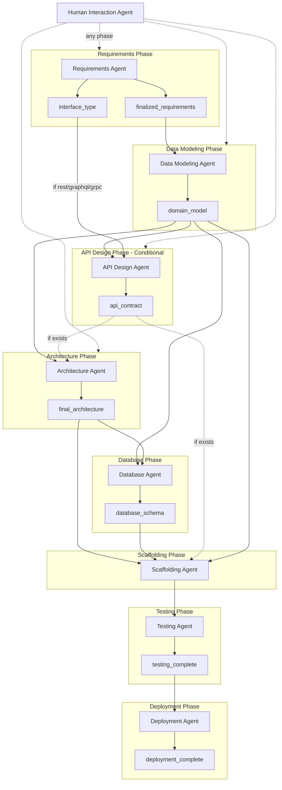

# Agent Reference

This document provides a comprehensive reference for all agents in the Dev Quickstart Agent system. Each agent is a specialized "smart tool" that executes specific tasks when delegated by the cognitive orchestrator.

---

## Table of Contents

1. [Overview](#overview)
2. [Agent Architecture](#agent-architecture)
3. [Requirements Agent](#requirements-agent)
4. [Data Modeling Agent](#data-modeling-agent)
5. [API Design Agent](#api-design-agent)
6. [Architecture Agent](#architecture-agent)
7. [Database Agent](#database-agent)
8. [Scaffolding Agent](#scaffolding-agent)
9. [Testing Agent](#testing-agent)
10. [Deployment Agent](#deployment-agent)
11. [Human Interaction Agent](#human-interaction-agent)
12. [Adding New Agents](#adding-new-agents)

---

## Overview

### Agent Roster

| Agent | Phase | Purpose | Key Artifacts |
|-------|-------|---------|---------------|
| **Requirements Agent** | requirements | Gather, structure, and validate requirements | `finalized_requirements` |
| **Data Modeling Agent** | data_modeling | Extract domain entities, relationships, rules | `domain_model` |
| **API Design Agent** | api_design | Design API contracts (conditional) | `api_contract` |
| **Architecture Agent** | architecture | Design system architecture and select frameworks | `final_architecture` |
| **Database Agent** | database | Generate database schemas and migrations | `database_schema` |
| **Scaffolding Agent** | scaffolding | Generate project structure and code | `scaffolding_complete` |
| **Testing Agent** | testing | Generate test suites and QA strategies | `testing_complete` |
| **Deployment Agent** | deployment | Create deployment configurations | `deployment_complete` |
| **Human Interaction Agent** | any | Handle clarifications and user communication | - |

### Complete Workflow



---

## Agent Architecture

### Base Classes

All agents extend the same base architecture:

```python
BaseDevTool (Foundation)
    ↓
BaseLLMTool (LLM Integration)
    ↓
BaseAgent (Agent-specific behaviors)
    ↓
├── RequirementsAgent
├── DataModelingAgent
├── APIDesignAgent
├── ArchitectureAgent
├── DatabaseAgent
├── ScaffoldingAgent
├── TestingAgent
├── DeploymentAgent
└── HumanInteractionAgent
```

### Agent Characteristics

- **Stateless**: Agents don't remember past executions - the brain does
- **Action-Based**: Each agent has a registry of discrete actions
- **LLM-Wrapped**: Use language models for intelligent processing
- **Persona-Enabled**: Each agent can be staffed with dynamic personas

### Common File Structure

Each agent follows the same structural pattern:

```
src/dev_quickstart_agent/
├── agents/
│   └── {agent_name}_agent.py              # Agent class
├── actions/
│   └── {agent_name}/
│       ├── {agent_name}_action_registry.py    # Action definitions
│       ├── base_{agent_name}_handler.py       # Base handler class
│       ├── {action_1}_handler.py              # Action handlers
│       └── {action_2}_handler.py
├── prompts/
│   └── {agent_name}/
│       ├── {prompt_1}.md                      # System prompts
│       └── {prompt_1}_human.txt               # Human prompts
├── tools/
│   └── {agent_name}/
│       └── {tool_name}_tool.py                # Specialized tools
└── schemas/
    └── {schema_name}.py                       # Pydantic schemas
```

### Capability Registry Integration

All agent actions are defined in the Capability Registry:

```python
# From capability_registry.py
"agent_name": {
    "ACTION_NAME": {
        "conditions": {
            "pre": {
                "artifacts_exist": ["required_artifact"],
                "state_conditions": ["condition_name"],
            },
            "post": {
                "produces": ["output_artifact"],
                "invalidates": ["stale_artifact"],
            },
        },
        "decision_context": {
            "when_to_use": "Description of when this action is appropriate",
            "when_not_to_use": "Description of when to avoid this action",
            "value_signals": ["signal_1", "signal_2"],
        },
        "execution": {
            "handler": "HandlerClassName",
            "timeout_seconds": 30,
        },
    },
}
```

---

## Requirements Agent

### Purpose

Gather, structure, and validate project requirements from user conversations. The requirements agent is typically the first agent to engage in a new project.

### Files

```
src/dev_quickstart_agent/
├── agents/
│   └── requirements_agent.py
├── actions/
│   └── requirements/
│       ├── requirements_action_registry.py
│       ├── base_requirements_handler.py
│       ├── ask_specific_question_handler.py
│       ├── generate_follow_up_question_handler.py
│       ├── assess_conversation_completeness_handler.py
│       ├── extract_requirements_handler.py
│       ├── format_requirements_handler.py
│       ├── generate_user_stories_handler.py
│       ├── elaborate_requirements_handler.py
│       ├── validate_requirements_handler.py
│       └── finalize_requirements_handler.py
├── prompts/
│   └── requirements/
│       ├── ask_specific_question.md
│       ├── ask_specific_question_human.txt
│       ├── extract_requirements.md
│       ├── extract_requirements_human.txt
│       ├── format_requirements.md
│       ├── validate_requirements.md
│       └── finalize_requirements.md
└── tools/
    └── requirements/
        ├── requirements_extraction_tool.py
        ├── requirements_elaboration_tool.py
        ├── requirements_format_tool.py
        └── requirements_validation_tool.py
```

### Actions

| Action | Description | Pre-conditions | Produces |
|--------|-------------|----------------|----------|
| `ASK_SPECIFIC_QUESTION` | Ask targeted clarifying question | - | Conversation turn |
| `GENERATE_FOLLOW_UP_QUESTION` | Generate contextual follow-up | - | Conversation turn |
| `ASSESS_CONVERSATION_COMPLETENESS` | Evaluate if enough info gathered | - | Completeness score |
| `EXTRACT_REQUIREMENTS` | Extract structured requirements | `goal_clarity ≥ 0.7`, `requirements_coverage ≥ 0.5` | `extracted_requirements` |
| `FORMAT_REQUIREMENTS` | Format into standard structure | `extracted_requirements` | `formatted_requirements` |
| `GENERATE_USER_STORIES` | Create user stories from requirements | `formatted_requirements` | `user_stories` |
| `ELABORATE_REQUIREMENTS` | Add acceptance criteria | `formatted_requirements` | Enhanced requirements |
| `VALIDATE_REQUIREMENTS` | Validate completeness | `formatted_requirements` | Validation report |
| `FINALIZE_REQUIREMENTS` | Lock in confirmed requirements | User approval, `overall_readiness ≥ 0.7` | `finalized_requirements` |

### Capability Registry Entry

```python
"requirements_agent": {
    "EXTRACT_REQUIREMENTS": {
        "conditions": {
            "pre": {
                "artifacts_exist": [],
                "state_conditions": [
                    "user_message_exists",
                    "goal_clarity_gte_0.7",
                    "requirements_coverage_gte_0.5",
                ],
            },
            "post": {
                "produces": ["extracted_requirements_text"],
                "invalidates": [],
            },
        },
        "decision_context": {
            "when_to_use": """
                Use when the user has provided enough context about their project goal
                and you need to formally capture what they've described. Good for:
                - After a productive discovery conversation (2-3 exchanges)
                - When the user has described their core problem and desired outcome
            """,
            "when_not_to_use": """
                Avoid if:
                - Goal is still vague or user seems unsure
                - Only received a single greeting message
                - User is asking questions rather than describing needs
            """,
            "value_signals": [
                "goal_clarity_score >= 0.7 (required gate)",
                "requirements_coverage_score >= 0.5 (required gate)",
                "User has provided concrete examples and constraints",
            ],
        },
    },
    "FINALIZE_REQUIREMENTS": {
        "conditions": {
            "pre": {
                "artifacts_exist": ["formatted_requirements_text", "user_stories"],
                "state_conditions": [
                    "overall_readiness_gte_0.7",
                    "user_confirmed_requirements",
                ],
            },
            "post": {
                "produces": ["finalized_requirements"],
                "invalidates": [],
            },
        },
    },
}
```

### Key Handlers

#### ExtractRequirementsHandler

```python
class ExtractRequirementsHandler(BaseRequirementsHandler):
    """Extract structured requirements from conversation.
    
    Uses LLM to identify:
    - Functional requirements (what the system must do)
    - Non-functional requirements (performance, security, scalability)
    - Constraints (technical, business, regulatory)
    - Assumptions (implicit decisions)
    """
    
    async def execute(self, context: ActionContext) -> ActionResult:
        # Get conversation history
        messages = context.state.get("messages", [])
        
        # Load extraction prompt
        prompt = await self.load_prompt("extract_requirements")
        
        # Call LLM
        response = await self.llm.generate(
            prompt,
            conversation=messages,
            project_goal=context.state.get("project_goal"),
        )
        
        # Parse and validate
        requirements = self._parse_requirements(response)
        
        return ActionResult(
            success=True,
            data={"extracted_requirements_text": requirements}
        )
```

### Brain Integration

- **Wernicke's Area**: Interprets user language and extracts intent
- **Prefrontal Cortex**: Validates completeness and quality
- **Hippocampus**: Recalls similar requirement patterns from past projects

### Default Persona

`requirements_analyst` - Lead Business Analyst with:
- Northwestern Kellogg MBA
- 10 years at Deloitte Consulting
- CBAP certified
- Discovery workshop expertise

---

## Data Modeling Agent

### Purpose

Extract business domain entities, relationships, and rules from finalized requirements. The domain model becomes the **keystone artifact** consumed by all downstream phases.

### Files

```
src/dev_quickstart_agent/
├── agents/
│   └── data_modeling_agent.py
├── actions/
│   └── data_modeling/
│       ├── data_modeling_action_registry.py
│       ├── base_data_modeling_handler.py
│       ├── extract_domain_model_handler.py
│       ├── validate_domain_model_handler.py
│       ├── present_domain_model_handler.py
│       ├── confirm_domain_model_handler.py
│       └── update_domain_model_handler.py
├── prompts/
│   └── data_modeling/
│       ├── domain_model_extraction.md
│       ├── domain_model_extraction_human.txt
│       ├── domain_model_validation.md
│       └── domain_model_presentation.md
├── tools/
│   └── data_modeling/
│       └── domain_model_extractor_tool.py
└── schemas/
    └── domain_model.py
```

### Actions

| Action | Description | Pre-conditions | Produces |
|--------|-------------|----------------|----------|
| `EXTRACT_DOMAIN_MODEL` | Extract entities from requirements | `finalized_requirements` | `domain_model_draft` |
| `VALIDATE_DOMAIN_MODEL` | Check completeness and consistency | `domain_model_draft` | `domain_model_validated` |
| `PRESENT_DOMAIN_MODEL` | Present to user for review | `domain_model_validated` | Human interaction |
| `CONFIRM_DOMAIN_MODEL` | Process user confirmation | User approval | `domain_model` |
| `UPDATE_DOMAIN_MODEL` | Apply user modifications | User feedback | Updated draft |

### Schema

Location: `src/dev_quickstart_agent/schemas/domain_model.py`

```python
class EntityAttribute(BaseModel):
    """Single attribute of a domain entity."""
    name: str
    type: str  # "string", "integer", "boolean", "datetime", "uuid", "json"
    description: str
    required: bool = True
    unique: bool = False
    default: Any | None = None
    validation_rules: list[str] = Field(default_factory=list)


class EntityRelationship(BaseModel):
    """Relationship between entities."""
    target_entity: str
    relationship_type: Literal["one_to_one", "one_to_many", "many_to_one", "many_to_many"]
    description: str
    foreign_key: str | None = None
    inverse_name: str | None = None
    cascade_delete: bool = False


class BusinessRule(BaseModel):
    """Business rule or constraint."""
    rule_id: str
    description: str
    applies_to: list[str]  # Entity names
    rule_type: Literal["validation", "constraint", "computation", "workflow"]
    implementation_hint: str | None = None


class StateTransition(BaseModel):
    """Single state transition."""
    from_state: str
    to_state: str
    trigger: str
    guard: str | None = None  # Condition that must be true


class StateMachine(BaseModel):
    """State machine for entity lifecycle."""
    entity: str
    states: list[str]
    initial_state: str
    transitions: list[StateTransition]


class DomainEntity(BaseModel):
    """Complete domain entity definition."""
    name: str
    description: str
    attributes: list[EntityAttribute]
    relationships: list[EntityRelationship] = Field(default_factory=list)
    business_rules: list[str] = Field(default_factory=list)  # Rule IDs
    state_machine: StateMachine | None = None
    is_aggregate_root: bool = False


class DomainModel(BaseModel):
    """Complete domain model."""
    entities: list[DomainEntity]
    relationships: list[EntityRelationship]  # Cross-entity relationships
    business_rules: list[BusinessRule]
    aggregate_roots: list[str]
    bounded_contexts: list[str] | None = None
    
    def get_entity(self, name: str) -> DomainEntity | None:
        """Get entity by name."""
        return next((e for e in self.entities if e.name == name), None)
    
    def get_relationships_for(self, entity_name: str) -> list[EntityRelationship]:
        """Get all relationships involving an entity."""
        return [r for r in self.relationships if r.target_entity == entity_name]
```

### Key Handlers

#### ExtractDomainModelHandler

```python
class ExtractDomainModelHandler(BaseDataModelingHandler):
    """Extract domain entities from finalized requirements.
    
    Uses LLM to identify:
    - Core business entities (User, Order, Product, etc.)
    - Entity attributes with types and constraints
    - Relationships (one-to-one, one-to-many, many-to-many)
    - Business rules (validation, computation, workflow)
    - State machines for entities with lifecycle
    - Aggregate roots (DDD concept)
    """
    
    async def execute(self, context: ActionContext) -> ActionResult:
        # Load requirements
        requirements = context.state.get("finalized_requirements")
        
        # Get extraction prompt
        prompt = await self.load_prompt("domain_model_extraction")
        
        # Call LLM with structured output
        response = await self.llm.generate(
            prompt,
            requirements=requirements,
            response_format=DomainModel,
        )
        
        # Parse into DomainModel schema
        domain_model = DomainModel.model_validate(response)
        
        return ActionResult(
            success=True,
            data={"domain_model_draft": domain_model.model_dump()}
        )
```

#### ValidateDomainModelHandler

```python
class ValidateDomainModelHandler(BaseDataModelingHandler):
    """Validate domain model for completeness and consistency.
    
    Validation checks:
    - All entities have required attributes (id, created_at, etc.)
    - All relationships have valid target entities
    - No circular dependencies in aggregate roots
    - No orphan entities (not referenced anywhere)
    - Business rules reference valid entities
    - State machines have valid transitions
    - Naming conventions are consistent
    """
    
    async def execute(self, context: ActionContext) -> ActionResult:
        domain_model = DomainModel.model_validate(
            context.state.get("domain_model_draft")
        )
        
        issues = []
        
        # Check for required attributes
        for entity in domain_model.entities:
            if not any(a.name == "id" for a in entity.attributes):
                issues.append(f"Entity '{entity.name}' missing 'id' attribute")
        
        # Check relationship targets
        entity_names = {e.name for e in domain_model.entities}
        for rel in domain_model.relationships:
            if rel.target_entity not in entity_names:
                issues.append(f"Relationship targets unknown entity: {rel.target_entity}")
        
        # Check for orphan entities
        referenced = set()
        for rel in domain_model.relationships:
            referenced.add(rel.target_entity)
        orphans = entity_names - referenced - set(domain_model.aggregate_roots)
        if orphans:
            issues.append(f"Orphan entities (not referenced): {orphans}")
        
        return ActionResult(
            success=len(issues) == 0,
            data={
                "domain_model_validated": len(issues) == 0,
                "validation_issues": issues,
            }
        )
```

#### PresentDomainModelHandler

```python
class PresentDomainModelHandler(BaseDataModelingHandler):
    """Format domain model for human review.
    
    Generates:
    - Entity summary table
    - ER diagram (Mermaid syntax)
    - Business rules summary
    - Questions for user clarification
    """
    
    async def execute(self, context: ActionContext) -> ActionResult:
        domain_model = DomainModel.model_validate(
            context.state.get("domain_model_draft")
        )
        
        # Generate Mermaid ER diagram
        er_diagram = self._generate_er_diagram(domain_model)
        
        # Format entity summary
        entity_table = self._format_entity_table(domain_model)
        
        # Generate clarifying questions
        questions = await self._generate_questions(domain_model)
        
        presentation = f"""
## Domain Model Review

### Entities ({len(domain_model.entities)})

{entity_table}

### Entity Relationship Diagram

```mermaid
{er_diagram}
```

### Business Rules ({len(domain_model.business_rules)})

{self._format_rules(domain_model.business_rules)}

### Questions for Clarification

{questions}
"""
        
        return ActionResult(
            success=True,
            data={"presentation": presentation},
            requires_human_input=True,
        )
```

### Brain Integration

- **Wernicke's Area**: Interprets requirements text for entity identification
- **Cerebral Cortex**: Recognizes domain modeling patterns
- **Hippocampus**: Recalls similar domain models from past projects

### Default Persona

`data_architect` - Data Architect with:
- Carnegie Mellon MS in Information Systems
- 6 years at Meta (petabyte-scale data modeling)
- 4 years at Stripe (financial data modeling)
- CDMP certified

---

## API Design Agent

### Purpose

Design API contracts from domain model entities. Supports REST, GraphQL, and gRPC interfaces. Produces OpenAPI 3.x specifications.

### Conditional Activation

Only activated when `interface_type` requires it:

```python
def interface_type_requires_api(state: dict) -> bool:
    """Returns True if interface_type requires API design phase."""
    interface_type = state.get("interface_type")
    return interface_type in ["rest", "graphql", "grpc"]
```

Projects with `cli`, `library`, or `none` interface types skip this phase.

### Files

```
src/dev_quickstart_agent/
├── agents/
│   └── api_design_agent.py
├── actions/
│   └── api_design/
│       ├── api_design_action_registry.py
│       ├── base_api_design_handler.py
│       ├── design_api_resources_handler.py
│       ├── design_api_endpoints_handler.py
│       ├── design_request_schemas_handler.py
│       ├── design_response_schemas_handler.py
│       ├── design_error_format_handler.py
│       ├── generate_openapi_spec_handler.py
│       ├── present_api_contract_handler.py
│       └── confirm_api_contract_handler.py
├── prompts/
│   └── api_design/
│       ├── api_resource_design.md
│       ├── api_endpoint_design.md
│       ├── api_schema_design.md
│       ├── api_error_format.md
│       ├── openapi_generation.md
│       └── api_presentation.md
├── tools/
│   └── api_design/
│       ├── api_resource_designer_tool.py
│       ├── api_endpoint_designer_tool.py
│       └── openapi_generator_tool.py
└── schemas/
    └── api_contract.py
```

### Actions

| Action | Description | Pre-conditions | Produces |
|--------|-------------|----------------|----------|
| `DESIGN_API_RESOURCES` | Map domain entities to resources | `domain_model` | `api_resources` |
| `DESIGN_API_ENDPOINTS` | Define routes, methods, params | `api_resources` | `api_endpoints` |
| `DESIGN_REQUEST_SCHEMAS` | Create request DTOs | `api_endpoints` | `request_schemas` |
| `DESIGN_RESPONSE_SCHEMAS` | Create response DTOs | `api_endpoints` | `response_schemas` |
| `DESIGN_ERROR_FORMAT` | Standardize error responses | - | `error_format` |
| `GENERATE_OPENAPI_SPEC` | Generate OpenAPI 3.x spec | All above | `openapi_spec` |
| `PRESENT_API_CONTRACT` | Present to user for review | `openapi_spec` | Human interaction |
| `CONFIRM_API_CONTRACT` | Process user approval | User approval | `api_contract` |

### Schema

Location: `src/dev_quickstart_agent/schemas/api_contract.py`

```python
class APIParameter(BaseModel):
    """API endpoint parameter."""
    name: str
    location: Literal["path", "query", "header", "cookie"]
    type: str
    required: bool = True
    description: str
    default: Any | None = None


class APIEndpoint(BaseModel):
    """Single API endpoint."""
    path: str
    method: Literal["GET", "POST", "PUT", "PATCH", "DELETE"]
    operation_id: str
    summary: str
    description: str
    tags: list[str] = Field(default_factory=list)
    parameters: list[APIParameter] = Field(default_factory=list)
    request_schema: str | None = None  # Reference to schema name
    response_schema: str
    response_status: int = 200
    auth_required: bool = True
    rate_limit: str | None = None


class SchemaField(BaseModel):
    """Single field in a schema."""
    name: str
    type: str
    required: bool = True
    description: str
    example: Any | None = None


class APISchema(BaseModel):
    """Request or response schema."""
    name: str
    type: Literal["request", "response", "error", "shared"]
    fields: list[SchemaField]
    source_entity: str | None = None  # Maps to domain model entity
    description: str | None = None


class APIContract(BaseModel):
    """Complete API contract."""
    title: str
    version: str
    description: str
    base_path: str
    interface_type: Literal["rest", "graphql", "grpc"]
    
    # Endpoints and schemas
    endpoints: list[APIEndpoint]
    schemas: list[APISchema]
    
    # Standards
    error_format: dict  # RFC 7807 format
    pagination_pattern: Literal["cursor", "offset", "page"]
    auth_scheme: Literal["bearer", "api_key", "oauth2"]
    
    # Generated spec
    openapi_spec: str | None = None  # Generated OpenAPI YAML
    
    def get_endpoints_for_resource(self, resource: str) -> list[APIEndpoint]:
        """Get all endpoints for a resource."""
        return [e for e in self.endpoints if resource in e.path]
```

### Key Handlers

#### DesignAPIResourcesHandler

```python
class DesignAPIResourcesHandler(BaseAPIDesignHandler):
    """Map domain entities to API resources.
    
    Considerations:
    - Not all entities become resources (some are embedded)
    - Resource names follow REST conventions (plural, kebab-case)
    - Nested resources for strong parent-child relationships
    - Sub-resources for owned entities
    - Some entities are only accessible via parent resource
    """
    
    async def execute(self, context: ActionContext) -> ActionResult:
        domain_model = DomainModel.model_validate(
            context.state.get("domain_model")
        )
        
        resources = []
        
        for entity in domain_model.entities:
            # Aggregate roots become top-level resources
            if entity.is_aggregate_root:
                resources.append({
                    "name": self._to_resource_name(entity.name),
                    "entity": entity.name,
                    "nested_resources": self._get_nested(entity, domain_model),
                    "is_top_level": True,
                })
            # Non-aggregates may become nested resources
            elif self._should_be_resource(entity, domain_model):
                parent = self._find_parent(entity, domain_model)
                resources.append({
                    "name": self._to_resource_name(entity.name),
                    "entity": entity.name,
                    "parent_resource": parent,
                    "is_top_level": False,
                })
        
        return ActionResult(
            success=True,
            data={"api_resources": resources}
        )
```

#### DesignAPIEndpointsHandler

```python
class DesignAPIEndpointsHandler(BaseAPIDesignHandler):
    """Design endpoints for each resource.
    
    Standard CRUD operations:
    - GET /resources - List with pagination
    - GET /resources/{id} - Get by ID
    - POST /resources - Create
    - PUT /resources/{id} - Full update
    - PATCH /resources/{id} - Partial update
    - DELETE /resources/{id} - Delete
    
    Custom operations:
    - POST /resources/{id}/actions/{action} - RPC-style actions
    - GET /resources/{id}/{relation} - Related resource access
    
    Follows REST best practices:
    - Consistent naming (plural nouns, kebab-case)
    - Proper HTTP method semantics
    - Idempotency where appropriate
    - HATEOAS links in responses
    """
```

#### GenerateOpenAPISpecHandler

```python
class GenerateOpenAPISpecHandler(BaseAPIDesignHandler):
    """Generate OpenAPI 3.x specification.
    
    Produces valid OpenAPI 3.0/3.1 YAML including:
    - info: title, version, description, contact
    - servers: base URLs for environments
    - tags: logical groupings
    - paths: all endpoints with full details
    - components:
      - schemas: all request/response schemas
      - securitySchemes: authentication methods
      - responses: common response definitions
    - security: default security requirements
    """
    
    async def execute(self, context: ActionContext) -> ActionResult:
        endpoints = context.state.get("api_endpoints")
        schemas = context.state.get("request_schemas") + context.state.get("response_schemas")
        error_format = context.state.get("error_format")
        
        openapi = {
            "openapi": "3.1.0",
            "info": {
                "title": context.state.get("project_name", "API"),
                "version": "1.0.0",
                "description": context.state.get("project_description", ""),
            },
            "servers": [
                {"url": "http://localhost:8000", "description": "Development"},
                {"url": "https://api.example.com", "description": "Production"},
            ],
            "paths": self._build_paths(endpoints),
            "components": {
                "schemas": self._build_schemas(schemas, error_format),
                "securitySchemes": self._build_security_schemes(),
            },
        }
        
        openapi_yaml = yaml.dump(openapi, sort_keys=False)
        
        return ActionResult(
            success=True,
            data={"openapi_spec": openapi_yaml}
        )
```

### Error Format (RFC 7807)

```python
ERROR_FORMAT = {
    "type": "string",  # URI reference identifying error type
    "title": "string",  # Short human-readable summary
    "status": "integer",  # HTTP status code
    "detail": "string",  # Human-readable explanation
    "instance": "string",  # URI reference to specific occurrence
    "errors": [  # Validation errors (optional)
        {
            "field": "string",
            "message": "string",
            "code": "string",
        }
    ],
}

# Example error response
{
    "type": "https://api.example.com/errors/validation",
    "title": "Validation Error",
    "status": 400,
    "detail": "The request body contains invalid data",
    "instance": "/users/123",
    "errors": [
        {"field": "email", "message": "Invalid email format", "code": "invalid_format"}
    ]
}
```

### Brain Integration

- **Domain Model Analysis**: Consumes domain model as primary input
- **Pattern Recognition**: Applies REST/GraphQL/gRPC best practices
- **Risk Assessment**: Flags breaking changes, security concerns, versioning issues

### Default Persona

`api_architect` - API Architect with:
- Stanford MS in Computer Science
- 5 years at Stripe (API Platform Lead)
- 4 years at Twilio (Senior API Architect)
- OpenAPI Specification Expert

---

## Architecture Agent

### Purpose

Design system architecture with components, layers, and framework selection. Produces comprehensive architecture documentation and diagrams.

### Files

```
src/dev_quickstart_agent/
├── agents/
│   └── architecture_agent.py
├── actions/
│   └── architecture/
│       ├── architecture_action_registry.py
│       ├── base_architecture_handler.py
│       ├── identify_architecture_layers_handler.py
│       ├── design_components_handler.py
│       ├── select_framework_stack_handler.py
│       ├── generate_diagrams_handler.py
│       ├── assemble_architecture_handler.py
│       └── validate_architecture_handler.py
├── prompts/
│   └── architecture/
│       ├── identify_layers.md
│       ├── component_design.md
│       ├── framework_selection.md
│       ├── diagram_generation.md
│       └── architecture_assembly.md
└── tools/
    └── architecture/
        ├── component_design_tool.py
        ├── diagram_generation_tool.py
        └── architecture_assembly_tool.py
```

### Actions

| Action | Description | Pre-conditions | Produces |
|--------|-------------|----------------|----------|
| `IDENTIFY_ARCHITECTURE_LAYERS` | Define system layers | `domain_model` | `architecture_layers` |
| `DESIGN_COMPONENTS` | Design component structure | `architecture_layers` | `components` |
| `SELECT_FRAMEWORK_STACK` | Choose frameworks | `architecture_layers` | `framework_stack` |
| `GENERATE_DIAGRAMS` | Create architecture diagrams | `components` | Mermaid diagrams |
| `ASSEMBLE_ARCHITECTURE` | Combine all into final | All above | `final_architecture` |
| `VALIDATE_ARCHITECTURE` | Check architectural integrity | `final_architecture` | Validation report |

### Key Handlers

#### IdentifyArchitectureLayersHandler

```python
class IdentifyArchitectureLayersHandler(BaseArchitectureHandler):
    """Identify architectural layers based on requirements and domain model.
    
    Standard layers:
    - Presentation Layer: UI, API endpoints, controllers
    - Application Layer: Use cases, orchestration, DTOs
    - Domain Layer: Entities, business rules, domain services
    - Infrastructure Layer: Database, external services, messaging
    
    Considers:
    - Interface type (REST, GraphQL, CLI)
    - Scale requirements
    - Security requirements
    - Integration patterns
    """
```

#### SelectFrameworkStackHandler

```python
class SelectFrameworkStackHandler(BaseArchitectureHandler):
    """Select appropriate frameworks for each layer.
    
    Framework categories:
    - Backend: FastAPI, Django, Flask, Express, NestJS
    - Frontend: React, Next.js, Vue, Angular
    - Database: PostgreSQL, MongoDB, Redis
    - ORM: SQLAlchemy, Prisma, TypeORM
    - Testing: pytest, Jest, Playwright
    - DevOps: Docker, Kubernetes, GitHub Actions
    
    Selection criteria:
    - Requirements fit
    - Team expertise (if known)
    - Community support
    - Performance characteristics
    - Security track record
    """
```

### Brain Integration

- **Cerebral Cortex**: Analyzes architectural patterns
- **Amygdala**: Assesses technical and scalability risks
- **Hippocampus**: Retrieves successful architectures from past projects

### Default Persona

`principal_architect` - Principal Architect with:
- MIT PhD in Distributed Systems
- 8 years at Google (Staff Engineer, Infrastructure)
- 4 years at Netflix (Senior Platform Architect)
- AWS Solutions Architect Professional certified

---

## Database Agent

### Purpose

Generate database schemas, migrations, and optimization recommendations from the domain model.

### Files

```
src/dev_quickstart_agent/
├── agents/
│   └── database_agent.py
├── actions/
│   └── database/
│       ├── database_action_registry.py
│       ├── base_database_handler.py
│       ├── design_schema_handler.py
│       ├── generate_tables_handler.py
│       ├── design_indexes_handler.py
│       ├── generate_migrations_handler.py
│       └── confirm_database_schema_handler.py
├── prompts/
│   └── database/
│       ├── schema_design.md
│       ├── table_generation.md
│       ├── index_design.md
│       └── migration_generation.md
└── tools/
    └── database/
        ├── schema_design_tool.py
        └── migration_generator_tool.py
```

### Actions

| Action | Description | Pre-conditions | Produces |
|--------|-------------|----------------|----------|
| `DESIGN_SCHEMA` | Create database schema | `domain_model`, `final_architecture` | Schema design |
| `GENERATE_TABLES` | Generate CREATE TABLE statements | Schema design | SQL statements |
| `DESIGN_INDEXES` | Design index strategy | Tables | Index definitions |
| `GENERATE_MIGRATIONS` | Create migration scripts | All above | Migration files |
| `CONFIRM_DATABASE_SCHEMA` | Finalize schema | User approval | `database_schema` |

### Key Handlers

#### DesignSchemaHandler

```python
class DesignSchemaHandler(BaseDatabaseHandler):
    """Design database schema from domain model.
    
    Mapping rules:
    - Entity → Table
    - Attribute → Column with appropriate SQL type
    - one_to_many → Foreign key on "many" side
    - many_to_many → Junction table
    - State machine → Status column with CHECK constraint
    
    Considerations:
    - Normalization vs. denormalization trade-offs
    - Query patterns from requirements
    - Indexing strategy
    - Partitioning for scale
    """
```

### Brain Integration

- **Domain Model Consumption**: Uses domain model as primary input
- **Pattern Recognition**: Applies normalization and indexing patterns
- **Risk Assessment**: Flags performance and scalability concerns

### Default Persona

`database_engineer` - Database Engineer with:
- University of Wisconsin MS in Database Systems
- 7 years at Amazon (Senior Database Engineer, RDS)
- 4 years at Uber (Database Reliability Engineer)
- PostgreSQL Certified Professional

---

## Scaffolding Agent

### Purpose

Generate project structure, boilerplate code, and configuration files based on architecture decisions.

### Files

```
src/dev_quickstart_agent/
├── agents/
│   └── scaffolding_agent.py
├── actions/
│   └── scaffolding/
│       ├── scaffolding_action_registry.py
│       ├── base_scaffolding_handler.py
│       ├── generate_project_structure_handler.py
│       ├── generate_boilerplate_handler.py
│       ├── generate_models_handler.py
│       ├── generate_routes_handler.py
│       ├── generate_config_handler.py
│       └── confirm_scaffolding_handler.py
├── prompts/
│   └── scaffolding/
│       └── ... (framework-specific prompts)
└── tools/
    └── scaffolding/
        └── ... (framework-specific generators)
```

### Actions

| Action | Description | Pre-conditions | Produces |
|--------|-------------|----------------|----------|
| `GENERATE_PROJECT_STRUCTURE` | Create directory layout | `final_architecture` | Directory tree |
| `GENERATE_BOILERPLATE` | Create starter code | `framework_stack` | Code files |
| `GENERATE_MODELS` | Create data models | `domain_model`, `database_schema` | Model files |
| `GENERATE_ROUTES` | Create API routes | `api_contract` (if exists) | Route files |
| `GENERATE_CONFIG` | Create configuration | `framework_stack` | Config files |
| `CONFIRM_SCAFFOLDING` | Finalize generation | User approval | `scaffolding_complete` |

### Supported Frameworks

```python
SUPPORTED_FRAMEWORKS = {
    "backend": ["fastapi", "django", "flask", "express", "nestjs"],
    "frontend": ["react", "nextjs", "vue", "angular"],
    "agentic": ["langgraph", "langchain", "crewai", "autogen", "openai_agents"],
    "database": ["sqlalchemy", "prisma", "typeorm", "mongoose"],
    "testing": ["pytest", "jest", "playwright", "cypress"],
}
```

### Brain Integration

- **Multiple Artifact Consumption**: Uses architecture, domain model, API contract, database schema
- **Pattern Recall**: Applies successful project structure patterns
- **Quality Assessment**: Ensures code quality and best practices

### Default Persona

`lead_engineer` - Lead Engineer with:
- MIT MS in Software Engineering
- 5 years at Airbnb (Staff Engineer, Developer Platform)
- 4 years at Shopify (Senior Developer, Platform)
- Clean architecture and TDD expertise

---

## Testing Agent

### Purpose

Generate test suites, testing strategies, and QA documentation.

### Files

```
src/dev_quickstart_agent/
├── agents/
│   └── testing_agent.py
├── actions/
│   └── testing/
│       ├── testing_action_registry.py
│       ├── base_testing_handler.py
│       ├── design_test_strategy_handler.py
│       ├── generate_unit_tests_handler.py
│       ├── generate_integration_tests_handler.py
│       ├── generate_e2e_tests_handler.py
│       ├── generate_test_config_handler.py
│       └── confirm_testing_handler.py
└── prompts/
    └── testing/
        └── ... (testing strategy prompts)
```

### Actions

| Action | Description | Pre-conditions | Produces |
|--------|-------------|----------------|----------|
| `DESIGN_TEST_STRATEGY` | Create overall test strategy | `scaffolding_complete` | Test strategy doc |
| `GENERATE_UNIT_TESTS` | Create unit tests | Generated code | Unit test files |
| `GENERATE_INTEGRATION_TESTS` | Create integration tests | Generated code | Integration tests |
| `GENERATE_E2E_TESTS` | Create end-to-end tests | Generated code | E2E test files |
| `GENERATE_TEST_CONFIG` | Create CI/CD test configs | Test files | Config files |
| `CONFIRM_TESTING` | Finalize test suite | User approval | `testing_complete` |

### Brain Integration

- **Retrieves Testing Patterns**: Uses past successful test patterns
- **Risk Assessment**: Prioritizes tests by risk/impact
- **Coverage Analysis**: Ensures adequate test coverage

### Default Persona

`qa_lead` - QA Lead with:
- University of Washington MS in Software Engineering
- 8 years at Microsoft (Principal SDET)
- 5 years at Salesforce (QA Architect)
- ISTQB Advanced Test Analyst certified

---

## Deployment Agent

### Purpose

Create deployment configurations, infrastructure code, and CI/CD pipelines.

### Files

```
src/dev_quickstart_agent/
├── agents/
│   └── deployment_agent.py
├── actions/
│   └── deployment/
│       ├── deployment_action_registry.py
│       ├── base_deployment_handler.py
│       ├── generate_dockerfile_handler.py
│       ├── generate_compose_handler.py
│       ├── generate_k8s_manifests_handler.py
│       ├── generate_ci_cd_pipeline_handler.py
│       ├── generate_infrastructure_handler.py
│       └── confirm_deployment_handler.py
└── prompts/
    └── deployment/
        └── ... (deployment strategy prompts)
```

### Actions

| Action | Description | Pre-conditions | Produces |
|--------|-------------|----------------|----------|
| `GENERATE_DOCKERFILE` | Create Docker configuration | `scaffolding_complete` | Dockerfile |
| `GENERATE_COMPOSE` | Create Docker Compose | Dockerfile | docker-compose.yml |
| `GENERATE_K8S_MANIFESTS` | Create Kubernetes configs | Architecture | K8s YAML |
| `GENERATE_CI_CD_PIPELINE` | Create pipeline config | Test config | Pipeline files |
| `GENERATE_INFRASTRUCTURE` | Create IaC (Terraform, etc.) | Architecture | IaC files |
| `CONFIRM_DEPLOYMENT` | Finalize deployment config | User approval | `deployment_complete` |

### Supported Platforms

```python
SUPPORTED_PLATFORMS = {
    "containers": ["docker", "docker-compose", "kubernetes", "podman"],
    "ci_cd": ["github-actions", "gitlab-ci", "jenkins", "circleci"],
    "cloud": ["aws", "azure", "gcp", "vercel", "railway"],
    "iac": ["terraform", "pulumi", "cloudformation", "cdk"],
}
```

### Brain Integration

- **Pattern Recall**: Uses successful deployment patterns
- **Risk Assessment**: Flags operational and security concerns
- **Best Practices**: Applies cloud-native best practices

### Default Persona

`devops_lead` - DevOps Lead with:
- Georgia Tech MS in Computer Science
- 6 years at Netflix (Senior Reliability Engineer)
- 4 years at Datadog (Platform Engineer)
- CKA and AWS DevOps Professional certified

---

## Human Interaction Agent

### Purpose

Handle clarifications, user communication, and human-in-the-loop interactions. Can be invoked from any phase.

### Files

```
src/dev_quickstart_agent/
├── agents/
│   └── human_interaction_agent.py
├── actions/
│   └── human_interaction/
│       ├── human_interaction_action_registry.py
│       ├── base_human_interaction_handler.py
│       ├── request_clarification_handler.py
│       ├── present_options_handler.py
│       ├── confirm_decision_handler.py
│       ├── explain_recommendation_handler.py
│       └── handle_feedback_handler.py
└── prompts/
    └── human_interaction/
        └── ... (interaction prompts)
```

### Actions

| Action | Description | Pre-conditions | Produces |
|--------|-------------|----------------|----------|
| `REQUEST_CLARIFICATION` | Ask user for clarity | Ambiguity detected | Conversation turn |
| `PRESENT_OPTIONS` | Show choices to user | Multiple valid paths | User selection |
| `CONFIRM_DECISION` | Get user approval | Decision required | Confirmation |
| `EXPLAIN_RECOMMENDATION` | Explain agent reasoning | User question | Explanation |
| `HANDLE_FEEDBACK` | Process user feedback | User input | Updated state |

### Trigger Conditions

The Human Interaction Agent is triggered when:

- Confidence falls below threshold (Insular Cortex)
- Critical decisions require approval
- Conflicts detected (ACC)
- High anxiety state (Amygdala)
- User explicitly requests clarification

### Brain Integration

- **Insular Cortex**: Monitors when human help is needed
- **ACC**: Detects conflicts requiring resolution
- **Amygdala**: Emotional state triggers (high anxiety)

### Default Persona

`aura_base` - Base consultant persona with McKinsey communication style

---

## Adding New Agents

To add a new agent to the system:

### 1. Create Agent Class

```python
# src/dev_quickstart_agent/agents/new_agent.py
from dev_quickstart_agent.agents.base_agent import BaseAgent

class NewAgent(BaseAgent):
    """Description of new agent."""
    
    def __init__(self, config: AgentConfig):
        super().__init__(config)
        self.action_registry = NewAgentActionRegistry()
    
    async def process(self, state: DevAgentState, action_type: str) -> dict:
        handler = self.action_registry.get_handler(action_type)
        return await handler.execute(state)
```

### 2. Create Action Registry

```python
# src/dev_quickstart_agent/actions/new_agent/new_agent_action_registry.py
class NewAgentActionRegistry(BaseActionRegistry):
    ACTIONS = {
        "ACTION_ONE": ActionDefinition(...),
        "ACTION_TWO": ActionDefinition(...),
    }
```

### 3. Create Handlers

```python
# src/dev_quickstart_agent/actions/new_agent/action_one_handler.py
class ActionOneHandler(BaseNewAgentHandler):
    async def execute(self, context: ActionContext) -> ActionResult:
        # Implementation
        pass
```

### 4. Create Prompts

```markdown
<!-- src/dev_quickstart_agent/prompts/new_agent/action_one.md -->
# Action One System Prompt

You are a specialized agent for...
```

### 5. Register in Capability Registry

```python
# Add to capability_registry.py
"new_agent": {
    "ACTION_ONE": {
        "conditions": {...},
        "decision_context": {...},
    },
}
```

### 6. Create Persona

```yaml
# src/dev_quickstart_agent/personas/definitions/roles/new_role.yaml
id: new_role
extends: aura_base

identity:
  role_title: "New Role Title"
  role_essence: "You are..."

credentials:
  degrees: [...]
  professional_background: [...]
```

### 7. Register Smart Tool

```python
# Add to unified_registry.py
registry.register("new_agent", NewAgent)
```

### 8. Add to Main Graph

```python
# Add to main_graph.py
graph.add_node("new_agent", new_agent_node)
graph.add_conditional_edges("previous", route_to_new, {...})
```

---

## Related Documentation

- [Architecture Overview](./architecture.md) - High-level system architecture
- [Persona Management](./persona_management.md) - Dynamic persona staffing
- [Artifact Registry](./artifact_registry.md) - Artifact definitions and dependencies
- [Delegation Protocol](./delegation_protocol.md) - How orchestrator delegates to agents
- [Capability Registry](./architecture.md#capability-registry) - Action conditions and context
