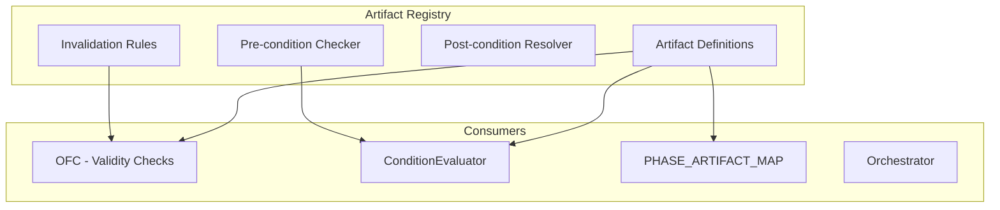
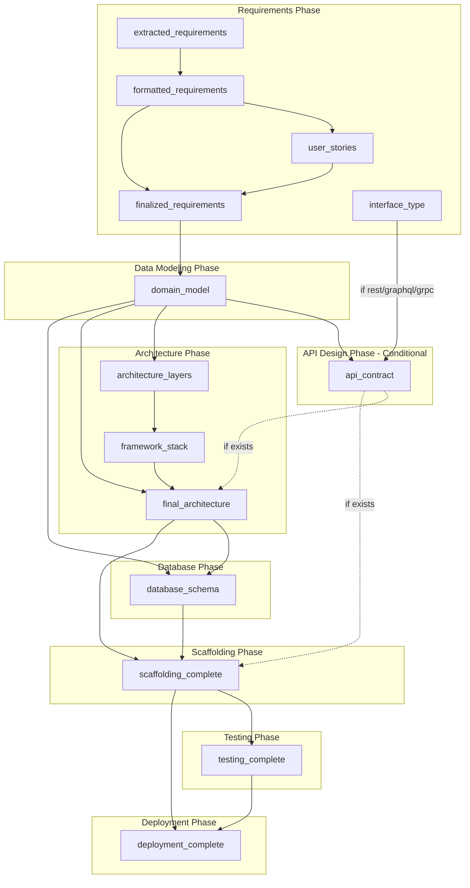

# Artifact Registry

The **Artifact Registry** is a centralized component that serves as the single source of truth for all artifact metadata in the Dev Quickstart Agent. It defines pre-conditions, post-conditions, and invalidation rules for every artifact in the system.

---

## Table of Contents

1. [Overview](#overview)
2. [Architecture](#architecture)
3. [Artifact Definitions](#artifact-definitions)
4. [Integration Points](#integration-points)
5. [Artifact Dependency Graph](#artifact-dependency-graph)
6. [API Reference](#api-reference)

---

## Overview

### The Problem

Before the Artifact Registry:

- Artifact definitions scattered across `PHASE_ARTIFACT_MAP` and hardcoded checks
- No centralized pre-condition validation
- OFC had to use hardcoded artifact lists
- Staleness detection was ad-hoc
- Conditional artifacts (like `api_contract`) required special handling everywhere

### The Solution

The Artifact Registry centralizes ALL artifact metadata:

- **Pre-conditions**: What must exist before an artifact can be created
- **Post-conditions**: What creating an artifact enables
- **Invalidation rules**: What changes should mark an artifact stale
- **Conditional logic**: Runtime checks for optional artifacts



---

## Architecture

### Artifact Definition Schema

Location: `src/dev_quickstart_agent/cognitive/artifacts/artifact_registry.py`

```python
from dataclasses import dataclass

@dataclass
class ArtifactDefinition:
    """Complete definition of an artifact in the system."""
    
    name: str
    """Unique artifact identifier (e.g., 'domain_model')"""
    
    description: str
    """Human-readable description of what this artifact represents"""
    
    producer_agent: str
    """Agent that creates this artifact (e.g., 'data_modeling_agent')"""
    
    producer_action: str
    """Action that produces this artifact (e.g., 'CONFIRM_DOMAIN_MODEL')"""
    
    phase: str
    """SDLC phase this artifact belongs to (e.g., 'data_modeling')"""
    
    pre_conditions: list[str]
    """Artifact names that must exist before this can be created"""
    
    enables: list[str]
    """Artifact names that this artifact enables"""
    
    invalidated_by: list[str]
    """Artifact names that, when modified, make this artifact stale"""
    
    conditional: bool = False
    """Whether this artifact requires a runtime condition check"""
    
    condition_checker: str | None = None
    """Name of condition function if conditional=True"""
```

### Registry Class

```python
class ArtifactRegistry:
    """Centralized registry for all artifact definitions."""
    
    _artifacts: dict[str, ArtifactDefinition] = {}
    
    @classmethod
    def register(cls, artifact: ArtifactDefinition) -> None:
        """Register an artifact definition."""
        cls._artifacts[artifact.name] = artifact
    
    @classmethod
    def get(cls, name: str) -> ArtifactDefinition | None:
        """Get artifact definition by name."""
        return cls._artifacts.get(name)
    
    @classmethod
    def get_pre_conditions(cls, name: str) -> list[str]:
        """Get pre-conditions for an artifact."""
        artifact = cls.get(name)
        return artifact.pre_conditions if artifact else []
    
    @classmethod
    def get_enabled_by(cls, name: str) -> list[str]:
        """Return artifacts that become possible once this artifact exists."""
        return [
            a.name for a in cls._artifacts.values() 
            if name in a.pre_conditions
        ]
    
    @classmethod
    def get_invalidation_sources(cls, name: str) -> list[str]:
        """Get artifacts that can invalidate this one."""
        artifact = cls.get(name)
        return artifact.invalidated_by if artifact else []
    
    @classmethod
    def is_conditional(cls, name: str) -> bool:
        """Check if artifact requires runtime condition check."""
        artifact = cls.get(name)
        return artifact.conditional if artifact else False
    
    @classmethod
    def get_phase_artifacts(cls, phase: str) -> list[str]:
        """Get all artifacts for a given phase."""
        return [
            a.name for a in cls._artifacts.values() 
            if a.phase == phase
        ]
    
    @classmethod
    def get_all_phases(cls) -> list[str]:
        """Get all unique phases in order."""
        return [
            "requirements",
            "data_modeling",
            "api_design",
            "architecture",
            "database",
            "scaffolding",
            "testing",
            "deployment",
        ]
```

---

## Artifact Definitions

### Requirements Phase

```python
ArtifactRegistry.register(ArtifactDefinition(
    name="extracted_requirements",
    description="Raw requirements extracted from user conversation",
    producer_agent="requirements_agent",
    producer_action="EXTRACT_REQUIREMENTS",
    phase="requirements",
    pre_conditions=[],
    enables=["formatted_requirements"],
    invalidated_by=["user_requirement_change"],
))

ArtifactRegistry.register(ArtifactDefinition(
    name="formatted_requirements",
    description="Structured requirements document",
    producer_agent="requirements_agent",
    producer_action="FORMAT_REQUIREMENTS",
    phase="requirements",
    pre_conditions=["extracted_requirements"],
    enables=["user_stories", "finalized_requirements"],
    invalidated_by=["extracted_requirements"],
))

ArtifactRegistry.register(ArtifactDefinition(
    name="user_stories",
    description="User stories derived from requirements",
    producer_agent="requirements_agent",
    producer_action="GENERATE_USER_STORIES",
    phase="requirements",
    pre_conditions=["formatted_requirements"],
    enables=["finalized_requirements"],
    invalidated_by=["formatted_requirements"],
))

ArtifactRegistry.register(ArtifactDefinition(
    name="finalized_requirements",
    description="Validated and confirmed requirements document",
    producer_agent="requirements_agent",
    producer_action="FINALIZE_REQUIREMENTS",
    phase="requirements",
    pre_conditions=["formatted_requirements", "user_stories"],
    enables=["domain_model"],
    invalidated_by=["user_requirement_change"],
))
```

### Data Modeling Phase

```python
ArtifactRegistry.register(ArtifactDefinition(
    name="domain_model",
    description="Business domain entities, relationships, and rules",
    producer_agent="data_modeling_agent",
    producer_action="CONFIRM_DOMAIN_MODEL",
    phase="data_modeling",
    pre_conditions=["finalized_requirements"],
    enables=["api_contract", "architecture_layers", "database_schema"],
    invalidated_by=["finalized_requirements"],
))
```

### API Design Phase (Conditional)

```python
ArtifactRegistry.register(ArtifactDefinition(
    name="api_contract",
    description="API endpoints, schemas, and OpenAPI specification",
    producer_agent="api_design_agent",
    producer_action="CONFIRM_API_CONTRACT",
    phase="api_design",
    pre_conditions=["domain_model"],
    enables=["final_architecture", "scaffolding_complete"],
    invalidated_by=["domain_model"],
    conditional=True,
    condition_checker="interface_type_requires_api",
))
```

### Architecture Phase

```python
ArtifactRegistry.register(ArtifactDefinition(
    name="architecture_layers",
    description="System layers and component organization",
    producer_agent="architecture_agent",
    producer_action="IDENTIFY_ARCHITECTURE_LAYERS",
    phase="architecture",
    pre_conditions=["domain_model"],
    enables=["framework_stack"],
    invalidated_by=["domain_model"],
))

ArtifactRegistry.register(ArtifactDefinition(
    name="framework_stack",
    description="Selected frameworks and technologies",
    producer_agent="architecture_agent",
    producer_action="SELECT_FRAMEWORK_STACK",
    phase="architecture",
    pre_conditions=["architecture_layers"],
    enables=["final_architecture"],
    invalidated_by=["architecture_layers"],
))

ArtifactRegistry.register(ArtifactDefinition(
    name="final_architecture",
    description="Complete system architecture with all components",
    producer_agent="architecture_agent",
    producer_action="ASSEMBLE_ARCHITECTURE",
    phase="architecture",
    pre_conditions=["domain_model", "framework_stack"],
    enables=["database_schema", "scaffolding_complete"],
    invalidated_by=["domain_model", "api_contract"],
))
```

### Database Phase

```python
ArtifactRegistry.register(ArtifactDefinition(
    name="database_schema",
    description="Complete database schema derived from domain model",
    producer_agent="database_agent",
    producer_action="CONFIRM_DATABASE_SCHEMA",
    phase="database",
    pre_conditions=["domain_model", "final_architecture"],
    enables=["scaffolding_complete"],
    invalidated_by=["domain_model", "final_architecture"],
))
```

### Scaffolding Phase

```python
ArtifactRegistry.register(ArtifactDefinition(
    name="scaffolding_complete",
    description="Generated project structure and code",
    producer_agent="scaffolding_agent",
    producer_action="GENERATE_SCAFFOLDING",
    phase="scaffolding",
    pre_conditions=["final_architecture", "database_schema"],
    enables=["testing_complete"],
    invalidated_by=["final_architecture", "database_schema", "api_contract"],
))
```

### Testing & Deployment Phases

```python
ArtifactRegistry.register(ArtifactDefinition(
    name="testing_complete",
    description="Test suites and QA artifacts",
    producer_agent="testing_agent",
    producer_action="GENERATE_TESTS",
    phase="testing",
    pre_conditions=["scaffolding_complete"],
    enables=["deployment_complete"],
    invalidated_by=["scaffolding_complete"],
))

ArtifactRegistry.register(ArtifactDefinition(
    name="deployment_complete",
    description="Deployment configurations and infrastructure code",
    producer_agent="deployment_agent",
    producer_action="GENERATE_DEPLOYMENT",
    phase="deployment",
    pre_conditions=["scaffolding_complete", "testing_complete"],
    enables=[],
    invalidated_by=["scaffolding_complete"],
))
```

---

## Integration Points

### 1. OFC Integration

The OFC uses the Artifact Registry for validity and staleness checks:

```python
# In ofc.py
from dev_quickstart_agent.cognitive.artifacts.artifact_registry import ArtifactRegistry

class OFC:
    def _check_artifact_validity(self, artifact_name: str, state: dict) -> bool:
        """Check if artifact exists and is not stale."""
        definition = ArtifactRegistry.get(artifact_name)
        if not definition:
            return False
        
        # Check if artifact exists
        if artifact_name not in state.get("artifacts", {}):
            return False
        
        # Check staleness via invalidation rules
        for invalidator in definition.invalidated_by:
            if self._artifact_was_modified_since(invalidator, artifact_name, state):
                return False
        
        return True
    
    def _is_artifact_stale(self, artifact_name: str, state: dict) -> bool:
        """Check if artifact is stale based on invalidation rules."""
        definition = ArtifactRegistry.get(artifact_name)
        if not definition:
            return False
        
        artifact_timestamp = state.get("artifact_timestamps", {}).get(artifact_name)
        for invalidator in definition.invalidated_by:
            invalidator_timestamp = state.get("artifact_timestamps", {}).get(invalidator)
            if invalidator_timestamp and invalidator_timestamp > artifact_timestamp:
                return True
        return False
    
    def _fetch_phase_artifacts(self, phase: str, state: dict) -> dict:
        """Fetch artifacts relevant to phase using ArtifactRegistry."""
        artifact_names = ArtifactRegistry.get_phase_artifacts(phase)
        return {
            name: state.get("artifacts", {}).get(name)
            for name in artifact_names
            if name in state.get("artifacts", {})
        }
```

### 2. ConditionEvaluator Integration

The ConditionEvaluator uses the registry for pre-condition checks:

```python
# In condition_evaluator.py
from dev_quickstart_agent.cognitive.artifacts.artifact_registry import ArtifactRegistry

class ConditionEvaluator:
    def artifacts_exist(self, artifact_names: list[str], state: dict) -> bool:
        """Check if all required artifacts exist."""
        for name in artifact_names:
            # Skip conditional artifacts that don't apply
            if ArtifactRegistry.is_conditional(name):
                checker = ArtifactRegistry.get(name).condition_checker
                if not self._check_condition(checker, state):
                    continue
            if name not in state.get("artifacts", {}):
                return False
        return True
    
    def check_artifact_preconditions(self, artifact_name: str, state: dict) -> bool:
        """Check if all pre-conditions for an artifact are met."""
        preconditions = ArtifactRegistry.get_pre_conditions(artifact_name)
        return self.artifacts_exist(preconditions, state)
    
    def interface_type_requires_api(self, state: dict) -> bool:
        """Returns True if interface_type requires API design phase."""
        interface_type = state.get("interface_type")
        return interface_type in ["rest", "graphql", "grpc"]
    
    def api_contract_satisfied(self, state: dict) -> bool:
        """Returns True if api_contract exists OR is not needed."""
        if not self.interface_type_requires_api(state):
            return True
        return "api_contract" in state.get("artifacts", {})
```

### 3. PHASE_ARTIFACT_MAP Derivation

The `PHASE_ARTIFACT_MAP` constant now derives from the registry:

```python
# In constants.py
from dev_quickstart_agent.cognitive.artifacts.artifact_registry import ArtifactRegistry

def get_phase_artifact_map() -> dict[str, list[str]]:
    """Generate PHASE_ARTIFACT_MAP from ArtifactRegistry (single source of truth)."""
    return {
        phase: ArtifactRegistry.get_phase_artifacts(phase)
        for phase in ArtifactRegistry.get_all_phases()
    }

# Legacy constant for backward compatibility
PHASE_ARTIFACT_MAP = get_phase_artifact_map()
```

---

## Artifact Dependency Graph

### Complete Dependency Visualization



### Invalidation Cascade

When an artifact is modified, dependent artifacts become stale:

```
finalized_requirements modified
         │
         ├── domain_model → STALE
         │       │
         │       ├── api_contract → STALE
         │       │       │
         │       │       └── final_architecture → STALE
         │       │               │
         │       │               └── scaffolding_complete → STALE
         │       │
         │       ├── architecture_layers → STALE
         │       │
         │       └── database_schema → STALE
         │
         └── (cascade continues)
```

---

## API Reference

### Registry Methods

| Method | Description | Returns |
|--------|-------------|---------|
| `register(artifact)` | Register an artifact definition | `None` |
| `get(name)` | Get artifact by name | `ArtifactDefinition | None` |
| `get_pre_conditions(name)` | Get pre-conditions for artifact | `list[str]` |
| `get_enabled_by(name)` | Get artifacts enabled by this one | `list[str]` |
| `get_invalidation_sources(name)` | Get invalidators for artifact | `list[str]` |
| `is_conditional(name)` | Check if artifact is conditional | `bool` |
| `get_phase_artifacts(phase)` | Get all artifacts for a phase | `list[str]` |
| `get_all_phases()` | Get all SDLC phases in order | `list[str]` |

### Relationship to Capability Registry

The Artifact Registry and Capability Registry are **complementary** systems:

| Aspect | Capability Registry | Artifact Registry |
|--------|---------------------|-------------------|
| **Organized by** | Agent → Action | Artifact |
| **Primary question** | "What can agents DO?" | "What do artifacts DEPEND ON?" |
| **Primary consumer** | Orchestrator (action selection) | OFC (validity/staleness checks) |
| **Owns** | `produces`, `invalidates` (action-centric) | `pre_conditions`, `enables`, `invalidated_by` |

**The shared key is artifact names** - they MUST match between registries.

### Example Flow

```
Orchestrator asks: "Can I run EXTRACT_DOMAIN_MODEL?"
    │
    ▼
Capability Registry: "Needs artifacts_exist: [finalized_requirements]"
    │
    ▼
ConditionEvaluator: "Is finalized_requirements present and valid?"
    │
    ▼
Artifact Registry: "finalized_requirements exists, not stale"
    │
    ▼
Result: "Yes, action is eligible"
```

---

## File Structure

```
src/dev_quickstart_agent/cognitive/artifacts/
├── __init__.py
├── artifact_registry.py    # ArtifactDefinition dataclass + ArtifactRegistry class
└── tests/
    └── test_artifact_registry.py
```

---

## Success Criteria

1. **Single Source of Truth**: All artifact metadata centralized
2. **Pre-condition Validation**: Programmatic checks for all actions
3. **Staleness Detection**: Automatic invalidation cascade
4. **Conditional Logic**: Runtime checks for optional artifacts
5. **OFC Integration**: Validity checks use registry
6. **ConditionEvaluator Integration**: Pre-condition checks use registry
7. **Backward Compatible**: PHASE_ARTIFACT_MAP derives from registry
