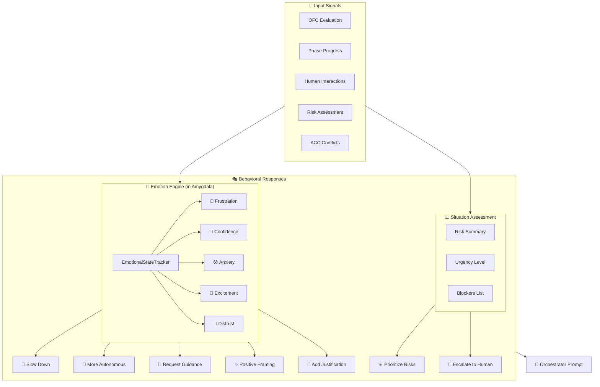

# Cognitive Emotional Intelligence System

> **Status**: Implemented (with pending IC integration)  
> **Location**: `src/dev_quickstart_agent/cognitive/brain/components/emotional_state.py`, `src/dev_quickstart_agent/cognitive/brain/amygdala.py`

## Overview

The system implements a true emotional state tracking mechanism inspired by human emotions. Unlike traditional sentiment analysis, this system tracks **persistent emotional states** that influence agent behavior and decision-making.

### Why Emotional Intelligence?

1. **Behavioral Adaptation** - High frustration → slow down, verify assumptions
2. **Trust Building** - High distrust → explain reasoning thoroughly
3. **Cognitive Safety** - High anxiety → request human guidance
4. **Momentum Preservation** - High excitement → positive framing, celebrate progress
5. **Confidence Calibration** - Low confidence → conservative recommendations

## Architecture



<details>
<summary>ASCII Art Version (for terminal viewing)</summary>

```
┌─────────────────────────────────────────────────────────────────────┐
│ Input Signals                                                        │
├─────────────────────────────────────────────────────────────────────┤
│ • OFC Prediction Accuracy     • Phase Progress                      │
│ • Human Interactions          • Risk Assessment                     │
│ • ACC Conflicts               • User Rejections                     │
└───────────────────────────────┬─────────────────────────────────────┘
                                │
                                ▼
┌─────────────────────────────────────────────────────────────────────┐
│ EmotionalStateTracker (in Amygdala)                                  │
├─────────────────────────────────────────────────────────────────────┤
│ Calculates 5 core emotions from signals:                            │
│ • Frustration - repeated failures, scope changes                    │
│ • Confidence  - prediction accuracy, plan progress                  │
│ • Anxiety     - context overload, unknowns                          │
│ • Excitement  - progress, positive feedback                         │
│ • Distrust    - user overrides, rejections                          │
└───────────────────────────────┬─────────────────────────────────────┘
                                │
                                ▼
┌─────────────────────────────────────────────────────────────────────┐
│ Behavioral Responses                                                 │
├─────────────────────────────────────────────────────────────────────┤
│ • EmotionalPromptModifier - injects behavioral instructions         │
│ • Hard Gates - force human interaction on extreme emotions          │
│ • Response Tone - adjust agent output style                         │
└───────────────────────────────┬─────────────────────────────────────┘
                                │
                                ▼
┌─────────────────────────────────────────────────────────────────────┐
│ Orchestrator Prompt                                                  │
├─────────────────────────────────────────────────────────────────────┤
│ ## System Emotional State (For Decision Context)                    │
│ Dominant Emotion: {dominant_emotion}                                │
│ | Emotion | Level | Behavioral Impact |                             │
│ | Frustration | Medium | Verify assumptions |                       │
└─────────────────────────────────────────────────────────────────────┘
```

</details>

## Core Emotions

### 1. Frustration (0.0 - 1.0)

**Triggers:**
- Repeated clarification requests (3+ in session)
- User changing scope/requirements mid-phase
- OFC predictions consistently wrong
- Same question asked multiple times
- Blocked steps in plan

**Behavioral Response (High Frustration):**
```
BEHAVIORAL OVERRIDE - FRUSTRATION DETECTED:
- Before taking ANY action, explicitly verify your assumptions with the user
- Ask clarifying questions BEFORE making decisions, not after
- Break complex requests into smaller, confirmable steps
- Do NOT assume you understand scope - confirm it
```

### 2. Confidence (0.0 - 1.0)

**Sources:**
- OFC prediction accuracy (rolling average)
- Plan progress (steps completing)
- Validation passing
- Human approval rate
- Insular Cortex calibration

**Behavioral Response (High Confidence):**
```
AUTONOMY ENABLED: Historical accuracy is high.
- You may take initiative on straightforward decisions
- Proceed with recommended actions without excessive hedging
- Trust your analysis - state conclusions confidently
```

**Behavioral Response (Low Confidence):**
```
CAUTION: Recent predictions have been inaccurate.
- Express uncertainty where it exists
- Prefer conservative recommendations
- Seek confirmation before major decisions
```

### 3. Anxiety (0.0 - 1.0)

**Triggers:**
- High context saturation (>75%)
- Many unknowns/missing requirements
- Critical risks present
- Multiple conflicts detected
- Approaching deadlines

**Behavioral Response (High Anxiety):**
```
COMPLEXITY ALERT: System is approaching cognitive limits.
- Prioritize the single most important next step
- Request human guidance for ambiguous decisions
- Do NOT attempt to solve everything at once
- If uncertain, explicitly ask the user for direction
```

### 4. Excitement (0.0 - 1.0)

**Triggers:**
- Phase completing successfully
- Positive user feedback
- Plan steps completing ahead of schedule
- High opportunity score
- Breakthrough moments (first scaffold, first deploy)

**Behavioral Response (High Excitement):**
```
MOMENTUM: Good progress is being made.
- Maintain positive, encouraging tone
- Celebrate completed milestones briefly
- Build on current momentum with clear next steps
```

### 5. Distrust (0.0 - 1.0)

**Triggers:**
- User overriding OFC recommendations
- User rejecting agent suggestions
- Orchestrator deviating from OFC (and being wrong)
- Repeated "no" responses from user
- Human taking over tasks agent offered to do

**Behavioral Response (High Distrust):**
```
TRUST BUILDING REQUIRED: Previous recommendations were overridden.
- Explain your reasoning thoroughly before recommendations
- Acknowledge alternative approaches the user might prefer
- Ask "Does this approach align with what you're thinking?" before proceeding
- Anticipate and address potential objections proactively
```

## Implementation Details

### EmotionalState Dataclass

```python
@dataclass
class EmotionalState:
    """True emotional state of the agent system."""
    
    # Core emotions (0.0 = none, 1.0 = maximum)
    frustration: float = 0.0
    confidence: float = 0.5  # Start neutral
    anxiety: float = 0.0
    excitement: float = 0.0
    distrust: float = 0.0
    
    # Metadata
    last_updated: datetime
    dominant_emotion: str = "neutral"
    
    def get_behavioral_guidance(self) -> dict[str, Any]:
        """Return behavioral modifications based on emotional state."""
        return {
            "slow_down": self.frustration > 0.6,
            "request_human_guidance": self.anxiety > 0.7,
            "take_autonomous_action": self.confidence > 0.8 and self.anxiety < 0.3,
            "use_positive_framing": self.excitement > 0.6,
            "add_justification": self.distrust > 0.5,
            "needs_emotional_reset": self.frustration > 0.8 or self.anxiety > 0.8,
        }
```

### Decay Rates

Emotions naturally decay toward baseline (like human emotions):

```python
FRUSTRATION_DECAY = 0.1    # Decays moderately
ANXIETY_DECAY = 0.15       # Decays moderately
EXCITEMENT_DECAY = 0.2     # Decays quickly (excitement is fleeting)
DISTRUST_DECAY = 0.05      # Decays slowly (trust is hard to rebuild)
```

### Hard Behavioral Gates

Beyond prompt injection, extreme emotional states trigger hard gates:

```python
# High anxiety + critical risks = require human
if behavioral_guidance.get("request_human_guidance"):
    if situation.get("has_critical_risks"):
        state["forced_human_interaction"] = True
        state["force_reason"] = "System anxiety high with critical risks present"

# Extreme frustration = pause and reset
if emotional_state.get("frustration", 0) > 0.9:
    state["needs_emotional_reset"] = True
```

## Situation Assessment (Separate from Emotions)

**Key Distinction:** Emotional state is separate from situation assessment.

- **Situation Assessment**: Objective risk/urgency data
- **Emotional State**: Subjective agent "feelings" that influence behavior

```python
# In Amygdala enrichment
return {
    # Objective data
    "situation_assessment": {
        "urgency": "high",
        "sentiment": "concerning",
        "blockers": ["Requirements clarity low"],
        "has_critical_risks": True,
        "risk_count": 3,
        "opportunity_count": 1,
    },
    # Subjective state
    "emotional_state": {
        "frustration": 0.3,
        "confidence": 0.6,
        "anxiety": 0.4,
        "excitement": 0.2,
        "distrust": 0.1,
        "dominant_emotion": "neutral",
    },
}
```

## Orchestrator Prompt Integration

The orchestrator sees both emotional state and situation assessment:

```markdown
## System Emotional State (For Decision Context)

**Dominant Emotion:** neutral

| Emotion | Level |
|---------|-------|
| Frustration | Minimal |
| Confidence | Medium |
| Anxiety | Minimal |
| Excitement | Low |
| Distrust | Minimal |

Use this emotional state to inform your strategic decisions:
- High frustration/anxiety → Consider simpler next steps, verify assumptions
- Low confidence → Prefer conservative actions, seek confirmation
- High distrust → Ensure clear justification in instructions to agents

---

## Situation Assessment

- **Urgency Level:** medium
- **Sentiment:** concerning
- **Active Blockers:** Requirements clarity low (requirements clarity: 40%)
- **Critical Risks Present:** No
- **Risks Materialized This Session:** 0
- **Assumptions Violated:** 0
```

## Integration with Other Brain Regions

### OFC Integration
- OFC prediction accuracy feeds into confidence calculation
- OFC recalibration needs increase frustration

### ACC Integration
- ACC conflict count increases anxiety
- Detected conflicts influence urgency

### Insular Cortex Integration
- IC provides raw confidence baseline
- IC context saturation feeds anxiety

## Files

| File | Purpose |
|------|---------|
| `cognitive/brain/components/emotional_state.py` | EmotionalState dataclass, EmotionalStateTracker |
| `cognitive/brain/components/emotional_prompt_modifier.py` | Behavioral prompt injection |
| `cognitive/brain/amygdala.py` | Emotion tracking integration |
| `orchestration/orchestrator_node.py` | Behavioral gates, prompt injection |

## Implementation Status

### Completed

1. **IC Confidence Integration** ✅ - EmotionalStateTracker's `_update_confidence()` reads `ic_confidence` from `system_health.confidence_level` and blends it 60/40 with OFC accuracy.

2. **IC Introspection Integration** ✅ - Full integration with InsularCortex signals:
   - `_update_anxiety()` now reads:
     - `system_health.needs_human_review` → increases anxiety
     - `system_health.cognitive_load` (high/critical) → increases anxiety
     - `introspection_insights` warnings (⚠, "novel scenario", "critical phase") → increases anxiety
   - `_update_frustration()` now reads:
     - `introspection_insights` ("declining", "low performance") → increases frustration
     - `confidence_calibration.adjustment_reason == "adjusted_down_overconfident"` → increases frustration
   - `_update_excitement()` now reads:
     - `introspection_insights` ("improving", ✓) → increases excitement
     - `confidence_calibration.adjustment_reason == "well_calibrated"` → increases excitement

3. **OFC Emotion Integration** ✅ - OFC evaluation results feed into emotion calculation:
   - `ofc_recalibration_needed` → reduces confidence, increases frustration
   - `learning_signals.orch_override_effective` → adjusts distrust

### Future Enhancements

1. **Emotion History** - The `emotion_history` field exists in the dataclass but is not yet populated. Future work to track emotional trends over session.
2. **User Emotion Detection** - Infer user emotional state from messages (frustration, enthusiasm, confusion)
3. **Adaptive Thresholds** - Currently all thresholds are static (0.6, 0.7, etc.). Future work to learn optimal thresholds per user.
