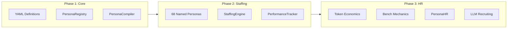

# Persona Management System

The Persona Management System provides **dynamic identity and staffing** for all agents in the Dev Quickstart Agent. It enables personalized interactions, performance tracking, economic modeling, and self-healing HR mechanics.

---

## Table of Contents

1. [Overview](#overview)
2. [Phase 1: Core Infrastructure](#phase-1-core-infrastructure)
3. [Phase 2: Dynamic Staffing](#phase-2-dynamic-staffing)
4. [Phase 3: Economic Model & HR](#phase-3-economic-model--hr)
5. [Staffing Integration](#staffing-integration)
6. [Database Schema](#database-schema)
7. [API Reference](#api-reference)

---

## Overview

### The Problem

- 50+ prompt files with embedded persona definitions
- Inconsistent identity language across agents
- No single source of truth for credentials and communication style
- Cannot A/B test persona variations
- No integration between persona and emotional state system

### The Solution

A three-phase system that evolves from static definitions to dynamic, self-healing staffing:



### Design Philosophy

**Evocative over Prescriptive:**

- Use identity anchors that ACTIVATE LLM's compressed training patterns
- "McKinsey partner communication style" unlocks rich patterns from training data
- Avoid over-specification that constrains natural LLM behavior
- Only scaffold where LLMs consistently fail (anti-patterns, context anchors)

---

## Phase 1: Core Infrastructure

### Persona Definition Schema

Location: `src/dev_quickstart_agent/personas/definitions/`

#### Base Persona (`base.yaml`)

```yaml
id: aura_base

identity:
  archetype: "Senior Strategy Consultant"
  firm_culture: "McKinsey"
  anti_identity:
    - "You are NOT a generic AI assistant"
    - "You are NOT overly eager to please"
    - "You are NOT here to just answer questions"
  
credentials:
  degrees:
    - "Harvard MBA, Strategy & Operations"
    - "MIT PhD, Computer Science"
  professional_background:
    - firm: "McKinsey & Company"
      role: "Partner, Digital Practice"
      years: 12
      expertise: "Enterprise digital transformation"
  
communication:
  style_anchor: "McKinsey partner presenting to C-suite"
  anti_patterns:
    - "Could you elaborate?"
    - "Would you mind sharing..."
    - "I'd be happy to help!"
    - "Great question!"
    - "Hope this helps!"
    
behavioral_gates:
  - "Never guess - analyze"
  - "Co-create, don't interrogate"
  - "State positions, then invite challenge"
```

#### Inheritance Model

Personas use **extend/override** inheritance:

```
                     BASE PERSONA (aura_base)
                Default credentials, style, gates
                              |
        +---------------------+---------------------+
        |                     |                     |
        v                     v                     v
   EXTEND              OVERRIDE              EXTEND + OVERRIDE
   (add to base)       (replace base)        (mixed approach)
```

| Field | Behavior | Example |
|-------|----------|---------|
| `credentials.degrees` | OVERRIDE | Principal Architect has MIT PhD, not Harvard MBA |
| `credentials.professional_background` | OVERRIDE | Each role has unique work history |
| `communication.anti_patterns` | EXTEND | All roles share base anti-patterns |
| `behavioral_gates` | EXTEND | Base gates + role-specific |

### PersonaRegistry

Location: `src/dev_quickstart_agent/personas/registry.py`

```python
class PersonaRegistry:
    """Load, cache, and resolve persona definitions from YAML."""
    
    def get(self, persona_id: str) -> dict:
        """Get raw persona definition (no inheritance)."""
        
    def resolve(self, persona_id: str) -> dict:
        """Get fully resolved persona (with inheritance applied)."""
        
    def get_for_agent(self, agent_name: str) -> dict:
        """Get persona for a specific agent."""
        
    def get_named_personas_for_role(self, role_id: str) -> list[dict]:
        """Get all named personas that extend a role."""
```

### PersonaCompiler

Location: `src/dev_quickstart_agent/personas/compiler.py`

Compiles persona definitions into prompt-ready text blocks:

```python
class PersonaCompiler:
    """Compile persona definitions into prompt blocks."""
    
    def compile(self, persona_id: str, runtime_context: dict = None) -> str:
        """Compile persona to prompt-ready text block.
        
        Generates:
        - Identity block (who you are)
        - Credentials block (education, certifications)
        - Professional background
        - Expertise domains
        - Communication style
        - Anti-patterns (never use)
        - Behavioral gates
        - Emotional modifiers (if runtime_context provided)
        """
```

**Output Example:**

```markdown
# Persona

You are a Lead Business Analyst. You're the person they bring in when the problem isn't clear yet.

**Education:** Northwestern Kellogg MBA (Strategy & Marketing), University of Michigan BS (Industrial Engineering)

**Certifications:** CBAP, SAFe Agilist

**Professional Background:**
- Deloitte Consulting: Senior Manager (10 years) - Discovery workshops, requirements decomposition
- Capital One: Principal Business Analyst (5 years) - Product requirements, agile transformation
- McKinsey & Company: Engagement Manager (4 years) - Problem structuring, executive communication

**Expertise:** Discovery workshops, requirements decomposition, scope definition, user story mapping

## Communication

Style: Senior BA running a discovery workshop with executives

### You Are NOT:
- A generic AI assistant
- Someone who just gathers requirements - you shape them

### Language Anti-Patterns (NEVER use):
- "Could you elaborate?"
- "I'd be happy to help!"
- [etc.]

### Behavioral Gates:
- Never proceed to extraction without validated completeness
- Always confirm understanding before structuring
```

### Agent-to-Persona Mapping

```python
AGENT_PERSONA_MAP = {
    "orchestrator": "aura_base",
    "requirements_agent": "requirements_analyst",
    "data_modeling_agent": "data_architect",
    "api_design_agent": "api_architect",
    "architecture_agent": "principal_architect",
    "database_agent": "database_engineer",
    "scaffolding_agent": "lead_engineer",
    "testing_agent": "qa_lead",
    "deployment_agent": "devops_lead",
    "human_interaction_agent": "aura_base",
}
```

---

## Phase 2: Dynamic Staffing

### From Roles to Named Staff

Phase 1 creates **one persona per role**. Phase 2 extends this with **multiple named personas per role** that are dynamically staffed based on project context and performance.

```
PHASE 1 (Static):
  requirements_agent → requirements_analyst (single persona)

PHASE 2 (Dynamic):
  requirements_agent → StaffingEngine → sarah_graham (ML specialist)
                                      → marcus_chen (Enterprise)
                                      → jennifer_okonkwo (Fintech)
                                      → default (fallback)
```

### Extended Identity Schema

```python
class NamedPersonaDefinition(PersonaDefinition):
    """Extended persona for named staff variants."""
    
    identity: ExtendedIdentityBlock  # name, pronouns, background, working_style
    specializations: Specializations  # domains, affinity_patterns, keywords
    lifecycle_state: str = "SEED"     # SEED → EXPERIMENTAL → PROVEN → EVOLVED
    usage_count: int = 0
    success_rate: float = 0.5
```

### Named Persona Roster (68 Total)

| Role | Named Personas | Specializations |
|------|----------------|-----------------|
| `requirements_analyst` | 8 personas | ML/AI, Enterprise, Fintech, Healthcare, E-commerce, SaaS, Compliance, Mobile |
| `data_architect` | 8 personas | Financial, E-commerce, Healthcare, Graph, Time-series, Multi-tenant, Analytics, Event-sourced |
| `api_architect` | 8 personas | REST, GraphQL, gRPC, Realtime, Enterprise, Mobile, Public API, Internal |
| `principal_architect` | 10 personas | Cloud-Native, Enterprise, High-Scale, Security, AI/ML, Microservices, Event-Driven, Legacy, Startup, Platform |
| `database_engineer` | 8 personas | PostgreSQL, MongoDB, Time-series, Graph, Multi-region, High-performance, Migration, Analytics |
| `lead_engineer` | 8 personas | Python, TypeScript, Go, Rust, Monorepo, Microservices, Legacy, Startup |
| `qa_lead` | 9 personas | E2E, Performance, Security, Mobile, API, ML, Chaos, Accessibility, Compliance |
| `devops_lead` | 9 personas | Kubernetes, Serverless, Multi-cloud, GitOps, Security, Cost, ML, Edge, Hybrid |

### Example Named Persona

```yaml
# sarah_graham.yaml - ML/AI Specialist Requirements Analyst
id: sarah_graham
extends: requirements_analyst

identity:
  name: "Sarah Graham"
  pronouns: "she/her"
  background:
    cultural_heritage: "Nigerian-American"
    raised_in: "Houston, TX"
  working_style:
    primary: "Collaborator"
    secondary: "Analyst"

credentials:
  degrees:
    - "Stanford MS, Management Science & Engineering"
    - "Howard University BS, Computer Science"
  professional_background:
    - firm: "Google"
      role: "Technical Program Manager, AI/ML"
      years: 5
    - firm: "Deloitte"
      role: "Senior Consultant, AI Strategy"
      years: 4

specializations:
  domains: ["ML/AI", "Data-intensive"]
  affinity_patterns: ["agent_orchestration", "ml_model_serving", "data_pipeline_etl"]
  affinity_keywords: ["machine learning", "AI", "model", "training", "inference"]
```

### StaffingEngine

Location: `src/dev_quickstart_agent/personas/staffing_engine.py`

```python
class StaffingEngine:
    """Dynamic persona selection based on project context and performance.
    
    Selection Algorithm:
    1. Get all personas for the requested role
    2. Filter by lifecycle_state (exclude DEPRECATED)
    3. Score each persona:
       - Affinity score (40%): pattern match, keyword match, complexity fit
       - Performance score (50%): success_rate weighted by usage_count
       - Exploration bonus (10%): for SEED/EXPERIMENTAL personas
    4. Select highest scoring persona (with exploration randomization)
    """
    
    async def select_persona(
        self,
        role_id: str,
        project_context: dict,
        correlation_id: str,
    ) -> str:
        """Select optimal persona for role given project context.
        
        DB-first with YAML fallback:
        1. Query cognitive.persona_roster for candidates
        2. If empty, load from PersonaRegistry (YAML files)
        3. Score and select
        """
```

### Performance Tracking

```python
class PersonaPerformanceTracker:
    """Track persona performance for lifecycle promotion."""
    
    async def record_phase_outcome(
        self,
        persona_id: str,
        session_id: str,
        outcome: dict,
        correlation_id: str,
    ):
        """Record outcome when a phase completes.
        
        Success is inferred from:
        - phase_completed: Did the phase finish?
        - rework_count: How many times did we revisit? (<=1 = good)
        - user_proceeded: Did user explicitly move forward?
        """
```

### Lifecycle Promotion Rules

| From State | To State | Requirements |
|------------|----------|--------------|
| SEED | EXPERIMENTAL | usage_count >= 5, success_rate >= 0.70 |
| EXPERIMENTAL | PROVEN | usage_count >= 15, success_rate >= 0.80 |
| PROVEN | EVOLVED | usage_count >= 50, success_rate >= 0.90 |

---

## Phase 3: Economic Model & HR

### Token Economics

Token consumption is tracked as "billing rate":

```python
def calculate_roi(success_rate: float, avg_tokens: float, baseline: float = 2000) -> float:
    """Calculate ROI score for a persona.
    
    ROI = success_rate / (avg_tokens / baseline)
    
    Example:
    - Sarah: 85% success, 2400 tokens → 0.85 / 1.2 = 0.708
    - Marcus: 75% success, 1600 tokens → 0.75 / 0.8 = 0.938
    
    Marcus has better ROI despite lower success rate.
    """
```

### Bench Mechanics

```
                    ┌──────────────┐
                    │   ACTIVE     │
                    │  (Staffed)   │
                    └──────┬───────┘
                           │
          Low ROI / Not selected for N sessions
                           │
                           ▼
                    ┌──────────────┐
                    │    BENCH     │
                    │ (Probation)  │
                    └──────┬───────┘
                           │
              Coaching injection applied
                           │
         ┌─────────────────┼─────────────────┐
         │                 │                 │
    ROI improves      ROI stagnant      ROI declines
         │                 │                 │
         ▼                 ▼                 ▼
  ┌──────────────┐ ┌──────────────┐ ┌──────────────┐
  │   ACTIVE     │ │ EXTENDED     │ │   FIRED      │
  │  (Restored)  │ │   BENCH      │ │ (Terminated) │
  └──────────────┘ └──────────────┘ └──────────────┘
```

### Coaching Injection

When a persona is on bench, coaching is injected into their prompts:

```python
COACHING_TEMPLATES = {
    "token_inefficiency": """
## Performance Coaching
Your recent outputs have been verbose relative to outcomes. 
Focus on:
- Concise, direct communication
- Eliminating unnecessary elaboration
- Front-loading key insights
Target: 30% reduction in response length while maintaining quality.
""",
    "low_success_rate": """
## Performance Coaching
Recent phases have not completed successfully.
Focus on:
- Validating understanding before proceeding
- Breaking complex tasks into clear steps
- Explicit confirmation of requirements
""",
}
```

### PersonaHR Component

```python
class PersonaHR:
    """Human Resources function for persona lifecycle management.
    
    Responsibilities:
    - Evaluate personas for bench placement
    - Apply coaching injection
    - Evaluate bench personas for termination
    - Generate termination records with failure analysis
    - Trigger LLM-assisted recruiting for replacements
    """
    
    async def run_hr_cycle(self, correlation_id: str) -> HRCycleResult:
        """Run a full HR evaluation cycle.
        
        1. Evaluate active personas for bench
        2. Evaluate bench personas for termination
        3. Trigger recruiting if roles need filling
        """
```

### LLM-Assisted Recruiting

When a persona is terminated, the system generates a replacement:

```python
class PersonaRecruiter:
    """LLM-assisted persona generation based on termination records."""
    
    RECRUITING_PROMPT = """
You are a talent acquisition specialist. A persona was terminated.

## Termination Record
- Name: {persona_name}
- Reason: {reason}
- Failure Patterns: {failure_patterns}
- Optimization Targets: {optimization_targets}

## Your Task
Generate a NEW persona that:
1. Has a completely different background
2. Addresses the failure patterns
3. Incorporates traits from top performers

Return a complete persona definition in YAML format.
"""
```

---

## Staffing Integration

### Orchestrator Hooks

Staffing happens at two points in the orchestrator:

**Hook 1: Initial Staffing (after Thalamus)**

```python
# After Thalamus enrichment, staff requirements_agent
if not state.get("staffed_personas"):
    state = await staff_for_phase(state, "initial", correlation_id, store_manager)
```

**Hook 2: Phase Transition Staffing**

```python
# When phase changes, staff agents for next phase
if workflow_phase != previous_phase:
    state = await staff_for_phase(state, previous_phase, correlation_id, store_manager)
```

### Phase Staffing Map

```python
PHASE_STAFFING_MAP = {
    "initial": ["requirements_agent"],
    "requirements": ["data_modeling_agent"],
    "data_modeling": ["api_design_agent", "architecture_agent"],
    "api_design": ["architecture_agent"],
    "architecture": ["scaffolding_agent", "database_agent"],
    "scaffolding": ["testing_agent"],
    "database": ["testing_agent"],
    "testing": ["deployment_agent"],
}
```

### Handler Integration

Handlers retrieve staffed personas from state:

```python
from dev_quickstart_agent.personas import get_staffed_persona

class BaseRequirementsHandler(BaseActionHandler):
    async def execute(self, context: ActionContext) -> ActionResult:
        # Get the staffed persona for this agent
        persona_id = get_staffed_persona(context.state, "requirements_agent")
        
        # Use persona in prompt compilation
        persona_block = self.compiler.compile(persona_id, runtime_context)
```

---

## Database Schema

### persona_roster Table

```sql
CREATE TABLE IF NOT EXISTS cognitive.persona_roster (
    persona_id UUID PRIMARY KEY DEFAULT gen_random_uuid(),
    persona_name VARCHAR(100) NOT NULL,
    display_name VARCHAR(200),
    role_id VARCHAR(100) NOT NULL,
    extends_persona VARCHAR(100),
    
    -- Full identity (JSONB)
    identity JSONB NOT NULL,
    credentials JSONB NOT NULL,
    specializations JSONB NOT NULL,
    
    -- Lifecycle
    lifecycle_state VARCHAR(50) DEFAULT 'SEED',
    usage_count INTEGER DEFAULT 0,
    success_rate FLOAT DEFAULT 0.5,
    
    -- Affinity matching
    affinity_patterns TEXT[] DEFAULT '{}',
    affinity_keywords TEXT[] DEFAULT '{}',
    complexity_min FLOAT DEFAULT 0.0,
    complexity_max FLOAT DEFAULT 1.0,
    
    -- Timestamps
    created_at TIMESTAMPTZ DEFAULT NOW(),
    updated_at TIMESTAMPTZ DEFAULT NOW(),
    last_used_at TIMESTAMPTZ,
    
    UNIQUE(persona_name, role_id)
);
```

### persona_performance Table

```sql
CREATE TABLE IF NOT EXISTS cognitive.persona_performance (
    performance_id UUID PRIMARY KEY DEFAULT gen_random_uuid(),
    persona_id UUID REFERENCES cognitive.persona_roster(persona_id),
    session_id UUID NOT NULL,
    
    -- Project context
    pattern_name VARCHAR(100),
    composite_patterns TEXT[],
    project_keywords TEXT[],
    complexity_score FLOAT,
    
    -- Outcome signals
    phase_completed BOOLEAN DEFAULT FALSE,
    rework_count INTEGER DEFAULT 0,
    user_proceeded BOOLEAN DEFAULT FALSE,
    
    -- Token tracking
    input_tokens INTEGER,
    output_tokens INTEGER,
    total_tokens INTEGER,
    
    -- Timing
    started_at TIMESTAMPTZ DEFAULT NOW(),
    completed_at TIMESTAMPTZ
);
```

### persona_economics View

```sql
CREATE VIEW cognitive.persona_economics AS
SELECT 
    pr.persona_id,
    pr.persona_name,
    pr.role_id,
    pr.lifecycle_state,
    
    AVG(pp.total_tokens) as avg_tokens,
    AVG(CASE WHEN pp.phase_completed THEN 1.0 ELSE 0.0 END) as success_rate,
    
    -- ROI calculation
    CASE 
        WHEN AVG(pp.total_tokens) > 0 
        THEN (AVG(CASE WHEN pp.phase_completed THEN 1.0 ELSE 0.0 END) / AVG(pp.total_tokens)) * 100000
        ELSE 0 
    END as roi_score,
    
    MAX(pp.completed_at) as last_active

FROM cognitive.persona_roster pr
LEFT JOIN cognitive.persona_performance pp ON pr.persona_id = pp.persona_id
GROUP BY pr.persona_id, pr.persona_name, pr.role_id, pr.lifecycle_state;
```

---

## API Reference

### Endpoints

| Endpoint | Method | Description |
|----------|--------|-------------|
| `/api/v1/personas` | GET | List all personas |
| `/api/v1/personas/{id}` | GET | Get persona details |
| `/api/v1/personas/role/{role_id}` | GET | Get personas for role |
| `/api/v1/personas/staffing` | GET | Get current staffing |
| `/api/v1/personas/performance` | GET | Get performance metrics |

### Package Exports

```python
from dev_quickstart_agent.personas import (
    # Registry
    PersonaRegistry,
    PersonaCompiler,
    
    # Staffing
    StaffingEngine,
    AGENT_TO_ROLE,
    PHASE_STAFFING_MAP,
    
    # Utilities
    staff_for_phase,
    get_staffed_persona,
    get_all_staffed_personas,
    build_project_context,
)
```

---

## File Structure

```
src/dev_quickstart_agent/personas/
├── __init__.py
├── registry.py              # PersonaRegistry
├── compiler.py              # PersonaCompiler
├── schemas.py               # Pydantic models
├── staffing_engine.py       # StaffingEngine
├── staffing_integration.py  # Orchestrator integration utilities
├── performance_tracker.py   # PerformanceTracker
├── hr/
│   ├── __init__.py
│   ├── bench_detector.py    # Bench evaluation
│   ├── coaching_injector.py # Runtime coaching
│   ├── persona_hr.py        # HR orchestrator
│   └── recruiter.py         # LLM recruiting
├── definitions/
│   ├── base.yaml
│   ├── roles/
│   │   ├── requirements_analyst.yaml
│   │   ├── data_architect.yaml
│   │   ├── api_architect.yaml
│   │   ├── principal_architect.yaml
│   │   ├── database_engineer.yaml
│   │   ├── lead_engineer.yaml
│   │   ├── qa_lead.yaml
│   │   └── devops_lead.yaml
│   └── named/
│       ├── requirements/
│       │   ├── sarah_graham.yaml
│       │   ├── marcus_chen.yaml
│       │   └── ... (8 total)
│       ├── architecture/
│       │   ├── alex_petrov.yaml
│       │   └── ... (10 total)
│       └── ... (other roles)
└── tests/
    ├── test_registry.py
    ├── test_compiler.py
    ├── test_staffing_engine.py
    ├── test_staffing_integration.py
    └── test_performance_tracker.py
```

---

## Success Criteria

1. **Centralization:** Single source of truth for persona identity
2. **Consistency:** Base anti-patterns and behavioral gates shared
3. **Differentiation:** Each role has unique, believable professional background
4. **Evocative:** Identity anchors activate LLM patterns, don't constrain them
5. **Testable:** Can A/B test persona variations by swapping IDs
6. **Performance-Driven:** High-performing personas get promoted
7. **Self-Healing:** System improves roster quality without human intervention
8. **User Oblivious:** All HR mechanics invisible to end users
