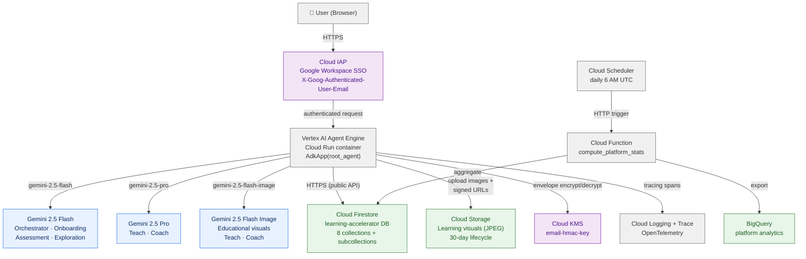
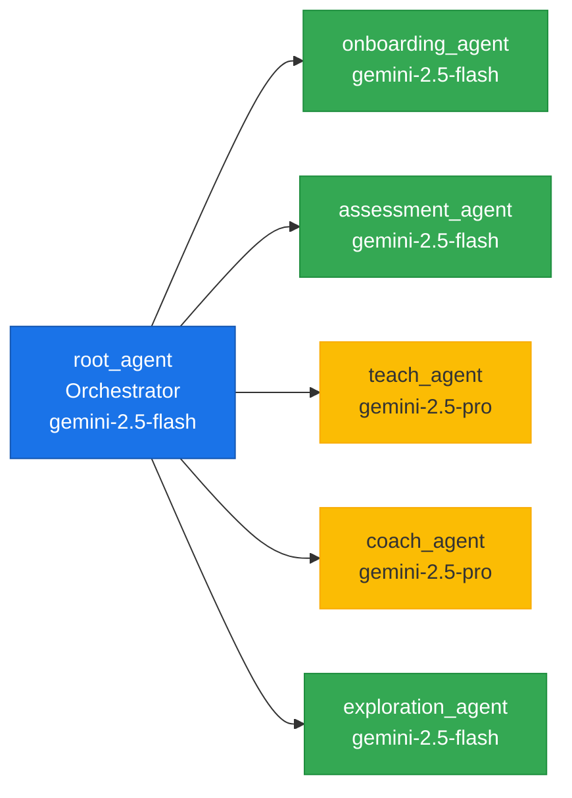

# Learning Accelerator — Architecture Overview

> **Last Updated**: 2026-03-25
> **Platform**: Vertex AI Agent Engine (Cloud Run) · Firestore · Cloud KMS
> **Framework**: Google Agent Development Kit (ADK) v1.22.1+

## Architecture Documents

- [01_system_architecture.md](01_system_architecture.md) — Infrastructure, deployment, GCP services, IAM, observability
- [02_agent_architecture.md](02_agent_architecture.md) — Agent hierarchy, state machine, tool distribution, handoff protocol, prompt design
- [03_database_architecture.md](03_database_architecture.md) — Firestore collections, subcollection hierarchy, access patterns, pseudonymization
- [04_integrated_flow.md](04_integrated_flow.md) — End-to-end user journey, assessment pipeline, learning path composition, cross-agent data flow
- [05_llm_curriculum_and_metrics.md](05_llm_curriculum_and_metrics.md) — LLM-driven curriculum model, generative content engine, adaptive assessment, pedagogical design, persona personalization, engagement analytics, platform health metrics

## High-Level System Map



## Agent Hierarchy (Quick Reference)



## Key Design Decisions

| Decision | Rationale |
|----------|-----------|
| **Firestore over Cloud SQL** | No VPC required — public HTTPS APIs simplify Agent Engine deployment. Subcollections model hierarchical quiz data naturally |
| **Pickle-based deployment** | Org-proven pattern for Agent Engine. `cloudpickle` serializes the entire `AdkApp` + dependency tarball to GCS |
| **HMAC-SHA256 pseudonymization** | Emails never stored in plaintext. KMS envelope encryption with multi-key rotation support. Deterministic hashing enables lookups |
| **Pre-generated assessment questions** | All 20 questions generated at session creation, not on-demand. Eliminates latency between questions. LLM persona-specific generation with template fallback |
| **State-based agent routing** | User's `state` field in Firestore determines which sub-agent handles the conversation. Orchestrator reads state, dispatches accordingly |
| **Auto-identification callback** | `before_agent_callback` on root_agent extracts IAP email, pre-loads user session state. Returning users are never asked for their email |
| **Session state pre-loading** | All sub-agent prompts render `{user:name?}`, `{user:email?}`, etc. from session state. Agents check state before calling `find_user_by_email` |
| **Gemini Flash Image for visuals** | Teach and Coach agents generate inline educational illustrations via `generate_learning_visual`. JPEG output, 16:9/1:1 aspect ratios, no person generation |
| **gemini-2.5-pro for Teach/Coach** | Higher capability needed for adaptive pedagogy, analogies, Socratic method. Flash sufficient for structured routing and quiz presentation |

## File Structure Reference

```
learning_accelerator/
├── __init__.py                    # Exports root_agent (ADK entrypoint)
├── agent.py                       # All 6 agent definitions
├── logging_config.py              # Dev/prod logging (K_SERVICE detection)
├── crypto/
│   └── hmac_service.py            # KMS envelope encryption, multi-key support
├── data/
│   ├── personas.py                # 7 BM&C persona contexts (~600 lines)
│   ├── question_templates.py      # 20 assessment templates (beginner→advanced)
│   └── test_users.py              # Seed user definitions
├── database/
│   ├── enums.py                   # Persona, ProficiencyLevel, UserState, ProgressStatus
│   ├── firestore_db.py            # All Firestore operations (~1000 lines)
│   ├── init.py                    # Idempotent database seeding
│   ├── seed.py                    # Curriculum module definitions (4 tracks)
│   ├── connection.py              # Legacy SQLAlchemy (migration scripts only)
│   └── models.py                  # Legacy ORM models (migration scripts only)
├── prompts/
│   ├── orchestrator_agent.md      # Routing & state dispatch rules
│   ├── onboarding_agent.md        # Account creation flow
│   ├── assessment_agent.md        # 20-question adaptive quiz
│   ├── teach_agent.md             # 5-phase lesson delivery
│   ├── coach_agent.md             # Remediation & support
│   └── exploration_agent.md       # Advanced topic creation
└── tools/
    ├── _helpers.py                # Internal: hashing, validation, session state, _require_user()
    ├── auth_tools.py              # IAP header extraction
    ├── assessment_tools.py        # Quiz sessions, answer recording, scoring
    ├── calendar_tools.py          # ICS generation (DISABLED in production)
    ├── image_tools.py             # Gemini 2.5 Flash Image generation, GCS upload, signed URLs
    ├── module_tools.py            # Module fetch & details
    ├── path_tools.py              # Learning path creation, progress
    ├── progress_tools.py          # Session management, module lifecycle
    └── user_tools.py              # Account CRUD, state transitions
```
