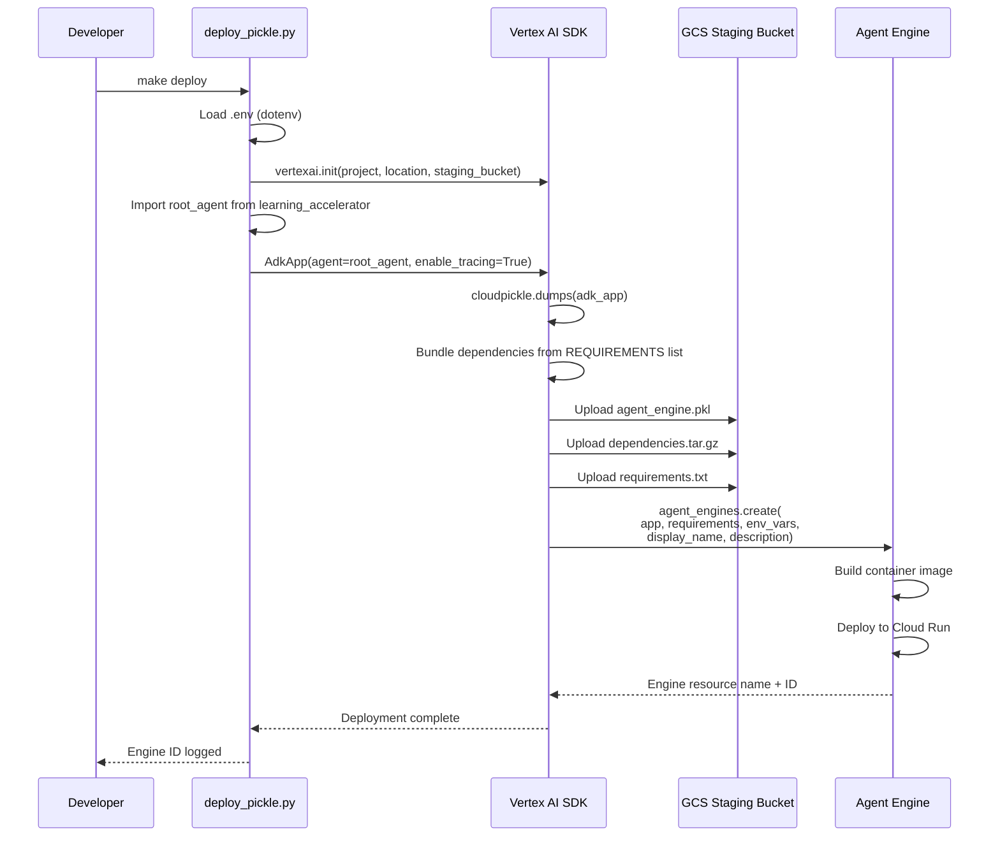
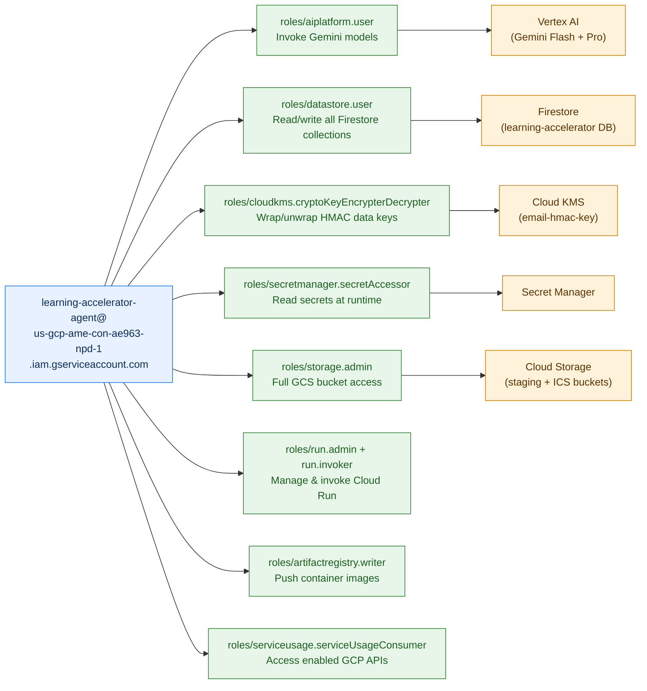
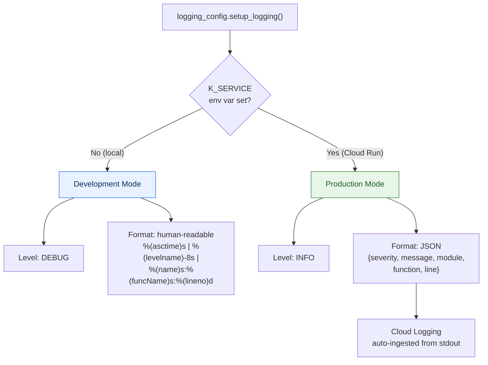
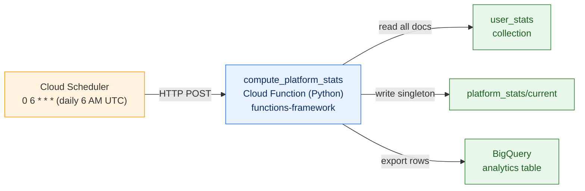

# System Architecture — Learning Accelerator

> **Last Updated**: 2026-03-25
> **Scope**: GCP infrastructure, deployment pipeline, service-to-service communication, IAM, observability, scheduled jobs
> **Runtime**: Vertex AI Agent Engine (Cloud Run) in `us-central1`

## 1. Infrastructure Topology

The Learning Accelerator runs as a **single pickled agent** on Vertex AI Agent Engine.
No VPC, no sidecar services, no message queues. The agent communicates with
GCP services over public HTTPS APIs using a dedicated service account.

```mermaid
flowchart TD
  classDef infra fill:#f0f0f0,stroke:#666,color:#333
  classDef compute fill:#e8f1ff,stroke:#1f6feb,color:#0b2c5c
  classDef data fill:#e8f5e9,stroke:#2e7d32,color:#1b5e20
  classDef security fill:#f3e5f5,stroke:#7b1fa2,color:#4a148c
  classDef observe fill:#fff2db,stroke:#d17b00,color:#5c3200
  classDef scheduled fill:#fff3e0,stroke:#ff9800,color:#333,stroke-dasharray: 5 5

  subgraph Entry["Entry Points"]
    User["👤 User (Browser)"]:::infra
    DevWeb["ADK Web UI<br/>adk web . (dev only)<br/>localhost:8000"]:::infra
    DevCLI["ADK CLI<br/>adk run (dev only)"]:::infra
  end

  subgraph Identity["Identity Layer"]
    IAP["Cloud IAP<br/>Google Workspace SSO<br/>X-Goog-Authenticated-User-Email<br/>X-Goog-Iap-Jwt-Assertion"]:::security
  end

  subgraph Compute["Compute — Vertex AI Agent Engine"]
    AE["Agent Engine Container<br/>Cloud Run auto-scaled<br/>Engine ID: 8197853693337403392"]:::compute
    PKL["agent_engine.pkl<br/>Cloudpickled AdkApp<br/>(root_agent + all sub-agents)"]:::compute
    DEPS["dependencies.tar.gz<br/>Bundled Python packages"]:::compute
    ENV["Container Environment<br/>PROJECT · LOCATION<br/>GOOGLE_GENAI_USE_VERTEXAI=1<br/>FIRESTORE_DATABASE<br/>KMS_KEY_RING · KMS_CRYPTO_KEY<br/>IMAGE_BUCKET_NAME<br/>ICS_BUCKET_NAME"]:::compute
  end

  subgraph Models["AI Models — Vertex AI"]
    Flash["Gemini 2.5 Flash<br/>4 agents: orchestrator,<br/>onboarding, assessment, exploration<br/>+ question generation (temp=0.7)"]:::compute
    Pro["Gemini 2.5 Pro<br/>2 agents: teach, coach<br/>Higher reasoning for pedagogy"]:::compute
    FlashImg["Gemini 2.5 Flash Image<br/>Educational visuals:<br/>concept cards, analogy anchors,<br/>achievement images<br/>Used by teach + coach agents"]:::compute
  end

  subgraph Data["Data Layer"]
    FS["Cloud Firestore<br/>Named DB: learning-accelerator<br/>Public HTTPS API (no VPC)<br/>8 top-level collections<br/>+ nested subcollections"]:::data
    GCS["Cloud Storage<br/>Staging: gs://...-learning-accelerator<br/>Deployment artifacts<br/>Learning visuals (JPEG, 30-day lifecycle)<br/>ICS files (disabled)"]:::data
  end

  subgraph Security["Security Layer"]
    KMS["Cloud KMS<br/>Key Ring: learning-accelerator<br/>Key: email-hmac-key<br/>Envelope encryption for HMAC data keys"]:::security
    SM["Secret Manager<br/>API keys at runtime"]:::security
  end

  subgraph Observe["Observability"]
    OTEL["OpenTelemetry<br/>google-genai instrumentation<br/>Auto-tracing on LLM calls"]:::observe
    CL["Cloud Logging<br/>JSON structured (prod)<br/>Human-readable (dev)"]:::observe
    CT["Cloud Trace<br/>Span export via<br/>CloudTraceSpanExporter"]:::observe
  end

  subgraph Scheduled["Scheduled Jobs"]
    Sched["Cloud Scheduler<br/>Daily 6 AM UTC"]:::scheduled
    CF["Cloud Function<br/>compute_platform_stats<br/>HTTP-triggered"]:::scheduled
    BQ["BigQuery<br/>Platform analytics export"]:::scheduled
  end

  %% Entry paths
  User -- "HTTPS" --> IAP
  IAP -- "authenticated" --> AE
  DevWeb -- "localhost" --> AE
  DevCLI -- "stdin/stdout" --> AE

  %% Compute internals
  AE --> PKL
  AE --> DEPS
  ENV --> AE

  %% Model calls
  AE -- "generateContent()" --> Flash
  AE -- "generateContent()" --> Pro
  AE -- "generateContent()<br/>(image modality)" --> FlashImg

  %% Data access
  AE -- "Firestore SDK<br/>(public HTTPS)" --> FS
  AE -- "GCS SDK" --> GCS

  %% Security
  AE -- "encrypt/decrypt<br/>data keys" --> KMS
  AE -- "read secrets" --> SM

  %% Observability
  AE -- "spans" --> OTEL
  OTEL --> CL
  OTEL --> CT

  %% Scheduled
  Sched -- "HTTP trigger" --> CF
  CF -- "read user_stats" --> FS
  CF -- "write platform_stats/current" --> FS
  CF -- "export" --> BQ
```



## 2. Deployment Pipeline

Deployment uses the **cloudpickle-based** approach proven by other teams in the org.
The entire `AdkApp` (root agent + sub-agents + tools + prompts) is serialized into
a pickle, bundled with a dependency tarball, and uploaded to Agent Engine.



### Deployment requirements (bundled in container)

```python
REQUIREMENTS = [
    "google-cloud-aiplatform[adk,agent_engines]",   # v1.134.0+
    "google-cloud-secret-manager",
    "google-cloud-firestore",                        # v2.22.0+
    "google-cloud-kms",                              # v2.24.1+
    "google-cloud-storage>=2.19.0",
    "google-adk>=1.0.0",                             # v1.22.1+
    "google-genai",                                  # v1.56.0+
    "pydantic",                                      # v2.12.5+
    "python-dotenv",                                 # v1.2.1+
    "opentelemetry-instrumentation-google-genai>=0.7b0",
]
```

### Local testing mode

`deploy_pickle.py --test-local` creates the `AdkApp` in-process, opens a session,
and streams a test query — validates the full agent chain without a GCP deployment.

## 3. Environment Configuration

### Container environment variables (set at deploy time)

| Variable | Value | Purpose |
|----------|-------|---------|
| `PROJECT` | `us-gcp-ame-con-ae963-npd-1` | GCP project ID |
| `LOCATION` | `us-central1` | Region |
| `GOOGLE_GENAI_USE_VERTEXAI` | `1` | Route genai SDK through Vertex AI (not AI Studio) |
| `GOOGLE_CLOUD_AGENT_ENGINE_ENABLE_TELEMETRY` | `true` | Agent Engine tracing |
| `FIRESTORE_DATABASE` | `learning-accelerator` | Named Firestore database (not `(default)`) |
| `KMS_KEY_RING` | `learning-accelerator` | Cloud KMS key ring |
| `KMS_CRYPTO_KEY` | `email-hmac-key` | KMS crypto key for HMAC data key wrapping |
| `ICS_BUCKET_NAME` | `{project_id}-learning-accelerator` | GCS bucket for ICS files (currently disabled) |
| `IMAGE_BUCKET_NAME` | `{project_id}-learning-accelerator` | GCS bucket for generated learning visuals (JPEG, V4 signed URLs, 7-day expiry, 30-day lifecycle) |

### Auto-detected runtime variables

| Variable | Detected By | Indicates |
|----------|-------------|-----------|
| `K_SERVICE` | Cloud Run | **Production mode** — enables JSON logging, idempotent DB seeding at startup |
| `GOOGLE_CLOUD_PROJECT` | Agent Engine | GCP project (resolves to project **number** in Agent Engine, not ID) |

### Development-only variables (`.env` file, never deployed)

| Variable | Purpose |
|----------|---------|
| `EMAIL_HMAC_SECRET` | Local dev fallback for HMAC (bypasses KMS) |
| `GCP_STAGING_BUCKET` | GCS staging bucket URI for deployment |
| `AGENT_SERVICE_ACCOUNT` | SA email used in `deploy_pickle.py` |
| `ALLOW_INSECURE_FALLBACK` | Allow dev HMAC fallback (default: false) |
| `SIGNING_SERVICE_ACCOUNT` | SA email for IAM signBlob fallback when signing GCS URLs with user credentials (local dev) |

## 4. IAM Architecture

The agent runs under a dedicated service account with least-privilege bindings.
No user-level credentials, no API keys in code.



## 5. Logging & Observability

### Environment detection

The logging system auto-detects production via the `K_SERVICE` environment variable
(set by Cloud Run / Agent Engine). No configuration needed.



### Tracing

- **OpenTelemetry** instrumentation via `opentelemetry-instrumentation-google-genai` — auto-traces all LLM calls
- Agent Engine enables `GOOGLE_CLOUD_AGENT_ENGINE_ENABLE_TELEMETRY=true` for built-in span export
- All spans visible in **Cloud Trace** console under the project

## 6. Scheduled Jobs — Platform Statistics

A Cloud Function runs daily to aggregate per-user metrics into platform-wide KPIs.



### Metrics computed

| Category | Fields |
|----------|--------|
| **Users** | `total_users`, `active_users_7d`, `active_users_30d` |
| **Learning** | `total_learning_hours`, `total_modules_delivered`, `total_custom_modules` |
| **Engagement** | `avg_time_to_completion_days`, `avg_session_minutes`, `avg_streak_days` |
| **Outcomes** | `completion_rate` |
| **Persona breakdown** | All above fields broken down per persona in `by_persona` map |

## 7. Makefile Targets

| Target | Command | Purpose |
|--------|---------|---------|
| `setup` | `uv venv` + `uv pip install` | Create venv (Python 3.13), install deps |
| `web` | `adk web .` | Start ADK web UI at localhost:8000 |
| `run` | `adk run learning_accelerator` | Run agent in CLI mode |
| `init-db` | `python scripts/init_database.py` | Seed Firestore (idempotent) |
| `seed-users` | `python scripts/import_users.py $(FILE)` | Bulk import users from CSV |
| `lint` | `ruff check learning_accelerator/` | Run ruff linter |
| `format` | `black . && ruff check --fix .` | Format + auto-fix |
| `typecheck` | `mypy learning_accelerator/` | Strict type checking |
| `test` | `lint` + `typecheck` | All quality checks |
| `deploy` | `python deploy_pickle.py --deploy` | Deploy to Agent Engine |
| `clean` | Remove `__pycache__`, `.pyc`, caches | Clean build artifacts |

## 8. Key Characteristics

| Aspect | Design |
|--------|--------|
| **Runtime** | Vertex AI Agent Engine (Cloud Run container, auto-scaled) |
| **Framework** | Google ADK v1.22.1+ — `root_agent` export is the entrypoint |
| **Models** | Gemini 2.5 Flash (4 agents) + Gemini 2.5 Pro (2 agents) via Vertex AI |
| **Database** | Cloud Firestore (named DB `learning-accelerator`, public HTTPS, no VPC) |
| **Auth** | Cloud IAP for users, IAM service account for service-to-service |
| **Email privacy** | HMAC-SHA256 pseudonymization with KMS envelope encryption |
| **Deployment** | Pickle-based — `cloudpickle` serializes `AdkApp`, GCS staging, Agent Engine create |
| **Observability** | OpenTelemetry genai instrumentation → Cloud Logging (JSON) + Cloud Trace |
| **Aggregation** | Daily Cloud Function → `platform_stats/current` in Firestore + BigQuery export |
| **Config** | Environment variables only — no config files in container, no hardcoded secrets |
| **Linting** | ruff + black + mypy strict — enforced pre-commit |
| **Testing** | 167 unit tests, pytest, full mocking (no network IO in tests) |
| **Python** | 3.13 (runtime), 3.11 minimum (pyproject.toml) |
| **Package manager** | uv (fast resolver, lockfile at `uv.lock`) |
