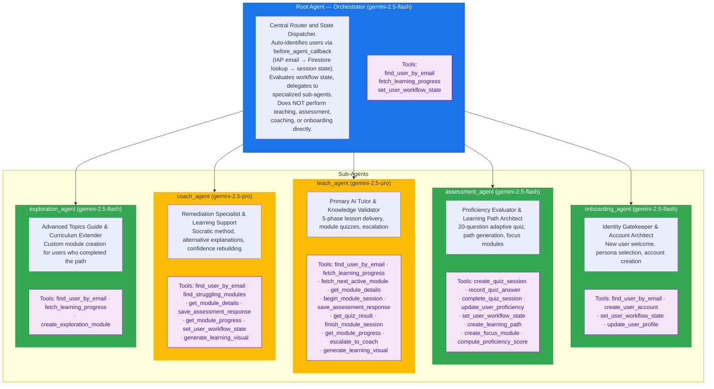
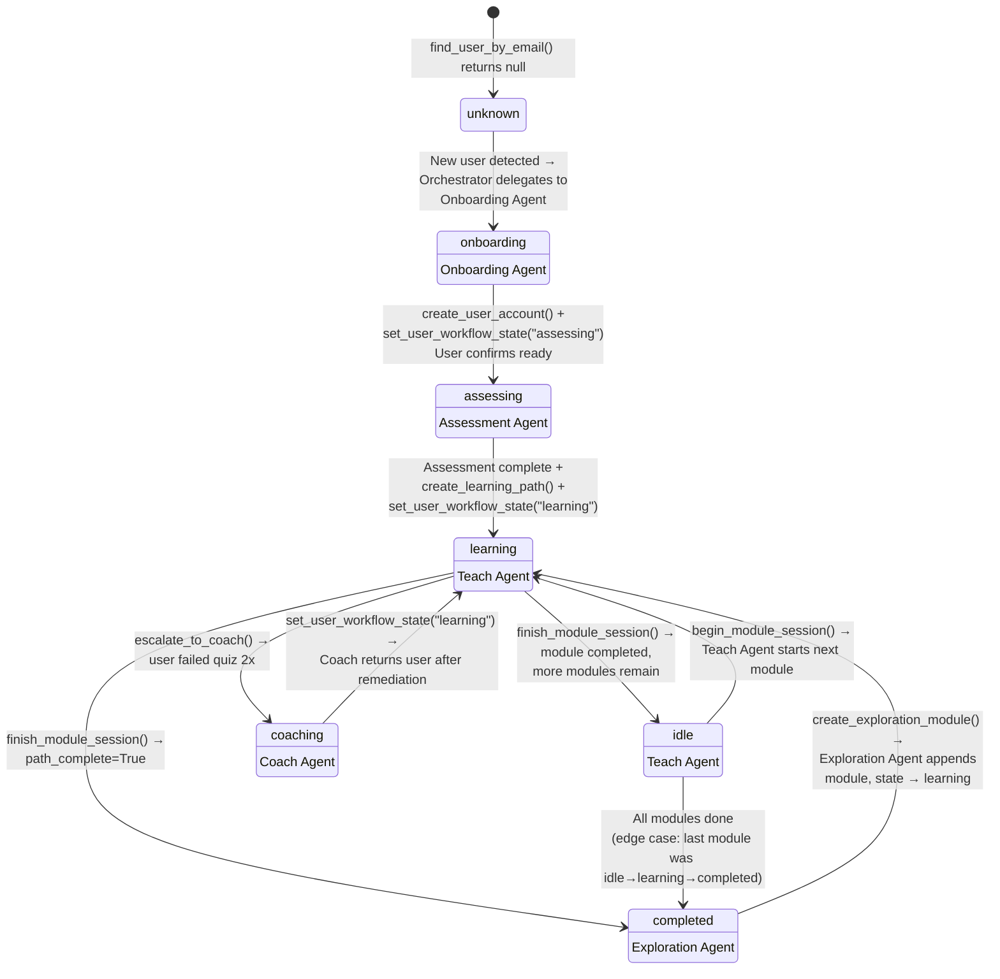
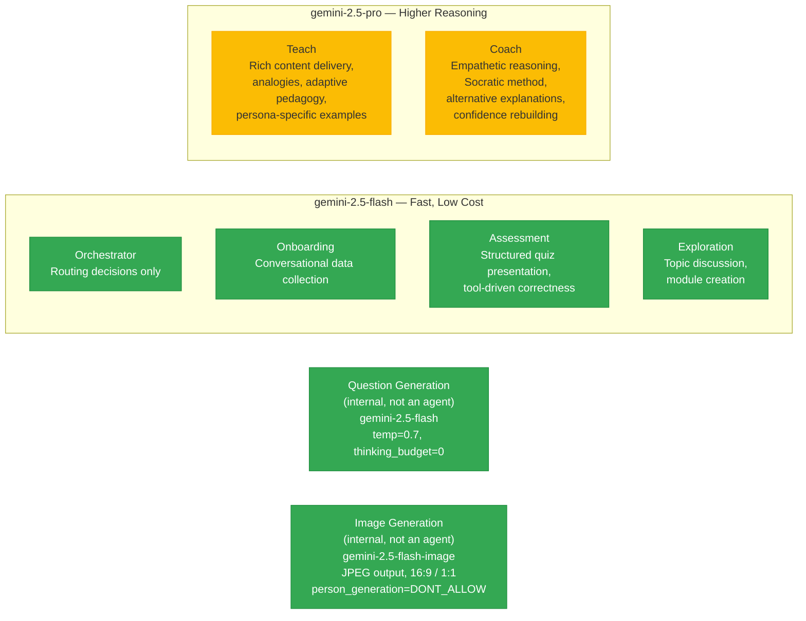
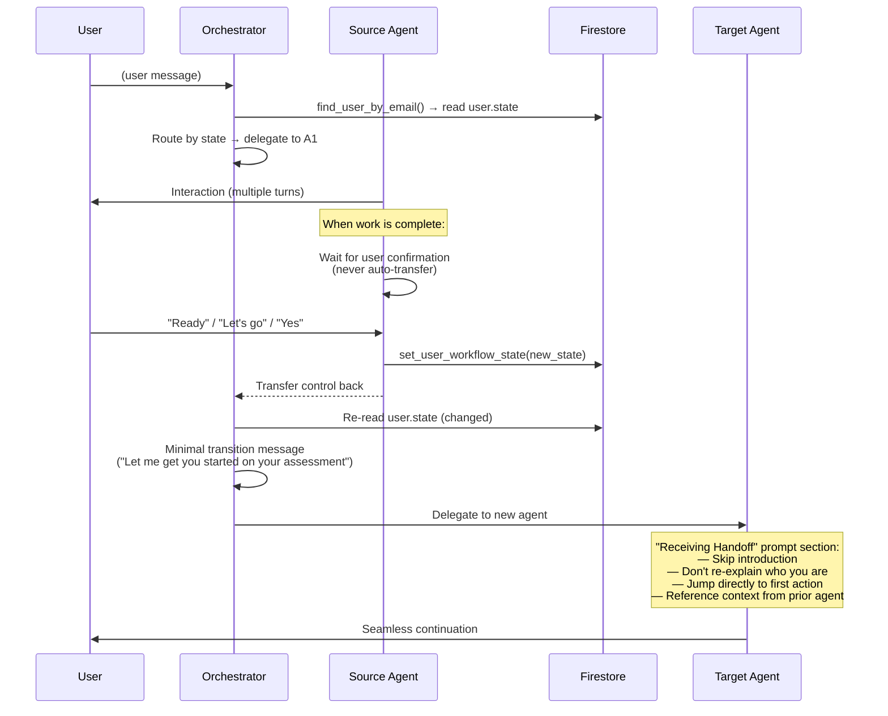
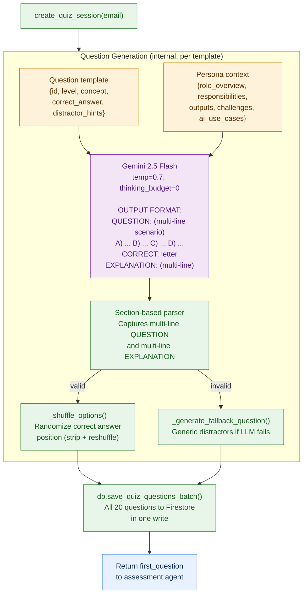
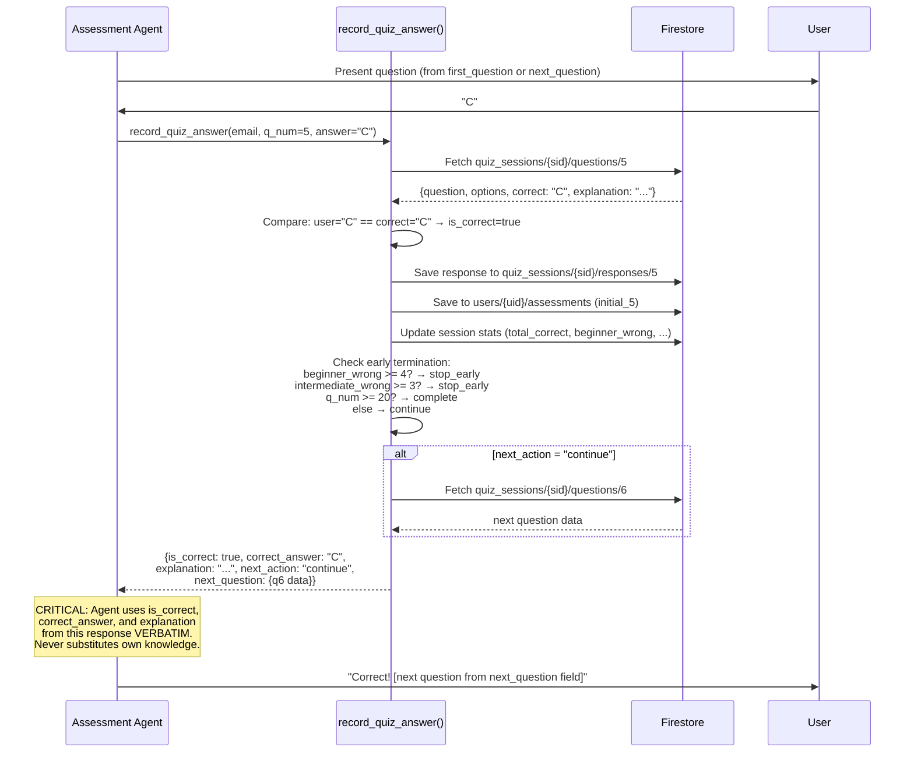
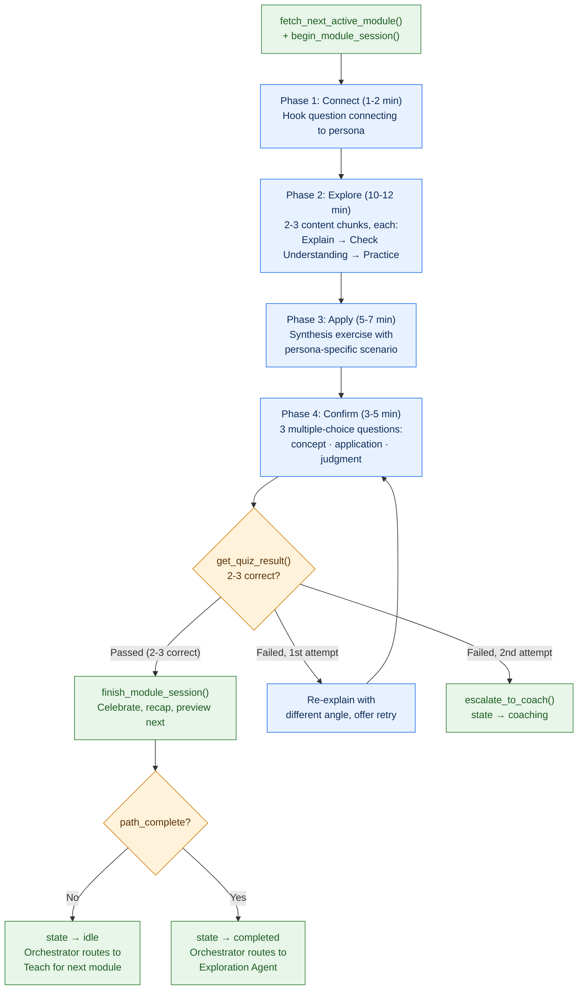

# Agent Architecture — Learning Accelerator

> **Last Updated**: 2026-03-25
> **Scope**: Agent hierarchy, orchestration pattern, state machine, tool distribution, handoff protocol, prompt design, model selection
> **Source of truth**: `learning_accelerator/agent.py` (all agent definitions), `learning_accelerator/prompts/` (agent instructions)

## 1. Orchestration Pattern (Foundation)

The Learning Accelerator uses **hierarchical state-based orchestration**.
A central orchestrator reads the user's workflow state from Firestore and
dispatches to one of five specialized sub-agents. Sub-agents do NOT invoke
each other directly — all transitions flow back through the orchestrator
via state changes.

This is a **state machine** where:
- The orchestrator is the only agent that has sub-agents
- Sub-agents change the user's `state` field via tools
- The orchestrator re-reads state on the next turn and dispatches accordingly
- Sub-agents never see each other's tools or prompts
- A `before_agent_callback` auto-identifies the user from the IAP session before the orchestrator runs



### Why this matters

| Design Decision | Rationale |
|---|---|
| Orchestrator runs `before_agent_callback` to auto-identify users | IAP email → Firestore lookup → session state pre-loaded. Returning users skip "what's your email?" |
| All sub-agent prompts include `## User Context` with `{user:name?}`, `{user:email?}`, etc. | Session state is checked before calling `find_user_by_email`. Eliminates redundant tool calls |
| Orchestrator reads `user.state`, dispatches to correct agent | State-driven routing is deterministic and auditable |
| Sub-agents call `set_user_workflow_state()` to signal transitions | Explicit state writes make every transition observable in Firestore |
| Each agent has only its own tools — no shared tool pool | Least-privilege: agents can only perform actions relevant to their role |
| Prompts define handoff behavior per agent | Handoff logic lives in version-controlled markdown, not hardcoded in application code |
| Orchestrator is stateless — state lives in Firestore | No in-memory caching means every turn reads the latest truth from the database |

## 2. State Machine — How Users Flow Between Agents

The user's `state` field in Firestore is the **single source of routing truth**.
The orchestrator reads it on every turn. Sub-agents write it via
`set_user_workflow_state()` to trigger transitions.



### State-to-agent routing table

| User State | Dispatched Agent | Entry Condition |
|-----------|-----------------|-----------------|
| *(unknown)* | `onboarding_agent` | `find_user_by_email()` returns null |
| `onboarding` | `onboarding_agent` | Account not fully created yet |
| `assessing` | `assessment_agent` | Account created, quiz not complete |
| `learning` | `teach_agent` | Active module in progress |
| `idle` | `teach_agent` | Between modules, ready for next |
| `reviewing` | `teach_agent` | Re-studying failed content |
| `coaching` | `coach_agent` | Failed module 2+ times, needs support |
| `completed` | `exploration_agent` | All standard modules finished |

### Override routing (keyword-based)

The orchestrator also supports **keyword overrides** in user messages:
- "help" / "struggling" → `coach_agent` (regardless of state)
- "start" / "begin" → `onboarding_agent`
- "quiz" / "assessment" → `assessment_agent`
- "progress" / "how am I doing" → orchestrator handles directly via `fetch_learning_progress()`

## 3. Model Selection Strategy



| Agent | Model | Why |
|-------|-------|-----|
| Orchestrator | Flash | Only reads state, calls tools, routes — no generation complexity |
| Onboarding | Flash | Collects name + persona, creates account — simple conversational flow |
| Assessment | Flash | Presents questions from tool responses, records answers — tool-driven, not generative |
| Teach | **Pro** | Must generate analogies, build on persona context, adapt explanations, create synthesis exercises |
| Coach | **Pro** | Must reason about *why* a user is struggling, try multiple explanation strategies, use Socratic method |
| Exploration | Flash | Discusses topics, creates modules — mostly tool-driven |
| Question Gen | Flash | Internal LLM call in `_generate_persona_question()` — structured output, not conversational |
| Image Gen | **Flash Image** | Internal LLM call in `generate_learning_visual()` — produces educational JPEG illustrations for Teach and Coach agents |

## 4. Tool Distribution Matrix

Each agent sees **only the tools it needs**. No shared tool pool.
Tools are registered via `FunctionTool()` in `agent.py`.

| Tool | Module | Orch | Onboard | Assess | Teach | Coach | Explore |
|------|--------|:----:|:-------:|:------:|:-----:|:-----:|:-------:|
| `find_user_by_email` | `user_tools` | ✅ | ✅ | | ✅ | ✅ | ✅ |
| `create_user_account` | `user_tools` | | ✅ | | | | |
| `update_user_profile` | `user_tools` | | ✅ | | | | |
| `set_user_workflow_state` | `user_tools` | ✅ | ✅ | ✅ | | ✅ | |
| `update_user_proficiency` | `user_tools` | | | ✅ | | | |
| `create_quiz_session` | `assessment_tools` | | | ✅ | | | |
| `record_quiz_answer` | `assessment_tools` | | | ✅ | | | |
| `complete_quiz_session` | `assessment_tools` | | | ✅ | | | |
| `compute_proficiency_score` | `assessment_tools` | | | ✅ | | | |
| `save_assessment_response` | `assessment_tools` | | | | ✅ | ✅ | |
| `get_quiz_result` | `assessment_tools` | | | | ✅ | | |
| `create_learning_path` | `path_tools` | | | ✅ | | | |
| `create_focus_module` | `path_tools` | | | ✅ | | | |
| `create_exploration_module` | `path_tools` | | | | | | ✅ |
| `fetch_learning_progress` | `path_tools` | ✅ | | | ✅ | | ✅ |
| `fetch_next_active_module` | `module_tools` | | | | ✅ | | |
| `get_module_details` | `module_tools` | | | | ✅ | ✅ | |
| `begin_module_session` | `progress_tools` | | | | ✅ | | |
| `finish_module_session` | `progress_tools` | | | | ✅ | | |
| `get_module_progress` | `progress_tools` | | | | ✅ | ✅ | |
| `escalate_to_coach` | `progress_tools` | | | | ✅ | | |
| `find_struggling_modules` | `progress_tools` | | | | | ✅ | |
| `generate_learning_visual` | `image_tools` | | | | ✅ | ✅ | |

**Total: 23 tool functions across 7 modules.** Internal helpers (`_helpers.py`) are not exposed to agents.

## 5. Agent Handoff Protocol

All transitions between agents follow a **minimal-friction handoff** pattern.
The source agent changes state, the orchestrator re-evaluates, and the target
agent has a **"Receiving Handoff"** section in its prompt that skips re-introductions.



### Transition rules enforced by prompts

| Rule | Enforced In | Example |
|------|------------|---------|
| **Never ask-then-immediately-transfer** | `orchestrator_agent.md` | Don't say "Ready?" and then transfer before user responds |
| **Wait for user confirmation** | All source agents | Assessment Step 9 waits for "ready" before `set_user_workflow_state("learning")` |
| **Skip re-introduction on handoff** | All target agents | "Receiving Handoff" section in every `.md` prompt |
| **Minimal orchestrator messages** | `orchestrator_agent.md` | One sentence max ("Let me get you set up") — not a paragraph |
| **Source agent doesn't normalize** | `teach_agent.md` → `coach_agent.md` | Teach escalates raw — Coach does its own assessment |

## 6. Prompt Architecture

Each agent's behavior is defined by a structured markdown prompt loaded from
`learning_accelerator/prompts/`. Prompts use a consistent format:

### Prompt structure pattern

```
## Identity
  Agent identity and personality

## Receiving Handoff
  How to behave when control arrives from another agent
  (skip intro, reference prior context)

## User Context
  Pre-loaded session state rendered via ADK template variables:
  - **Name:** {user:name?}
  - **Email:** {user:email?}
  - **State:** {user:state?}
  - **Persona:** {user:persona?}
  - **Proficiency:** {user:proficiency?}
  If Name is filled in, skip find_user_by_email.
  If blank, call it as fallback.

## Formatting & Visual Style  (Teach/Coach only)
  Emoji usage rules, text formatting, image placement

## Conversation Flow / Session Flow
  Numbered steps or phases defining the conversation flow
  Each step specifies:
    - What to say
    - What tool to call
    - What to check in the response
    - When to wait for user input
    - When to proceed

## Tools Available
  Tool references with [Tool Name](tool://tool_name) syntax

## Security
  System prompt protection, injection defense
```

### Ownership map (prompt → agent)

| Prompt File | Agent | Lines | Key Sections |
|-------------|-------|-------|-------------|
| `orchestrator_agent.md` | `learning_accelerator` (root) | ~130 | User context (state data fields), sub-agent catalog, routing rules, progress queries |
| `onboarding_agent.md` | `onboarding_agent` | ~120 | Persona selection (7 options), account creation, assessment intro |
| `assessment_agent.md` | `assessment_agent` | ~400 | User context, question loop, correctness from tool only, growth areas, focus modules, path creation |
| `teach_agent.md` | `teach_agent` | ~300 | User context, formatting & visual style, 5-phase lesson (Connect, Explore, Apply, Confirm, Close), image generation, quiz retry, escalation |
| `coach_agent.md` | `coach_agent` | ~220 | User context, formatting & visual style, gap identification, alternative explanation strategies, image generation, confidence rebuild |
| `exploration_agent.md` | `exploration_agent` | ~200 | User context, topic discovery, module creation (max 3), celebratory opening |

## 7. Assessment Agent — Deep Dive

The assessment agent has the most complex tool interaction pattern. It manages
a 20-question adaptive quiz where all questions are pre-generated, answers are
checked server-side, and feedback comes exclusively from tool responses.

### Question lifecycle



### Answer recording flow



### Adaptive early termination

| Section | Questions | Stop Condition | Classification |
|---------|-----------|---------------|----------------|
| Beginner | Q1–Q8 | 4+ wrong → `stop_early` | Beginner |
| Intermediate | Q9–Q14 | 3+ wrong → `stop_early` | Intermediate |
| Advanced | Q15–Q20 | Complete all → score determines | Intermediate or Advanced |

**Proficiency thresholds:** Beginner (< 45%) · Intermediate (45–75%) · Advanced (> 75%)

## 8. Teach Agent — Lesson Delivery Pattern

The teach agent runs a **5-phase pedagogical loop** for each module. It uses
`gemini-2.5-pro` for higher reasoning capability — generating analogies,
adapting to persona context, and creating synthesis exercises.



## 9. Persona Context System

Every agent has access to persona data via tool functions. Persona context is
used for question generation (assessment), lesson examples (teach), coaching
analogies (coach), and exploration suggestions (exploration).

### 7 BM&C Personas

| Persona | Title | Example AI Use Cases |
|---------|-------|---------------------|
| `communicator` | Communications Professional | Drafting press releases, social copy, sentiment monitoring |
| `coordinator` | Program/Event Coordinator | Project planning, meeting summaries, vendor research |
| `creator` | Creative Designer | Image generation, presentation design, brand assets |
| `insights` | Insights Analyst | Data analysis, survey synthesis, trend forecasting |
| `marketer` | Marketing Strategist | Campaign ideation, audience segmentation, A/B testing |
| `operator` | Operations Manager | Workflow automation, quality assurance, risk assessment |
| `strategist` | Strategy Consultant | Strategic analysis, business cases, scenario planning |

### Persona data structure (per persona)

```python
{
    "title": "...",
    "role_overview": "...",
    "also_known_as": [...],
    "key_responsibilities": [...],   # Used in question generation prompt
    "typical_outputs": [...],        # Used in question generation prompt
    "tools": [...],
    "top_challenges": [...],         # Used in question generation prompt
    "ai_use_cases": [...]            # Used in question generation prompt
}
```

## 10. Non-Goals / Guardrails

- Agents do **not** invoke each other directly — all routing is through the orchestrator via state changes.
- Sub-agents do **not** share tools — each has an explicit tool set registered in `agent.py`.
- The assessment agent does **not** determine answer correctness — it uses `is_correct` from the tool response verbatim.
- The teach agent does **not** generate quiz questions — it uses tool responses.
- The orchestrator does **not** teach, assess, coach, or onboard — it only routes.
- Agent prompts do **not** contain business logic — all correctness checking, scoring, and state transitions happen in tool code.
- Prompts do **not** reference other agents' prompts — each agent is self-contained.
