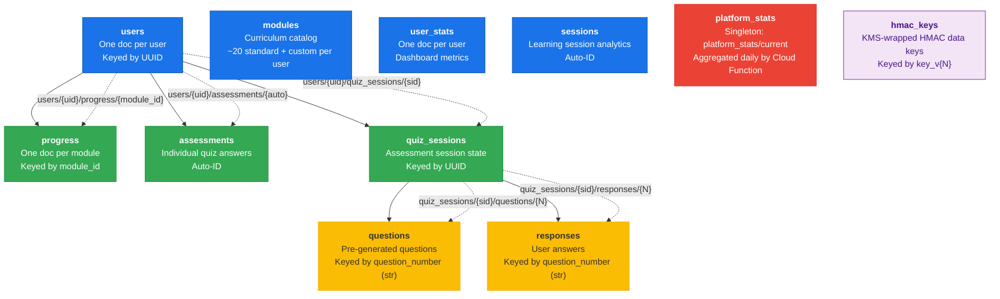
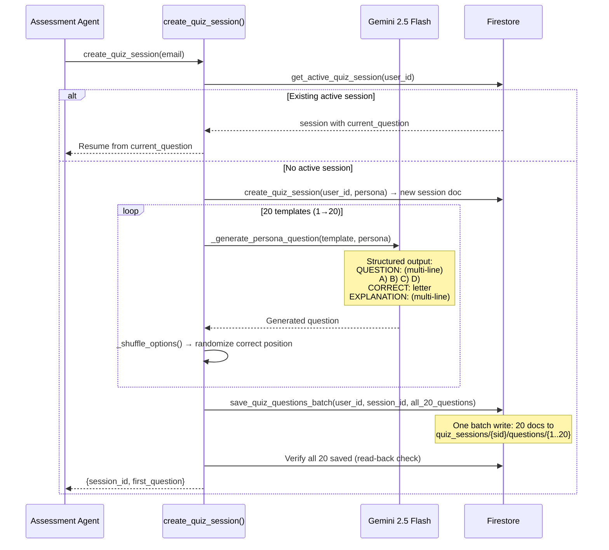
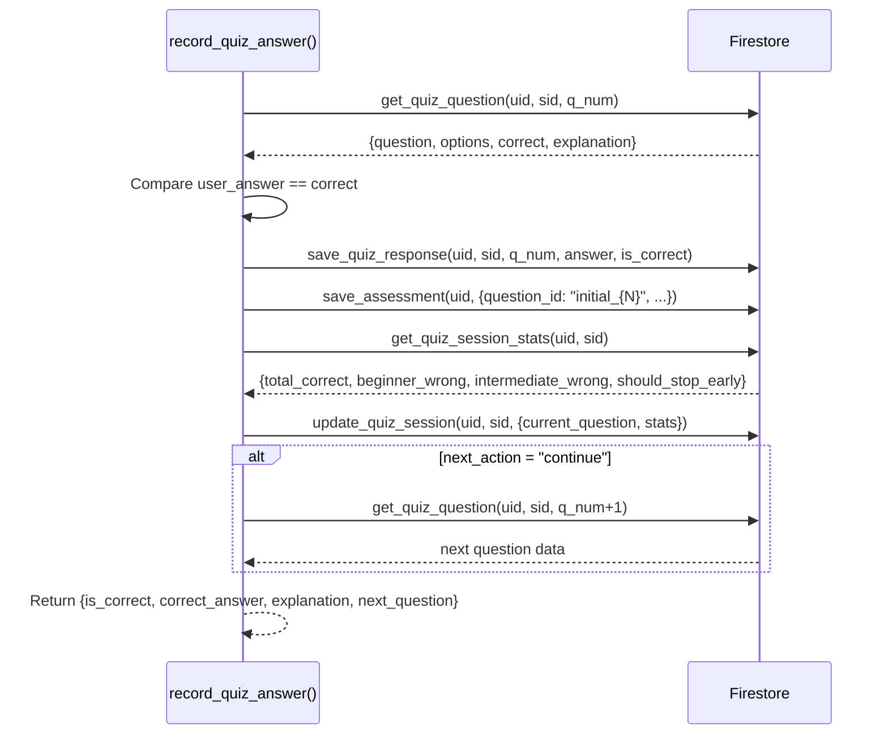
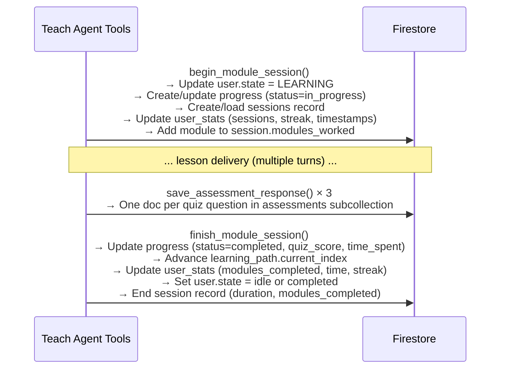
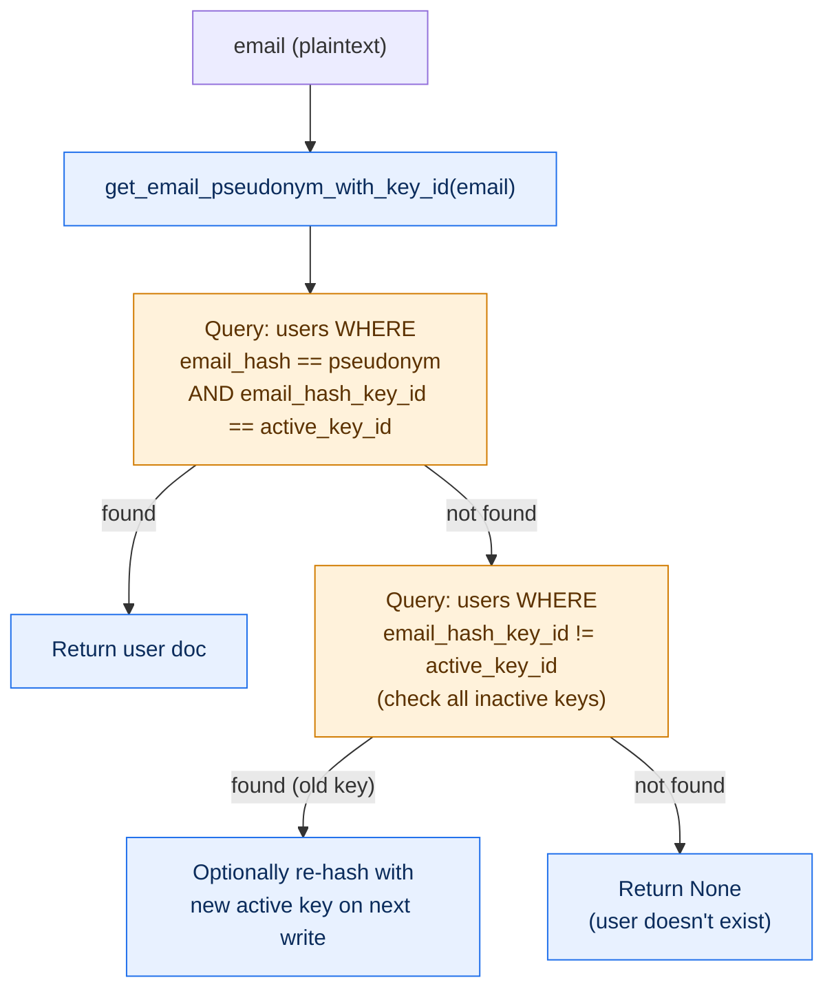
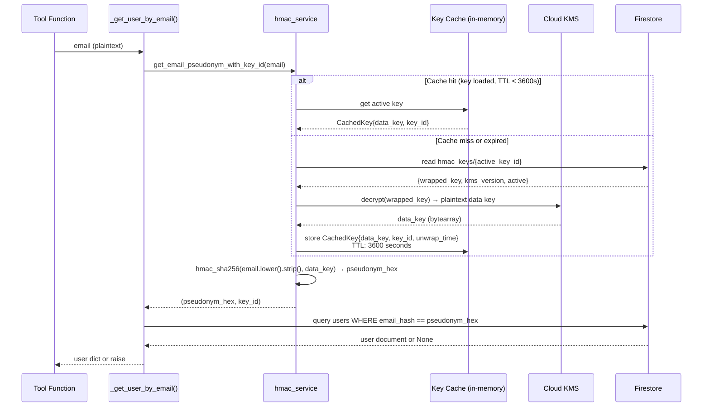

# Database Architecture — Learning Accelerator

> **Last Updated**: 2026-03-25
> **Scope**: Cloud Firestore schema, collection hierarchy, document structures, access patterns, pseudonymization, seeding
> **Source of truth**: `learning_accelerator/database/firestore_db.py` (all operations), `learning_accelerator/database/enums.py` (domain enums)

## 1. Persistence Principles

- **Firestore-native**: No ORM layer. Direct SDK calls via `google-cloud-firestore` client.
- **Subcollections for hierarchy**: Quiz sessions contain questions and responses as nested subcollections — not arrays in JSONB.
- **No VPC**: Firestore uses public HTTPS APIs. No VPC connector, no Private Service Connect.
- **Named database**: `learning-accelerator` (not the `(default)` database) — isolates from other project data.
- **Idempotent seeding**: `init_database()` checks for existing data before writing. Safe to run on every cold start.
- **Emails never stored**: All email references are HMAC-SHA256 pseudonyms via Cloud KMS. The `email_hash` field is the only identifier.
- **Enums decoupled from ORM**: Domain enums (`Persona`, `UserState`, `ProficiencyLevel`, `ProgressStatus`) live in `database/enums.py`, not in SQLAlchemy models.
- **Legacy SQLAlchemy preserved**: `connection.py` and `models.py` exist only for migration scripts. Not imported by production code.

## 2. Collection Hierarchy

Firestore uses a combination of top-level collections (indexed globally) and
nested subcollections (scoped to parent documents). This eliminates the need
for JSONB arrays — every entity is a first-class document with its own path.



### Document path reference

| Full Path | Key Strategy | Write Frequency |
|-----------|--------------|-----------------|
| `users/{uuid}` | Server-generated UUID | Create once, update `state`/`learning_path` per transition |
| `modules/{uuid}` | Server-generated UUID | Seed-time only + dynamic focus/exploration modules |
| `users/{uid}/progress/{module_id}` | Module ID as doc key | Per module start (`begin_module_session`) + complete (`finish_module_session`) |
| `users/{uid}/assessments/{auto}` | Auto-generated | Per quiz answer — up to 20 (assessment) + 3 per module (teach) |
| `users/{uid}/quiz_sessions/{uuid}` | Server-generated UUID | Once per assessment session creation |
| `.../quiz_sessions/{sid}/questions/{N}` | Question number (string) | Batch write at session creation (all 20 in one write) |
| `.../quiz_sessions/{sid}/responses/{N}` | Question number (string) | Per answer submission (up to 20) |
| `user_stats/{user_id}` | User ID as doc key | Per session start/end, module complete, path complete |
| `sessions/{auto}` | Auto-generated | Per learning session start + end |
| `platform_stats/current` | Singleton | Daily (Cloud Function) |
| `hmac_keys/{key_vN}` | Versioned key ID (`key_v1`, `key_v2`, ...) | Key rotation only |

## 3. Document Schemas

### users

```json
{
  "id": "a1b2c3d4-...",
  "email_hash": "8f14e45fceea167a...",
  "email_hash_key_id": "key_v1",
  "name": "Devon",
  "persona": "communicator",
  "proficiency_level": "intermediate",
  "state": "learning",
  "current_module_index": 3,
  "streak_days": 5,
  "learning_path": {
    "module_ids": ["mod_1", "mod_2", "mod_3", "..."],
    "current_index": 3,
    "updated_at": "2026-03-24T14:30:00Z"
  },
  "created_at": "2026-03-20T10:00:00Z",
  "last_active_at": "2026-03-24T14:30:00Z"
}
```

**Key fields:**
- `email_hash` — HMAC-SHA256 pseudonym (never plaintext email)
- `email_hash_key_id` — Tracks which HMAC key produced this hash (supports rotation)
- `state` — Routing determinant. One of: `onboarding`, `assessing`, `learning`, `reviewing`, `coaching`, `idle`, `completed`
- `persona` — One of 7: `communicator`, `coordinator`, `creator`, `insights`, `marketer`, `operator`, `strategist`
- `learning_path.module_ids` — Ordered list of module UUIDs (standard + focus + exploration)
- `learning_path.current_index` — Pointer to next incomplete module

### modules

```json
{
  "id": "f5e6d7c8-...",
  "week": 1,
  "track": "foundations",
  "sequence": 1,
  "title": "What AI Actually Is",
  "description": "Understand what AI can and cannot do...",
  "estimated_minutes": 20,
  "persona": null,
  "concept_chunks": 3,
  "practice_exercises": 1,
  "concept_theme": null,
  "topic": null,
  "user_id": null,
  "created_at": "2026-03-20T10:00:00Z"
}
```

**Key fields:**
- `track` — One of: `foundations`, `prompt_craft`, `persona_specific`, `advanced`, `focus_areas`, `exploration`
- `persona` — `null` for shared modules, specific persona string for persona-specific (week 3) modules
- `user_id` — `null` for standard curriculum, UUID for user-specific (focus/exploration) modules
- `concept_theme` — Set on focus modules (e.g., `"context_windows"`, `"hallucination"`)
- `topic` — Set on exploration modules (e.g., `"rag"`, `"fine_tuning"`)

### users/{uid}/progress/{module_id}

```json
{
  "module_id": "f5e6d7c8-...",
  "status": "completed",
  "lesson_completed": true,
  "quiz_score": 0.67,
  "quiz_passed": true,
  "started_at": "2026-03-24T09:00:00Z",
  "completed_at": "2026-03-24T09:25:00Z",
  "time_spent_seconds": 1500,
  "updated_at": "2026-03-24T09:25:00Z"
}
```

**Key fields:**
- `status` — One of: `not_started`, `in_progress`, `completed`, `struggled`
- `quiz_score` — 0.0–1.0 float (proportion correct on 3-question module quiz)
- `time_spent_seconds` — Computed from `started_at` to `completed_at` by `finish_module_session()`

### users/{uid}/quiz_sessions/{sid}

```json
{
  "id": "g7h8i9j0-...",
  "persona": "communicator",
  "status": "in_progress",
  "current_question": 12,
  "beginner_wrong": 1,
  "intermediate_wrong": 0,
  "advanced_wrong": 0,
  "total_correct": 10,
  "total_answered": 11,
  "proficiency_level": null,
  "final_score": null,
  "created_at": "2026-03-24T10:00:00Z",
  "updated_at": "2026-03-24T10:15:00Z",
  "completed_at": null
}
```

**Key fields:**
- `beginner_wrong` — If ≥ 4, triggers `stop_early` → classify as Beginner
- `intermediate_wrong` — If ≥ 3, triggers `stop_early` → classify as Intermediate
- `proficiency_level` — Set on completion by `complete_quiz_session()`
- `status` — `in_progress` or `completed`

### quiz_sessions/{sid}/questions/{N}

```json
{
  "question_number": 5,
  "question": "You're preparing a press release about your firm's new AI-powered\nclient analytics platform. The CMO asks you to have the AI draft\ninitial talking points. Which approach would produce the most\naccurate and useful output?",
  "options": [
    "A) Ask the AI to write talking points about AI analytics",
    "B) Provide the AI with the platform's feature list, target audience, and key differentiators, then ask for talking points",
    "C) Copy-paste the entire product documentation and ask for a summary",
    "D) Ask the AI to research your company's products and write talking points"
  ],
  "correct": "B",
  "explanation": "Providing specific context (features, audience, differentiators) produces the most accurate output because LLMs perform best when given concrete, relevant information rather than vague instructions or overwhelming amounts of text.",
  "created_at": "2026-03-24T10:00:00Z"
}
```

**Key fields:**
- `question` — Multi-line LLM-generated scenario text (persona-specific)
- `options` — Array of 4 strings, shuffled at generation time
- `correct` — Letter (A–D) after shuffling — may differ from the LLM's original output
- `explanation` — LLM-generated rationale, also multi-line capable

### quiz_sessions/{sid}/responses/{N}

```json
{
  "question_number": 5,
  "user_answer": "B",
  "is_correct": true,
  "answered_at": "2026-03-24T10:05:00Z"
}
```

### user_stats/{user_id}

```json
{
  "id": "a1b2c3d4-...",
  "user_id": "a1b2c3d4-...",
  "persona": "communicator",
  "total_modules_completed": 8,
  "focus_modules_created": 2,
  "exploration_modules_created": 0,
  "total_time_seconds": 9600,
  "longest_session_seconds": 1800,
  "shortest_session_seconds": 300,
  "total_sessions": 12,
  "current_streak": 5,
  "longest_streak": 7,
  "avg_quiz_score": 0.78,
  "struggles_recovered": 1,
  "path_completed_at": null,
  "days_to_completion": null,
  "first_activity_at": "2026-03-20T10:00:00Z",
  "last_activity_at": "2026-03-24T14:30:00Z",
  "updated_at": "2026-03-24T14:30:00Z"
}
```

### sessions/{auto}

```json
{
  "id": "k1l2m3n4-...",
  "user_id": "a1b2c3d4-...",
  "persona": "communicator",
  "started_at": "2026-03-24T14:00:00Z",
  "ended_at": "2026-03-24T14:30:00Z",
  "duration_seconds": 1800,
  "modules_worked": ["mod_8"],
  "modules_completed": 1,
  "day_of_week": "Monday",
  "hour_of_day": 14
}
```

### platform_stats/current (singleton)

```json
{
  "total_users": 47,
  "active_users_7d": 22,
  "active_users_30d": 38,
  "total_learning_hours": 156.5,
  "total_modules_delivered": 680,
  "total_custom_modules": 34,
  "avg_time_to_completion_days": 24,
  "avg_session_minutes": 18.5,
  "avg_streak_days": 3.8,
  "completion_rate": 0.58,
  "by_persona": {
    "communicator": { "active_users": 7, "total_learning_hours": 28, "modules_completed": 112 },
    "strategist": { "active_users": 5, "total_learning_hours": 22, "modules_completed": 85 }
  },
  "computed_at": "2026-03-24T06:00:00Z"
}
```

### hmac_keys/{key_vN}

```json
{
  "id": "key_v1",
  "wrapped_key": "<base64-encoded KMS-wrapped data key>",
  "kms_version": "projects/.../cryptoKeyVersions/1",
  "active": true,
  "created_at": "2026-03-20T10:00:00Z"
}
```

## 4. Write Path Architecture

### Assessment session creation (heaviest write path)



### Answer recording (per question)



### Module session lifecycle



## 5. Query Patterns

### Primary read paths

| Query | Collection | Filter | Frequency |
|-------|-----------|--------|-----------|
| **User lookup** | `users` | `email_hash == pseudonym` | Every tool call (via `_get_user_by_email()`) |
| **Active quiz session** | `users/{uid}/quiz_sessions` | `status == "in_progress"`, order by `created_at` desc, limit 1 | Per assessment question |
| **Specific question** | `.../questions/{N}` | Direct doc read by question number | Per answer submission |
| **Session stats** | `.../responses` | Stream all, count by correctness and level | Per answer submission |
| **Next module** | `users/{uid}/progress` | Match `learning_path.module_ids[current_index]`, check status | Per Teach Agent entry |
| **All modules** | `modules` | Order by `week`, `sequence` | Database seeding, path creation |
| **Persona modules** | `modules` | `persona IN [null, user_persona]` | Path creation |
| **Struggling modules** | `users/{uid}/progress` | `status == "struggled"` | Coach Agent entry |
| **Progress summary** | `users/{uid}/progress` | Stream all, aggregate counts | Progress queries |
| **Platform metrics** | `platform_stats/current` | Direct singleton read | Admin dashboard |

### Multi-key email lookup

When looking up a user by email, the system supports multiple HMAC keys
(for key rotation). The lookup tries the active key first, then falls back
to querying by any known key.



## 6. Email Pseudonymization — KMS Envelope Encryption

Emails are **never stored in Firestore**. The `email_hash` field contains a
deterministic HMAC-SHA256 pseudonym, and the data key used for HMAC is
itself encrypted by Cloud KMS (envelope encryption).



### Security properties

| Property | Implementation |
|----------|---------------|
| **Deterministic** | Same email + same key → same hash (enables lookups) |
| **One-way** | Cannot reverse hash to email |
| **KMS-protected** | Data key encrypted at rest by Cloud KMS; decrypted only in memory |
| **Multi-key** | Each record stores `email_hash_key_id`; rotation doesn't invalidate old hashes |
| **Memory hygiene** | `bytearray` data keys zeroed on process exit via `atexit` handler |
| **Thread-safe** | Initialization protected by `threading.Lock` |
| **Dev fallback** | `EMAIL_HMAC_SECRET` env var for local dev (no KMS dependency) |

## 7. Domain Enums

Decoupled from SQLAlchemy — imported from `database.enums`, not `database.models`.

```python
class Persona(StrEnum):        # communicator, coordinator, creator, insights, marketer, operator, strategist
class ProficiencyLevel(StrEnum):  # beginner, intermediate, advanced
class UserState(StrEnum):      # onboarding, assessing, learning, reviewing, coaching, idle, completed
class ProgressStatus(StrEnum): # not_started, in_progress, completed, struggled
```

## 8. Ownership Map (Code → Collections)

| Module | Primary Writes |
|--------|---------------|
| `tools/user_tools.py` | `users` (create, update state/proficiency/profile) |
| `tools/assessment_tools.py` | `users/{uid}/quiz_sessions`, `.../questions`, `.../responses`, `users/{uid}/assessments` |
| `tools/path_tools.py` | `modules` (focus + exploration), `users` (learning_path), `users/{uid}/progress` (init) |
| `tools/progress_tools.py` | `users/{uid}/progress` (begin/finish), `user_stats`, `sessions`, `users` (state, module_index) |
| `tools/module_tools.py` | *(read-only)* — reads from `modules`, `users/{uid}/progress` |
| `tools/image_tools.py` | *(no Firestore writes)* — generates images via Gemini Flash Image, uploads to GCS |
| `database/init.py` + `database/seed.py` | `modules` (curriculum seed), `users` (test user seed) |
| `crypto/hmac_service.py` | `hmac_keys` (key creation, rotation) |
| Cloud Function `compute_platform_stats` | `platform_stats/current` (daily aggregate from `user_stats`) |

## 9. Non-Goals / Guardrails

- Do **not** store plaintext emails in Firestore — only HMAC-SHA256 pseudonyms.
- Do **not** use JSONB arrays for events/history — use subcollections (questions, responses, progress).
- Do **not** import `database.models` or `database.connection` from production code — they are legacy migration-only.
- Do **not** store large LLM outputs in Firestore — questions and explanations are bounded by template structure.
- Do **not** query across users without an index — all queries are scoped to a single user's subcollections.
- Do **not** rely on `GOOGLE_CLOUD_PROJECT` for bucket names in Agent Engine — it resolves to project **number**, not ID. Use explicit env vars.
