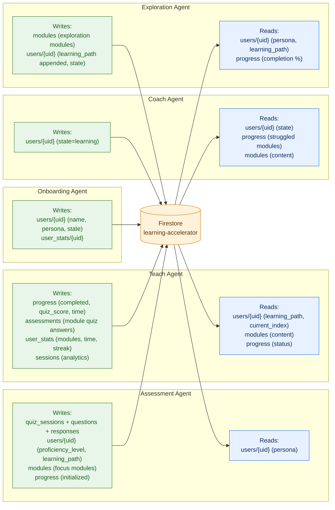
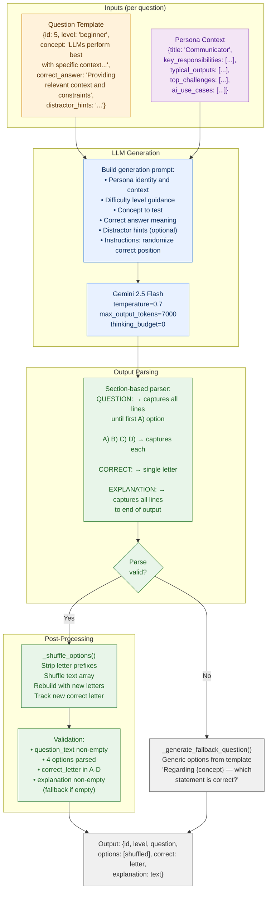
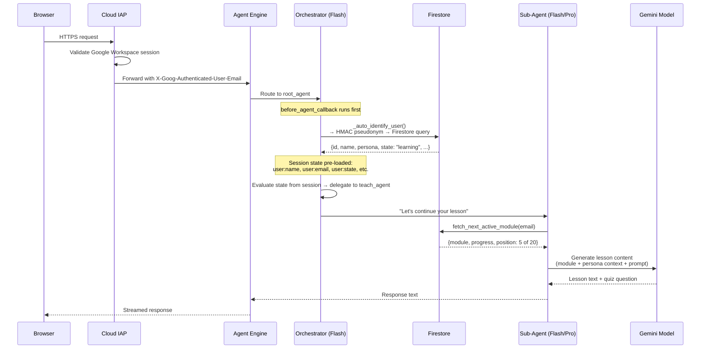

# Integrated Data Flow — Learning Accelerator

> **Last Updated**: 2026-03-25
> **Scope**: End-to-end user journey, cross-agent data flow, assessment pipeline, learning path composition, curriculum structure
> **Reads across**: All agent prompts, all tool modules, Firestore collections, personas, question templates

## 1. Complete User Journey — Phase by Phase

This is the full lifecycle from first visit to path completion and beyond.
Each phase maps to a specific agent, and the data written at each step
feeds into the next phase. All transitions go through the orchestrator
via state changes in Firestore.

```mermaid
flowchart TD
  classDef phase fill:#e8f1ff,stroke:#1f6feb,color:#0b2c5c
  classDef tool fill:#e8f5e9,stroke:#2e7d32,color:#1b5e20
  classDef data fill:#fff2db,stroke:#d17b00,color:#5c3200
  classDef decision fill:#f3e5f5,stroke:#7b1fa2,color:#4a148c
  classDef agent fill:#f0f0f0,stroke:#666,color:#333

  subgraph P1["Phase 1 — Onboarding (onboarding_agent)"]
    P1a["User arrives via IAP"]:::phase
    P1b["Orchestrator: find_user_by_email()"]:::tool
    P1c["→ null: new user<br/>Delegate to Onboarding Agent"]:::agent
    P1d["Collect: display name"]:::phase
    P1e["Present 7 personas with<br/>descriptions from personas.py"]:::phase
    P1f["User selects persona"]:::phase
    P1g["create_user_account(email, name, persona)"]:::tool
    P1h["Writes to Firestore:<br/>• users/{uid} (state=onboarding)<br/>• user_stats/{uid} (initialized)"]:::data
    P1i["Explain: 20-question adaptive assessment,<br/>no penalty for wrong answers, ~10 min"]:::phase
    P1j["WAIT for user confirmation"]:::phase
    P1k["set_user_workflow_state('assessing')"]:::tool

    P1a --> P1b --> P1c --> P1d --> P1e --> P1f --> P1g --> P1h --> P1i --> P1j --> P1k
  end

  subgraph P2["Phase 2 — Assessment (assessment_agent)"]
    P2a["create_quiz_session(email)"]:::tool
    P2b["Generate 20 persona-specific questions<br/>via Gemini 2.5 Flash"]:::phase
    P2c["Writes to Firestore:<br/>• quiz_sessions/{sid} (status=in_progress)<br/>• quiz_sessions/{sid}/questions/{1..20} (batch)"]:::data
    P2d["Present first_question to user"]:::phase
    P2e{"User answers<br/>A / B / C / D / E"}:::decision
    P2f["record_quiz_answer(email, q_num, answer)"]:::tool
    P2g["Writes to Firestore:<br/>• quiz_sessions/{sid}/responses/{N}<br/>• users/{uid}/assessments/initial_{N}<br/>• quiz_sessions/{sid} (updated stats)"]:::data
    P2h{"next_action?"}:::decision
    P2i["Present feedback:<br/>is_correct + correct_answer + explanation<br/>(all from tool response, never agent knowledge)"]:::phase

    P2a --> P2b --> P2c --> P2d --> P2e --> P2f --> P2g --> P2h
    P2f --> P2i
    P2h -- "continue" --> P2d
    P2h -- "stop_early<br/>(4+ beginner wrong<br/>or 3+ intermediate wrong)" --> P2j
    P2h -- "complete (Q20)" --> P2j

    P2j["complete_quiz_session(email)"]:::tool
    P2k["update_user_proficiency(email, level)"]:::tool
    P2l["Present results + max 3 growth areas<br/>framed as 'areas we'll strengthen'"]:::phase
    P2m{"User wants<br/>focus modules?"}:::decision
    P2n["create_learning_path(email)"]:::tool
    P2o["create_focus_module(email, title, desc, theme)<br/>× up to 3 modules"]:::tool
    P2p["Writes to Firestore:<br/>• users/{uid} (proficiency_level, learning_path)<br/>• modules/{new} (focus modules)<br/>• users/{uid}/progress/{mod} (initialized per module)"]:::data
    P2q["set_user_workflow_state('learning')"]:::tool

    P2j --> P2k --> P2l --> P2m
    P2m -- "Yes" --> P2n --> P2o --> P2p --> P2q
    P2m -- "No" --> P2n2["create_learning_path(email)"]:::tool
    P2n2 --> P2q
  end

  subgraph P3["Phase 3 — Learning Loop (teach_agent)"]
    P3a["fetch_next_active_module(email)"]:::tool
    P3b["begin_module_session(email, module_id)"]:::tool
    P3c["Writes to Firestore:<br/>• users/{uid} (state=learning, current_module_index)<br/>• users/{uid}/progress/{mod} (status=in_progress)<br/>• sessions/{sid} (created/loaded)<br/>• user_stats/{uid} (sessions, streak, timestamps)"]:::data
    P3d["Phase 1 — Connect: Hook question<br/>Phase 2 — Explore: 2-3 chunks<br/>(Explain → Check → Practice)<br/>Phase 3 — Apply: Synthesis exercise"]:::phase
    P3e["Phase 4 — Confirm: 3 quiz questions<br/>save_assessment_response() × 3"]:::tool
    P3f{"get_quiz_result()<br/>2-3 correct?"}:::decision
    P3g["finish_module_session(email, module_id, score)"]:::tool
    P3h["Writes to Firestore:<br/>• progress (status=completed, quiz_score, time_spent)<br/>• users/{uid} (learning_path.current_index++, state)<br/>• user_stats (modules_completed, time, streak)<br/>• sessions/{sid} (ended, duration)"]:::data
    P3i{"path_complete?"}:::decision
    P3j["state → idle<br/>Next turn: Teach Agent gets next module"]:::agent
    P3k["state → completed<br/>Next turn: Exploration Agent"]:::agent
    P3l["Re-explain with different angle,<br/>offer retry (attempt 2)"]:::phase
    P3m["escalate_to_coach(email, module_id)<br/>state → coaching"]:::tool

    P3a --> P3b --> P3c --> P3d --> P3e --> P3f
    P3f -- "Passed" --> P3g --> P3h --> P3i
    P3f -- "Failed, 1st" --> P3l --> P3e
    P3f -- "Failed, 2nd" --> P3m
    P3i -- "No" --> P3j
    P3i -- "Yes" --> P3k
  end

  subgraph P4["Phase 4 — Coaching (coach_agent, if needed)"]
    P4a["find_struggling_modules(email)"]:::tool
    P4b["get_module_details(module_id)"]:::tool
    P4c["Identify gap: ask where understanding breaks"]:::phase
    P4d["Alternative explanation:<br/>analogies, chunking, scaffolding"]:::phase
    P4e["Guided practice + confidence check quiz"]:::phase
    P4f["set_user_workflow_state('learning')"]:::tool
    P4g["Writes to Firestore:<br/>• users/{uid} (state=learning)<br/>• progress may be updated"]:::data

    P4a --> P4b --> P4c --> P4d --> P4e --> P4f --> P4g
  end

  subgraph P5["Phase 5 — Exploration (exploration_agent, post-completion)"]
    P5a["Celebrate completion (one sentence)"]:::phase
    P5b["Suggest advanced topics based on persona"]:::phase
    P5c["create_exploration_module(email, title, desc, topic)<br/>× up to 3 per session"]:::tool
    P5d["Writes to Firestore:<br/>• modules/{new} (exploration, user_id=uid)<br/>• users/{uid} (learning_path appended, state=learning)"]:::data
    P5e["→ Teach Agent starts new module"]:::agent

    P5a --> P5b --> P5c --> P5d --> P5e
  end

  P1k --> P2a
  P2q --> P3a
  P3m --> P4a
  P4g --> P3a
  P3j --> P3a
  P3k --> P5a
  P5e --> P3a
```



## 2. Data Flow Between Agents

Agents never communicate directly. All data passes through **Firestore** and
**tool responses**. This table shows what each agent writes and what the next
agent reads.



### Cross-agent data contract

| Data | Written By | Read By | Collection |
|------|-----------|---------|------------|
| User identity (name, persona) | Onboarding | All agents (via `find_user_by_email` or session state) | `users` |
| User state | Any agent (via `set_user_workflow_state`) | Orchestrator (routing), all sub-agents (via session state) | `users.state` |
| Session state (pre-loaded) | `_auto_identify_user` callback | All agents (via `{user:name?}`, `{user:email?}`, etc. in prompts) | ADK session state (in-memory) |
| Proficiency level | Assessment | Teach (adapts difficulty), path creation | `users.proficiency_level` |
| Learning path (module order) | Assessment + Exploration | Teach (which module next) | `users.learning_path` |
| Module progress | Teach | Coach (find struggles), Exploration (check completion) | `users/{uid}/progress` |
| Quiz session + questions | Assessment tools (internal) | Assessment tools (`record_quiz_answer`) | `quiz_sessions` subcollections |
| Module quiz answers | Teach | Teach (`get_quiz_result`) | `users/{uid}/assessments` |
| Session analytics | Teach (`begin`/`finish_module_session`) | Cloud Function (platform stats) | `sessions`, `user_stats` |

## 3. Assessment Question Generation Pipeline

The assessment pipeline pre-generates all 20 questions at session creation.
Each question is tailored to the user's persona using LLM generation with
a structured output format.



### Question template coverage (20 questions)

| Level | IDs | Concepts Tested |
|-------|-----|----------------|
| **Beginner** | 1–8 | What is AI · How LLMs work · Tokens & knowledge cutoff · Randomness in AI · Training data · Model differences · Specificity in prompts · Prompt quality |
| **Intermediate** | 9–14 | Few-shot learning · Hallucination detection · Document building · Context constraints · Context windows · Content analysis |
| **Advanced** | 15–20 | RAG architecture · Lost-in-the-middle · Temperature tuning · Multi-agent systems · Fine-tuning vs prompting · Prompt injection |

## 4. Learning Path Composition

The learning path is a **personalized ordered list of module IDs** stored in
`users/{uid}.learning_path.module_ids`. It combines standard curriculum modules
with optional personalized additions.

```mermaid
flowchart TB
  classDef focus fill:#EA4335,stroke:#D93025,color:#fff
  classDef standard fill:#e8f1ff,stroke:#1f6feb,color:#0b2c5c
  classDef explore fill:#9334E6,stroke:#7B1FA2,color:#fff

  subgraph Path["users/{uid}.learning_path.module_ids (ordered)"]
    direction LR
    F1["Focus Module 1<br/>e.g. Context Windows"]:::focus
    F2["Focus Module 2<br/>e.g. Hallucination"]:::focus

    W1_1["Foundations 1<br/>What AI Actually Is"]:::standard
    W1_2["Foundations 2<br/>How LLMs Work"]:::standard
    W1_3["Foundations 3<br/>AI Tools Landscape"]:::standard
    W1_4["Foundations 4<br/>Limitations & Hallucinations"]:::standard
    W1_5["Foundations 5<br/>When AI Helps vs Doesn't"]:::standard

    W2_1["Prompt Craft 1<br/>Anatomy of Effective Prompt"]:::standard
    W2_2["Prompt Craft 2<br/>Context, Constraints, Examples"]:::standard
    W2_3["Prompt Craft 3<br/>Iterative Refinement"]:::standard
    W2_4["Prompt Craft 4<br/>Role-Based Prompt Patterns"]:::standard
    W2_5["Prompt Craft 5<br/>Practice: First 10 Prompts"]:::standard

    W3_1["Persona 1"]:::standard
    W3_2["Persona 2"]:::standard
    W3_3["Persona 3"]:::standard
    W3_4["Persona 4"]:::standard
    W3_5["Persona 5"]:::standard

    W4_1["Advanced 1<br/>RAG & Knowledge Integration"]:::standard
    W4_2["Advanced 2<br/>Multi-modal AI"]:::standard
    W4_3["Advanced 3<br/>AI Agents & Workflows"]:::standard
    W4_4["Advanced 4<br/>Ethics & Governance"]:::standard
    W4_5["Advanced 5<br/>Building Your AI Toolkit"]:::standard

    E1["Exploration 1<br/>e.g. RAG Deep-Dive"]:::explore
    E2["Exploration 2<br/>e.g. Fine-Tuning"]:::explore

    F1 --> F2 --> W1_1 --> W1_2 --> W1_3 --> W1_4 --> W1_5
    W1_5 --> W2_1 --> W2_2 --> W2_3 --> W2_4 --> W2_5
    W2_5 --> W3_1 --> W3_2 --> W3_3 --> W3_4 --> W3_5
    W3_5 --> W4_1 --> W4_2 --> W4_3 --> W4_4 --> W4_5
    W4_5 --> E1 --> E2
  end
```



### Path composition rules

| Module Type | Created By | Position | Track | Condition |
|-------------|-----------|----------|-------|-----------|
| **Focus modules** | `create_focus_module()` | **Prepended** (index 0+) | `focus_areas` | User says "yes" to focus areas after assessment |
| **Foundations** | Seed (5 modules) | Week 1 | `foundations` | Always included |
| **Prompt Craft** | Seed (5 modules) | Week 2 | `prompt_craft` | Always included |
| **Persona-Specific** | Seed (5 per persona) | Week 3 | `persona_specific` | Filtered by user's persona |
| **Advanced** | Seed (5 modules) | Week 4 | `advanced` | Always included |
| **Exploration modules** | `create_exploration_module()` | **Appended** (end) | `exploration` | User creates after completing standard path |

### Persona-specific module tracks (Week 3)

| Persona | Modules |
|---------|---------|
| **Communicator** | AI Writing Assistants · Press Release & Exec Comms · Social Copy at Scale · Sentiment Monitoring · Voice Consistency |
| **Coordinator** | AI for Project Planning · Event Content Generation · Meeting Summaries · Vendor Research · Process Documentation |
| **Creator** | AI Image Generation · Video & Motion Content · Presentation Design · Brand Asset Creation · Creative Brief Optimization |
| **Insights** | Data Analysis with AI · Survey & Research Synthesis · Competitive Intelligence · Trend Forecasting · Report Automation |
| **Marketer** | Campaign Ideation · Audience Segmentation · Content Calendars · Performance Analysis · A/B Test Design |
| **Operator** | Workflow Automation · Quality Assurance · Resource Optimization · Risk Assessment · SOP Generation |
| **Strategist** | Strategic Analysis with AI · Business Case Development · Market Sizing · Scenario Planning · Executive Briefing |

## 5. Tool Invocation Chains — Per Agent

Each agent follows a specific sequence of tool calls during its lifecycle.
These chains are enforced by the prompt instructions.

### Onboarding Agent chain

```
find_user_by_email(email)
  → null: proceed with onboarding
  → exists: route back to orchestrator

create_user_account(email, display_name, persona)
  → user doc created with state=onboarding

[wait for user confirmation]

set_user_workflow_state(email, "assessing")
  → state updated, orchestrator routes to Assessment Agent
```

### Assessment Agent chain

```
create_quiz_session(email)
  → 20 questions generated and saved
  → returns first_question

[loop: present question, wait for answer]

record_quiz_answer(email, question_number, user_answer)
  → returns is_correct, correct_answer, explanation, next_action, next_question
  → repeat until next_action != "continue"

complete_quiz_session(email)
  → returns proficiency_level, total_correct, breakdown

update_user_proficiency(email, proficiency_level)

[present growth areas, ask about focus modules]

create_learning_path(email)
  → base curriculum created

create_focus_module(email, title, description, concept_theme)  × 0-3
  → focus modules prepended to path

[wait for user confirmation]

set_user_workflow_state(email, "learning")
```

### Teach Agent chain

```
[session state pre-loaded by _auto_identify_user callback]
  → if {user:name?} is populated, skip find_user_by_email
  → if blank, call find_user_by_email(email) as fallback

fetch_next_active_module(email)
  → returns module + progress + position

begin_module_session(email, module_id)
  → state=learning, session created, stats updated

generate_learning_visual(concept, context, style='concept_card')
  → returns image_markdown for module opening visual

[5-phase lesson delivery — multiple conversation turns]

generate_learning_visual(concept, context, style='analogy_anchor')  × 0-1
  → returns image_markdown for analogy visual (once per lesson)

save_assessment_response(email, question_id, text, answer, is_correct)  × 3
  → persists each quiz answer

get_quiz_result(email, module_id)
  → returns passed/failed, score

[if passed]
generate_learning_visual(concept, context, style='achievement')
  → returns image_markdown for completion celebration
finish_module_session(email, module_id, quiz_score)
  → state=idle or completed

[if failed 2x]
escalate_to_coach(email, module_id)
  → state=coaching
```

### Coach Agent chain

```
[session state pre-loaded by _auto_identify_user callback]
  → if {user:name?} is populated, skip find_user_by_email
  → if blank, call find_user_by_email(email) as fallback

find_struggling_modules(email)
  → list of modules where status=struggled

get_module_details(module_id)
  → full module content

[coaching conversation — multiple turns]

generate_learning_visual(concept, context, style='analogy_anchor')  × 0-1
  → fresh visual for alternative explanation

save_assessment_response(email, question_id, text, answer, is_correct)
  → optional confidence check quiz

generate_learning_visual(concept, context, style='achievement')  × 0-1
  → celebration on passing confidence check

set_user_workflow_state(email, "learning")
  → returns user to Teach Agent
```

### Exploration Agent chain

```
[session state pre-loaded by _auto_identify_user callback]
  → if {user:name?} is populated, skip find_user_by_email
  → if blank, call find_user_by_email(email) as fallback

fetch_learning_progress(email)
  → verify path complete

[discuss topics of interest]

create_exploration_module(email, title, description, topic)  × 1-3
  → module appended to path, state → learning
```

## 6. Request Path — Single User Interaction

What happens when a user sends a single message, from HTTP to response.



## 7. Key Characteristics

| Aspect | Design |
|--------|--------|
| **User journey** | Onboarding → Assessment → Learning Loop → (Coaching) → Completion → Exploration |
| **State transitions** | All via `set_user_workflow_state()` — no implicit transitions |
| **Agent isolation** | Agents share data only through Firestore — no direct invocation, no shared memory |
| **Question integrity** | Pre-generated, server-validated. Agent presents tool output verbatim. Never determines correctness independently |
| **Path personalization** | Focus modules (prepended, from growth areas) + persona modules (week 3) + exploration modules (appended) |
| **Adaptive assessment** | Early termination based on per-section error counts. 3 thresholds: beginner (Q1-8), intermediate (Q9-14), advanced (Q15-20) |
| **Lesson structure** | 5-phase pedagogical loop: Connect → Explore → Apply → Confirm → Close. Retry once, then escalate to Coach |
| **Coaching trigger** | Teach Agent calls `escalate_to_coach()` after 2 failed quiz attempts on same module |
| **Session tracking** | `sessions` collection tracks per-visit analytics (duration, modules worked, day/hour). `user_stats` aggregates lifetime metrics |
| **Streak calculation** | Updated on `begin_module_session()` — compares `last_activity_at` to current date |
| **Time tracking** | `started_at` set on `begin_module_session()`, `time_spent_seconds` computed on `finish_module_session()` |
| **Platform metrics** | Daily Cloud Function aggregates `user_stats` → `platform_stats/current` singleton + BigQuery export |
