# LLM-Driven Curriculum Model & Platform Metrics

> **Last Updated**: 2026-03-25
> **Scope**: Generative curriculum architecture, persona-aware content engine, adaptive assessment, pedagogical design, engagement analytics, platform health metrics
> **Core insight**: Zero pre-authored content. Every assessment question, lesson, practice exercise, coaching explanation, and exploration module is generated in real time by LLMs calibrated to the individual learner's role, proficiency, and context.

---

## 1. The Value Proposition — Why LLM-Driven Curriculum

Traditional enterprise learning platforms require teams of instructional
designers to author, maintain, and update static course content for every
audience segment. Content goes stale. Learners disengage because
material doesn't connect to their actual work. Scaling to new roles means
months of content development.

The Learning Accelerator inverts this model entirely.

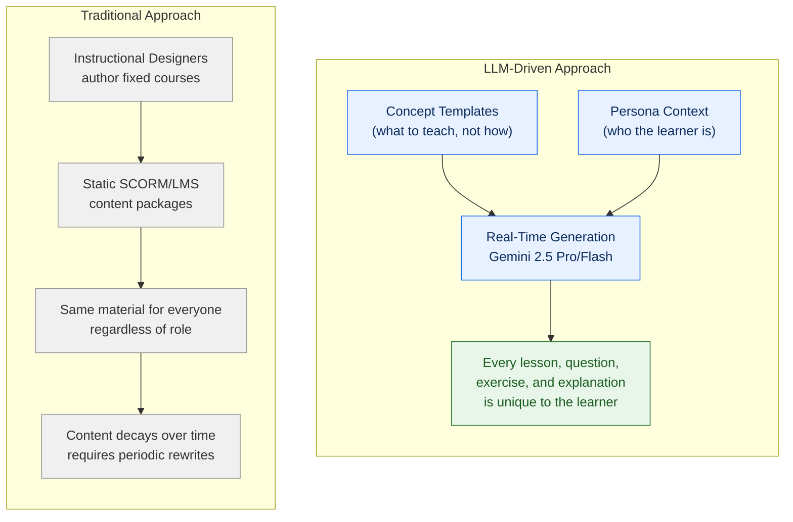

### What this means in practice

| Dimension | Traditional L&D | Learning Accelerator |
|-----------|----------------|---------------------|
| **Content authoring** | Instructional designers write fixed courses | LLMs generate lessons from concept scaffolds + persona context |
| **Personalization** | "Choose your track" dropdown | Every sentence is shaped by the learner's role, challenges, and outputs |
| **Assessment** | Pre-written question banks | LLM generates persona-specific scenarios from concept templates |
| **Scaling to new roles** | Months of course development | Define a new persona (responsibilities, challenges, AI use cases) — curriculum adapts instantly |
| **Content freshness** | Periodic manual rewrites | Model updates bring current knowledge automatically |
| **Remediation** | "Review the module again" | Coach agent re-explains using entirely different analogies, approaches, and scaffolding |
| **Cost to extend** | $50K–200K per course (industry avg) | One persona definition (~50 lines of structured data) |
| **Engagement model** | Passive: read slides, click next | Conversational: dialogue, practice, discovery |

---

## 2. The Generative Content Engine — Architecture

Four data layers combine at runtime to produce every piece of learner-facing
content. Nothing is pre-written except the structural scaffolding. Visual
content is generated by Gemini 2.5 Flash Image and served inline.

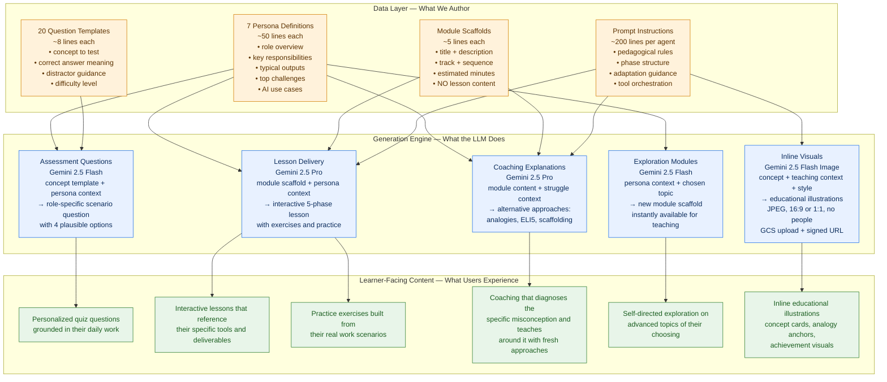

### What is authored vs. what is generated

| Layer | Authored By | Lines of Code | Generates |
|-------|-----------|---------------|-----------|
| **Persona definitions** | Human (once) | ~350 total (7 × 50) | Contextualizes every LLM interaction |
| **Question templates** | Human (once) | ~160 total (20 × 8) | 20 unique persona-specific questions per user |
| **Module scaffolds** | Human (once) | ~5 per module | Title, description, track placement. Lesson content is entirely LLM-generated |
| **Prompt instructions** | Human (iterated) | ~1,400 total (6 agents) | Pedagogical behavior, tool orchestration, adaptation rules, formatting, image placement |
| **Lesson content** | LLM (every session) | 0 pre-authored | Full interactive lessons with hooks, explanations, exercises, quizzes |
| **Quiz questions** | LLM (every assessment) | 0 pre-authored | Role-specific scenario questions with plausible distractors |
| **Coaching content** | LLM (every session) | 0 pre-authored | Alternative explanations, analogies, scaffolded practice |
| **Educational visuals** | LLM (every lesson) | 0 pre-authored | Concept cards, analogy anchors, achievement images — Gemini Flash Image |

**Total human-authored content**: ~1,700 lines of structural scaffolding.
**Total LLM-generated content**: Unlimited — unique to every learner, every session.

---

## 3. Persona-Aware Personalization — Deep Dive

The persona system is the primary personalization axis. Each persona is a
rich context object that gets injected into every LLM prompt across the
platform. This is not a "track filter" — it fundamentally changes the
content, examples, analogies, and exercises the learner sees.

### Persona structure

```mermaid
classDiagram
  class Persona {
    +title: str
    +role_overview: str
    +key_responsibilities: list~str~
    +typical_outputs: list~str~
    +top_tools: list~str~
    +top_challenges: list~str~
    +ai_use_cases: list~str~
    +get_persona_summary() str
  }

  class Communicator {
    title = "Communicator"
    key_responsibilities = [PR, internal comms, content]
    ai_use_cases = [draft press releases, adjust tone, monitor sentiment]
  }

  class Strategist {
    title = "Strategist"
    key_responsibilities = [brand strategy, media governance]
    ai_use_cases = [competitive analysis, scenario planning, market sizing]
  }

  class Creator {
    title = "Creator"
    key_responsibilities = [design, copywriting, video, UX]
    ai_use_cases = [image generation, creative briefs, presentation design]
  }

  class Coordinator {
    title = "Coordinator"
    key_responsibilities = [project/event management, budgets]
    ai_use_cases = [task breakdown, meeting summaries, vendor research]
  }

  class Insights {
    title = "Insights & Reporting"
    key_responsibilities = [data analysis, BI dashboards]
    ai_use_cases = [survey synthesis, trend forecasting, report automation]
  }

  class Marketer {
    title = "Marketer"
    key_responsibilities = [campaigns, demand generation]
    ai_use_cases = [audience segmentation, content calendars, A/B test design]
  }

  class Operator {
    title = "Operator"
    key_responsibilities = [process optimization, vendor management]
    ai_use_cases = [workflow automation, QA checklists, SOP generation]
  }

  Persona <|-- Communicator
  Persona <|-- Strategist
  Persona <|-- Creator
  Persona <|-- Coordinator
  Persona <|-- Insights
  Persona <|-- Marketer
  Persona <|-- Operator
```

### How persona context flows into content

The function `get_persona_summary()` extracts a 2–3 sentence prompt-ready
summary including the persona's top challenges and AI use cases. This summary
is injected into:

1. **Assessment question generation** — "As a [Communicator] who manages [PR, internal comms], you encounter..."
2. **Lesson delivery** — Teach agent adapts explanations, analogies, and exercises to the persona's tools and outputs
3. **Practice exercises** — Scenarios built from the persona's typical deliverables
4. **Coaching** — Alternative explanations use persona-relevant analogies
5. **Exploration** — Advanced topic suggestions tailored to persona interests

### Same concept, different experience

Consider the concept "How LLMs Work" taught to two different personas:

| Aspect | Communicator | Operator |
|--------|-------------|----------|
| **Hook question** | "When you draft a press release, how do you decide what comes next in a sentence?" | "When you write an SOP, how do you decide the sequence of steps?" |
| **Core analogy** | "LLMs are like a writing partner who's read everything but hasn't lived anything" | "LLMs are like a process manual that can generate new procedures based on patterns from thousands of existing SOPs" |
| **Practice exercise** | "Draft a prompt to generate 3 versions of a stakeholder update, then identify which version the LLM would likely produce first and why" | "Write a prompt to generate a quality checklist for a new vendor onboarding process, then predict where the LLM might miss context-specific steps" |
| **Quiz scenario** | "Your team asks you to use AI for a crisis communications draft. What should you consider about how the model generates text?" | "A colleague wants to automate incident response documentation with AI. What limitation of text generation is most relevant?" |

All four outputs come from the **same module scaffold** ("How LLMs Work") and
the **same question template** (concept: "How LLMs work"). The persona context
transforms the generic scaffold into role-specific learning.

---

## 4. Adaptive Assessment — The Proficiency Engine

The assessment is not a fixed exam. It is a **persona-specific, adaptive quiz**
that determines what the learner already knows and where they need to grow.

### Generation pipeline

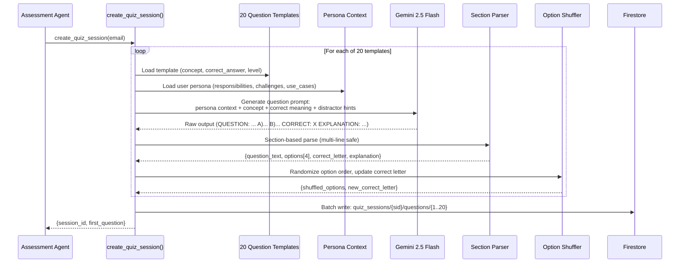

### Adaptive early termination

The assessment doesn't force all 20 questions when proficiency is already
clear. Per-section error thresholds stop the quiz early, respecting the
learner's time.

```mermaid
flowchart LR
  classDef beginner fill:#FFCDD2,stroke:#C62828,color:#B71C1C
  classDef intermediate fill:#FFF9C4,stroke:#F9A825,color:#F57F17
  classDef advanced fill:#C8E6C9,stroke:#2E7D32,color:#1B5E20
  classDef stop fill:#f0f0f0,stroke:#666,color:#333

  subgraph Section1["Beginner (Q1–Q8)"]
    direction LR
    Q1["Q1"]:::beginner
    Q2["Q2"]:::beginner
    Q3["Q3"]:::beginner
    Q4["Q4"]:::beginner
    Q5["Q5"]:::beginner
    Q6["Q6"]:::beginner
    Q7["Q7"]:::beginner
    Q8["Q8"]:::beginner
    Q1 --> Q2 --> Q3 --> Q4 --> Q5 --> Q6 --> Q7 --> Q8
  end

  subgraph Section2["Intermediate (Q9–Q14)"]
    direction LR
    Q9["Q9"]:::intermediate
    Q10["Q10"]:::intermediate
    Q11["Q11"]:::intermediate
    Q12["Q12"]:::intermediate
    Q13["Q13"]:::intermediate
    Q14["Q14"]:::intermediate
    Q9 --> Q10 --> Q11 --> Q12 --> Q13 --> Q14
  end

  subgraph Section3["Advanced (Q15–Q20)"]
    direction LR
    Q15["Q15"]:::advanced
    Q16["Q16"]:::advanced
    Q17["Q17"]:::advanced
    Q18["Q18"]:::advanced
    Q19["Q19"]:::advanced
    Q20["Q20"]:::advanced
    Q15 --> Q16 --> Q17 --> Q18 --> Q19 --> Q20
  end

  S1["STOP: ≥4 wrong<br/>in beginner section<br/>→ Beginner"]:::stop
  S2["STOP: ≥3 wrong<br/>in intermediate section<br/>→ Intermediate"]:::stop

  Section1 --> Section2 --> Section3
  Section1 -. "early stop" .-> S1
  Section2 -. "early stop" .-> S2
```

### Proficiency classification and path impact

| Score | Classification | Path Composition | Standard Modules |
|-------|---------------|-----------------|-----------------|
| **< 45%** | Beginner | Focus → Foundations → Prompt Craft → Persona → Advanced | Up to 23 modules |
| **45–75%** | Intermediate | Focus → Prompt Craft → Persona → Advanced | Up to 18 modules |
| **≥ 75%** | Advanced | Focus → Persona → Advanced | Up to 13 modules |

The proficiency level determines which tracks are included. Beginners get the
full curriculum. Advanced learners skip foundations and prompt craft —
material they've already demonstrated mastery of. Focus modules (addressing
specific assessment gaps) are always prepended regardless of level.

### Reliability engineering

The question generation pipeline is designed for zero-failure operation:

| Risk | Mitigation |
|------|-----------|
| LLM generates malformed output | Section-based parser handles multi-line text, missing fields |
| Parser extracts < 4 options | Fallback to `_generate_fallback_question()` with template-derived generic options |
| Correct answer not in A–D range | Fallback triggered |
| Empty explanation | Default explanation: "The correct answer demonstrates understanding of [concept]" |
| LLM always places correct answer in same position | Post-generation shuffle randomizes option order and updates correct letter |
| Agent presents its own assessment instead of tool data | Prompt "CRITICAL RULES" enforce verbatim presentation of tool response fields |

---

## 5. The Pedagogical Engine — How Teaching Works

Module scaffolds contain a title and description — typically 1–2 sentences.
The Teach Agent transforms this minimal scaffold into a rich, interactive,
20-minute conversational lesson using a structured 5-phase pedagogical model.

### Five-phase lesson architecture

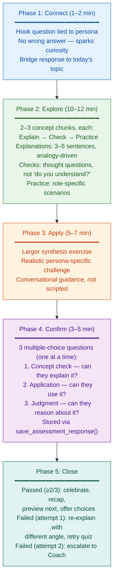

### The teaching philosophy

The prompt instructions encode specific pedagogical principles that shape
how the LLM delivers content:

| Principle | Implementation |
|-----------|---------------|
| **Ask before you tell** | Hook questions, check-in questions, Socratic probes before explanations |
| **Practice before you quiz** | Every concept chunk includes hands-on practice before the confirmation quiz |
| **Adapt based on responses** | If confused → different angle/analogy. If bored → accelerate. If engaged → go deeper |
| **Celebrate attempts, not just correctness** | Feedback acknowledges effort and reasoning, not only right/wrong |
| **Visual reinforcement** | Inline illustrations at 3 key moments: module open (concept card), after a key analogy (analogy anchor), module completion (achievement). Generated by Gemini Flash Image, rendered inline as JPEG |
| **Short messages** | 2–4 sentences per turn. Wait for response. Never lecture |
| **React authentically** | The agent responds to what the user actually said, not a scripted path |
| **Role-specific everything** | Explanations, analogies, exercises, and quiz scenarios all reference the learner's actual work |

### Coaching as alternative pedagogy

When a learner struggles (fails the module quiz twice), the Coach Agent
doesn't repeat the same lesson. It employs entirely different instructional
strategies:

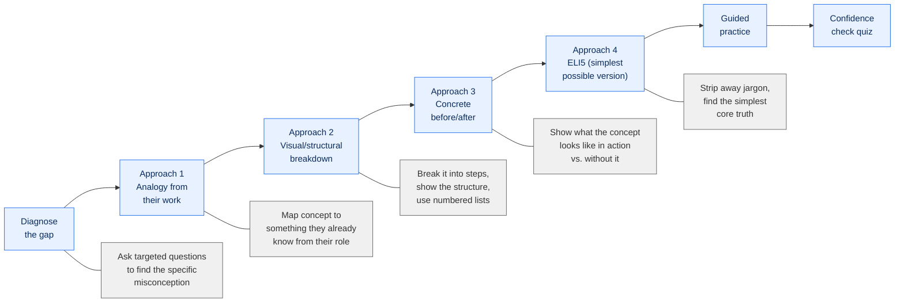

The coaching model is grounded in the philosophy that **difficulty is feedback,
not failure** — if a learner is struggling, the instruction needs to change,
not the learner.

---

## 6. Curriculum Composition — The Three Module Types

The curriculum is not a single fixed path. It is dynamically composed from
three types of modules, ordered to match the learner's proficiency and
interests.

### Module scaffold vs. lesson content

```mermaid
flowchart LR
  classDef scaffold fill:#fff2db,stroke:#d17b00,color:#5c3200
  classDef content fill:#e8f5e9,stroke:#2e7d32,color:#1b5e20

  subgraph Scaffold["What is stored in Firestore"]
    S1["title: 'How LLMs Work'"]:::scaffold
    S2["description: 'A mental model for<br/>understanding Large Language<br/>Models — tokens, context,<br/>and generation — without<br/>the math.'"]:::scaffold
    S3["track: 'foundations'"]:::scaffold
    S4["week: 1, sequence: 2"]:::scaffold
    S5["estimated_minutes: 20"]:::scaffold
  end

  subgraph Content["What the learner experiences"]
    C1["Hook: 'When you draft a<br/>press release, how do<br/>you predict what word<br/>comes next?'"]:::content
    C2["Chunk 1: Tokens explained<br/>via document editing analogy"]:::content
    C3["Practice: 'Here is a prompt<br/>— estimate how many tokens<br/>it uses and why that matters<br/>for your exec summary'"]:::content
    C4["Chunk 2: Context windows<br/>via inbox metaphor"]:::content
    C5["Quiz: 3 persona-specific<br/>scenario questions"]:::content
  end

  Scaffold -- "Teach Agent +<br/>Gemini 2.5 Pro +<br/>Persona Context<br/>= real-time generation" --> Content
```

### Standard modules (seeded)

27 module scaffolds authored once and seeded to Firestore. Organized in 4 tracks:

| Track | Week | Modules | Content |
|-------|------|---------|---------|
| **Foundations** | 1 | 5 | What AI Is · How LLMs Work · AI Tools Landscape · Limitations & Hallucinations · When AI Helps vs. Doesn't |
| **Prompt Craft** | 2 | 5 | Anatomy of a Prompt · Context, Constraints, Examples · Iterative Refinement · Role-Based Patterns · Your First 10 Prompts |
| **Persona-Specific** | 3–4 | 5 per persona | Unique to each of the 7 personas (35 scaffolds total, learner sees only their 5) |
| **Advanced** | 5 | 5 | RAG & Knowledge Integration · Multi-modal AI · AI Agents & Workflows · Ethics & Governance · Building Your AI Toolkit |

### Focus modules (generated from assessment gaps)

Created by `create_focus_module()` when the assessment identifies growth areas.
These are **prepended** to the learning path so the learner addresses gaps
before the main curriculum.

| Property | Value |
|----------|-------|
| **Created by** | Assessment Agent (via `create_focus_module()`) |
| **Trigger** | User says "yes" to working on growth areas after assessment |
| **Maximum** | 3 per assessment |
| **Estimated time** | 15 minutes |
| **Concept chunks** | 2 |
| **Practice exercises** | 1 |
| **Path position** | Prepended (index 0+) |
| **Track** | `focus_areas` |
| **Tagged with** | `concept_theme` linking to the assessed concept |

### Exploration modules (generated post-completion)

Created by `create_exploration_module()` after the learner completes their
entire standard path. These let the learner pursue advanced topics of their
choosing.

| Property | Value |
|----------|-------|
| **Created by** | Exploration Agent (via `create_exploration_module()`) |
| **Trigger** | User's state reaches `completed`, chooses a topic |
| **Maximum** | 3 per session |
| **Estimated time** | 20 minutes |
| **Concept chunks** | 3 |
| **Practice exercises** | 1 |
| **Path position** | Appended (end of path) |
| **Track** | `exploration` |
| **Tagged with** | `topic` (free-form: RAG deep-dive, fine-tuning, etc.) |

### The result: a path that is unique to each learner

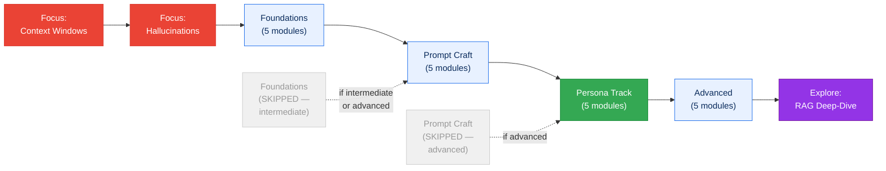

A beginner Communicator who struggled with context windows and hallucinations,
then later explored RAG, would have a path of: **2 focus + 5 foundations +
5 prompt craft + 5 communicator + 5 advanced + 1 exploration = 23 modules**.

An advanced Operator who had no focus areas would have: **5 operator +
5 advanced = 10 modules**.

---

## 7. Platform Metrics — Measuring What Matters

The platform computes two tiers of metrics: **per-user engagement stats**
tracked in real time, and **platform-wide analytics** aggregated daily.

### Per-user metrics (real-time)

Updated by tool functions as users interact. Stored in `user_stats/{uid}`.

```mermaid
flowchart TD
  classDef trigger fill:#e8f1ff,stroke:#1f6feb,color:#0b2c5c
  classDef metric fill:#e8f5e9,stroke:#2e7d32,color:#1b5e20
  classDef store fill:#fff2db,stroke:#d17b00,color:#5c3200

  BMS["begin_module_session()"]:::trigger
  FMS["finish_module_session()"]:::trigger
  CFM["create_focus_module()"]:::trigger
  CEM["create_exploration_module()"]:::trigger

  BMS --> M1["total_sessions++"]:::metric
  BMS --> M2["current_streak<br/>(consecutive day calc)"]:::metric
  BMS --> M3["longest_streak<br/>(personal best update)"]:::metric
  BMS --> M4["last_activity_at"]:::metric
  BMS --> M5["first_activity_at<br/>(if null)"]:::metric

  FMS --> M6["total_modules_completed++"]:::metric
  FMS --> M7["total_time_seconds+=<br/>(finished_at − started_at)"]:::metric
  FMS --> M8["avg_quiz_score<br/>(rolling average)"]:::metric
  FMS --> M9["path_completed_at<br/>(if final module)"]:::metric
  FMS --> M10["days_to_completion<br/>(path_completed − first_activity)"]:::metric

  CFM --> M11["focus_modules_created++"]:::metric
  CEM --> M12["exploration_modules_created++"]:::metric

  M1 & M2 & M3 & M4 & M5 & M6 & M7 & M8 & M9 & M10 & M11 & M12 --> FS["user_stats/{uid}<br/>Firestore"]:::store
```

#### Metric definitions

| Metric | Type | Source | Business Question |
|--------|------|--------|-----------------|
| `total_sessions` | Counter | `begin_module_session()` | How often does this user engage? |
| `total_modules_completed` | Counter | `finish_module_session()` | How far has the user progressed? |
| `total_time_seconds` | Accumulator | `finish - begin` timestamps | How much time has the user invested? |
| `avg_quiz_score` | Rolling avg | `finish_module_session(score)` | How well is the user retaining material? |
| `current_streak` | Calculated | Day-diff from `last_activity_at` | Is the user building a learning habit? |
| `longest_streak` | High water mark | Max of all streaks | What's the user's best engagement run? |
| `focus_modules_created` | Counter | `create_focus_module()` | How much remediation was needed? |
| `exploration_modules_created` | Counter | `create_exploration_module()` | Is the user self-directing beyond the path? |
| `days_to_completion` | Calculated | `path_completed_at - first_activity_at` | How long does it take to complete the curriculum? |
| `path_completed_at` | Timestamp | Final module finish | Has this user completed their learning path? |

#### Streak calculation logic

```
if last_activity was yesterday  → current_streak++, update longest if higher
if last_activity was today      → no change (already counted)
if last_activity was >1 day ago → current_streak = 1 (reset)
if first activity ever          → current_streak = 1, longest_streak = 1
```

### Platform-wide metrics (daily aggregation)

A Cloud Function runs daily at 6 AM UTC, aggregating all `user_stats`
documents into a single `platform_stats/current` document. Historical
snapshots are preserved for trend analysis.

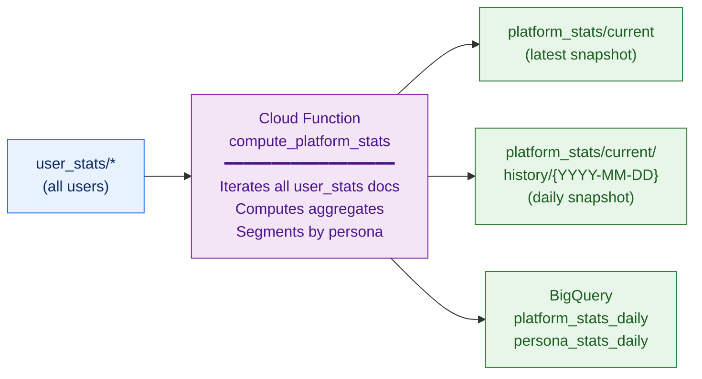

#### Platform metrics computed

| Metric | Formula | Business Question |
|--------|---------|-----------------|
| `total_users` | Count of `user_stats` docs | How large is our learner population? |
| `active_users_7d` | Users with `last_activity_at` ≥ 7 days ago | How many are actively learning this week? |
| `active_users_30d` | Users with `last_activity_at` ≥ 30 days ago | Monthly active learner base? |
| `total_learning_hours` | Sum of `total_time_seconds` / 3600 | Total platform learning investment? |
| `total_modules_delivered` | Sum of `total_modules_completed` | How much content has the platform delivered? |
| `total_custom_modules` | Sum of focus + exploration modules | How much personalized content has been generated? |
| `avg_time_to_completion_days` | Avg of `days_to_completion` (non-null) | How long does completion typically take? |
| `avg_session_minutes` | `total_time / total_sessions / 60` | How long is a typical learning session? |
| `avg_streak_days` | Avg of `current_streak` (active users) | How sticky is the platform? |
| `completion_rate` | `users_completed / total_users` | What fraction of learners finish the path? |

#### Per-persona breakdown

Every platform metric is also computed **per persona**, enabling:

| Analysis | Question |
|----------|----------|
| **Engagement disparity** | Are Strategists engaging less than Creators? Why? |
| **Completion variance** | Which persona completes fastest? Which struggles most? |
| **Custom module adoption** | Which personas create the most exploration modules? |
| **Quiz performance** | Are Operators scoring higher than Coordinators? |
| **Streak comparison** | Which persona builds the strongest learning habits? |

#### Data pipeline

| Destination | Format | Purpose | Retention |
|-------------|--------|---------|-----------|
| `platform_stats/current` | Firestore document | Live dashboard consumption | Overwritten daily |
| `platform_stats/current/history/{date}` | Firestore subcollection | Trend analysis within application | Ongoing |
| `learning_accelerator.platform_stats_daily` | BigQuery table | Cross-platform analytics, SQL queries | Ongoing |
| `learning_accelerator.persona_stats_daily` | BigQuery table | Persona-segmented trend analysis | Ongoing |

---

## 8. Scaling to New Audiences

Adding a new persona to the platform requires **zero code changes** to the
agents, tools, or infrastructure. The entire adaptation happens through data:

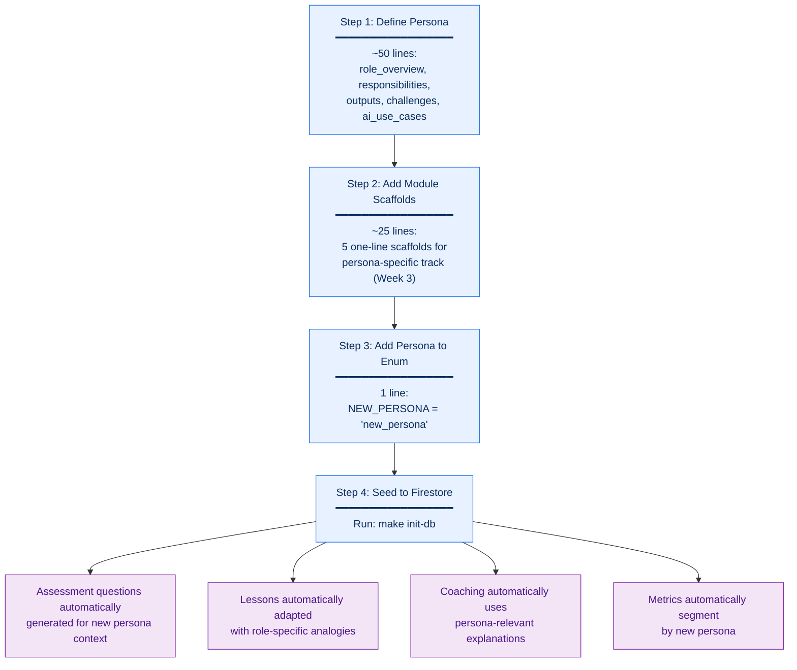

**Total effort**: ~80 lines of data definition. No prompt changes. No tool
changes. No agent changes. No deployment changes beyond running the seed
script.

This is the core value of LLM-driven curriculum: **the content engine scales
with data, not with development effort**.

---

## 9. Key Characteristics

| Aspect | Design |
|--------|--------|
| **Content authoring model** | Human-authored scaffolding (~1,700 lines) + LLM-generated content (unlimited, unique per learner) |
| **Personalization axis** | 7 persona definitions inject role context into every LLM interaction |
| **Assessment approach** | 20 concept templates → LLM generates persona-specific scenarios → adaptive early termination |
| **Teaching model** | 5-phase conversational pedagogy (Connect → Explore → Apply → Confirm → Close) |
| **Remediation model** | Coach agent uses fundamentally different instructional strategies, not repetition |
| **Path composition** | Dynamic: proficiency determines tracks, focus modules prepended, exploration appended |
| **Module type spectrum** | Seeded scaffolds (standard) → Gap-filling (focus) → Learner-directed (exploration) |
| **Engagement metrics** | Real-time per-user tracking (streaks, time, scores, custom modules) |
| **Platform metrics** | Daily aggregation → Firestore + BigQuery, segmented by persona |
| **Scaling model** | New persona = ~80 lines of data. No code changes. Full curriculum adapts instantly |
