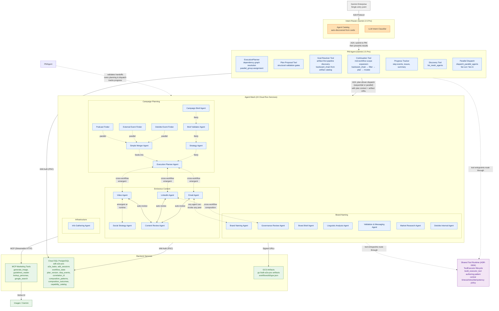
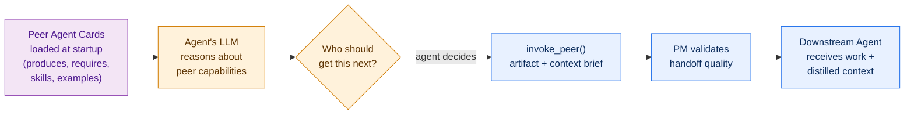
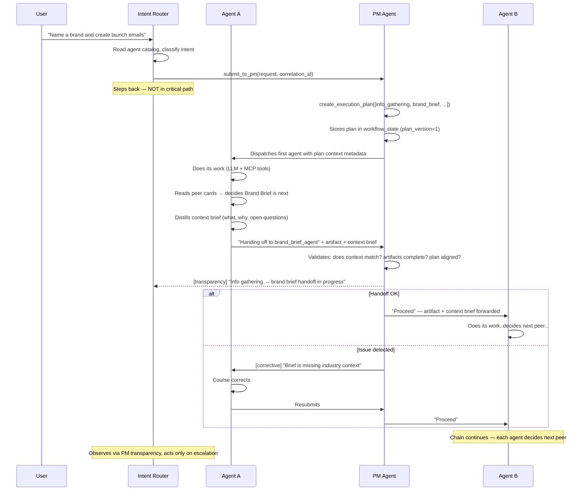
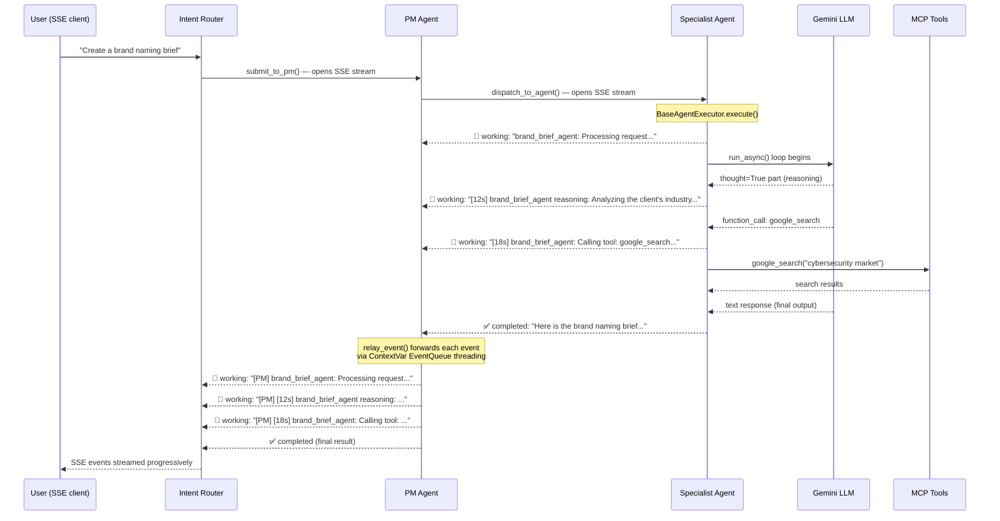
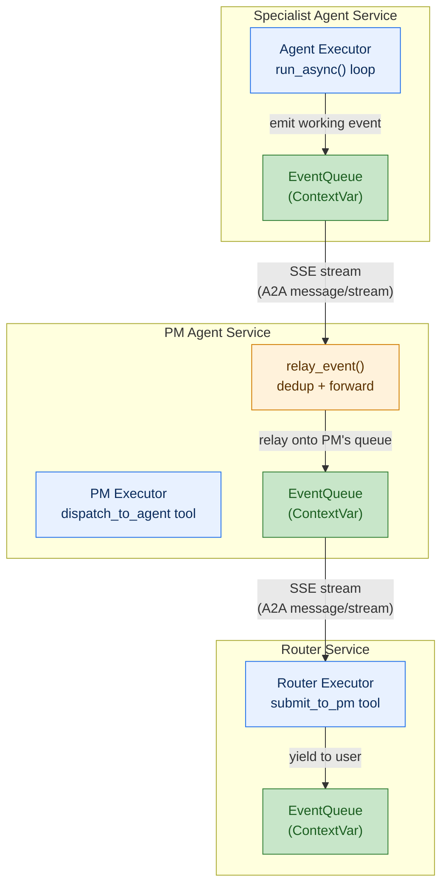
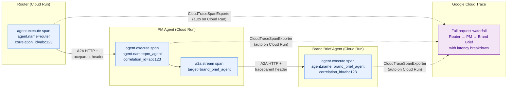
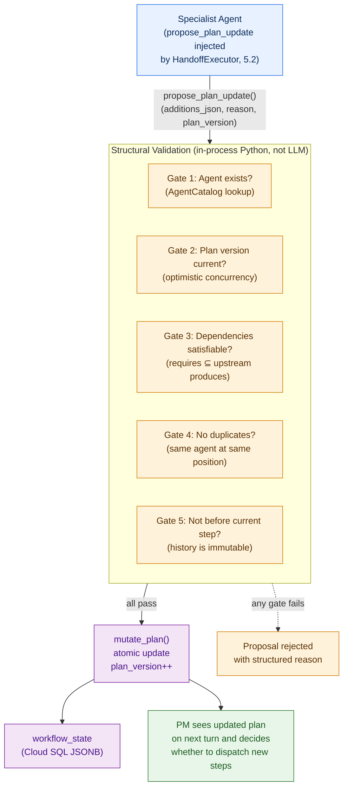
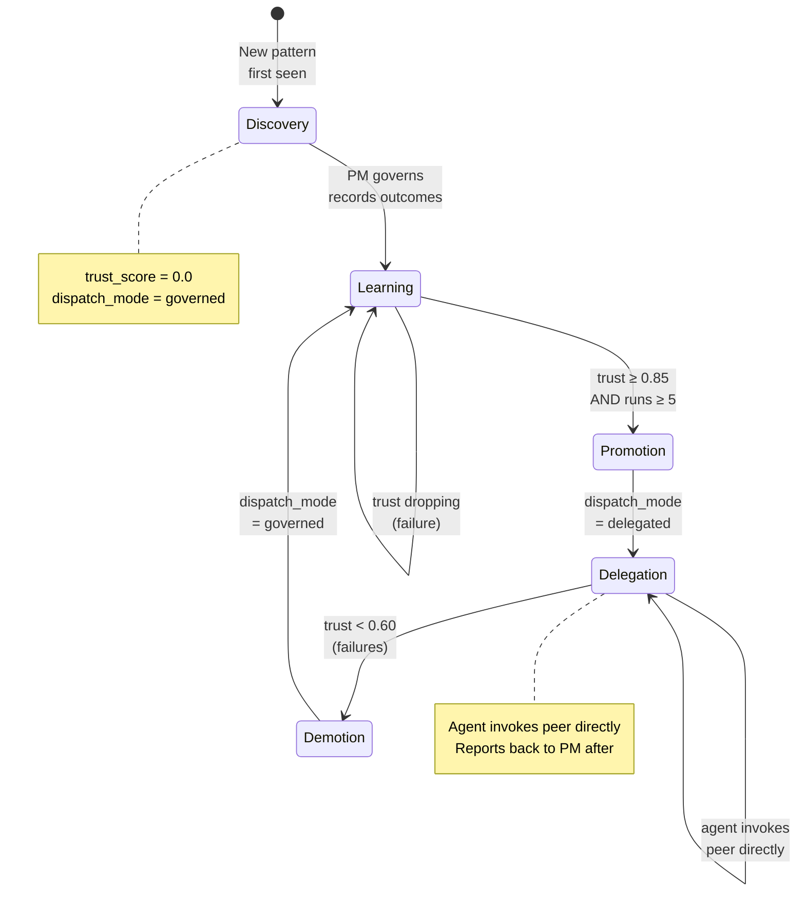
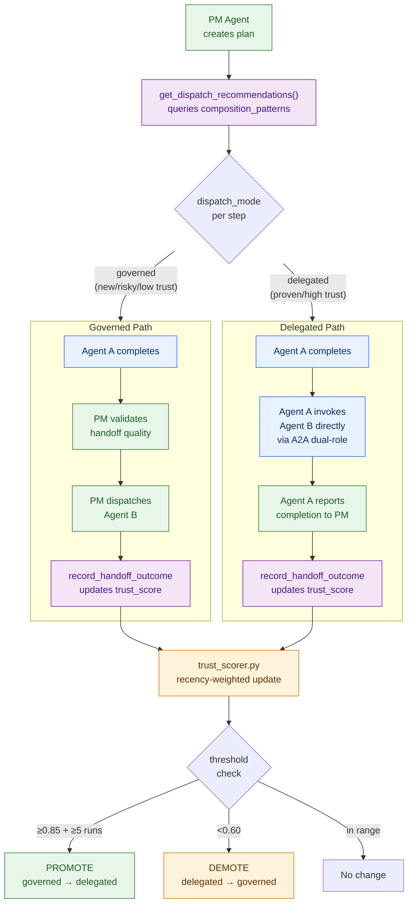
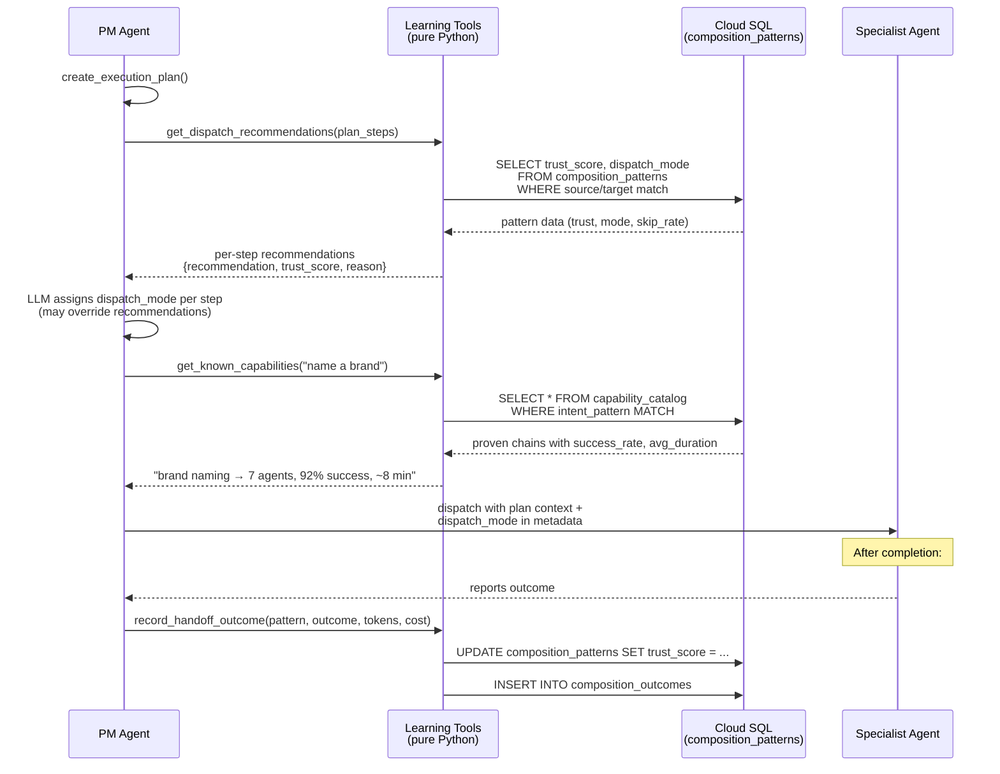

# System Architecture — V3 Full Mesh

> **Last Updated**: 2026-03-17  
> **Decisions**: D27 (B+C coordination), D28 (PM dual notification), D30-D35 (Router simplification, PM planning authority, LLM config, OTel tracing), Phase 5A (peer awareness, specialist proposals, artifact URI threading, parallel dispatch), Phase 5B (continuation tool, goal resolver, artifact catalog, composite planning), Phase 5D (artifact versioning, producer state tracker, cross-workflow artifact access), ADR-0004 (tool runtime standardization: Phase E complete; cloud telemetry dashboard validation pending)

## 1. High-Level System Flow



## 2. How Composition Works

The system does NOT have hardcoded workflows. Composition is **emergent** — agents
discover capabilities, reason about what they need, and invoke peers dynamically.



### What makes this a mesh, not a pipeline

| Pipeline (what we DON'T do) | Mesh (what we DO) |
|---|---|
| Router tells Agent B to call Agent C | Agent B reads peer cards and decides who to call |
| Fixed `A → B → C` execution order | Agent discovers next step from `produces`/`requires` + LLM reasoning |
| New workflow = code change | New workflow = new agent card dropped in `agent_cards/` |
| Router polls every step | Router kicks off, agents self-chain, PM tracks |
| Single workflow boundary | Agent can invoke ANY peer — cross-workflow composition is automatic |

## 3. Coordination Model (B+C)



## 4. Key Characteristics

| Aspect | Design |
|--------|--------|
| **Topology** | Full mesh — every agent is Server AND Client (dual-role). 23 agents + 1 MCP server across 3 workflows |
| **Entry point** | Gemini Enterprise → Intent Router (only registered surface) |
| **After kickoff** | Router submits to PM; PM plans, dispatches, and tracks; agents self-chain peer-to-peer |
| **Composition** | Emergent — agents read peer cards, LLM reasons about who to call next |
| **Coordination** | B+C — PM Agent validates handoffs, owns planning & dispatch + agents pass distilled context to peers (D27, D30-D34) |
| **Planning** | PM owns `ExecutionPlanner` — builds plan from dependency graph, agents propose mutations via `propose_plan_update` tool |
| **Plan evolution** | Living plans — any agent can propose additions; PM validates structurally (5 gates) then applies via `mutate_plan()` with optimistic concurrency (`plan_version`) |
| **Escalation** | Corrective → agent first, transparency → router, escalation only on retry exhaustion (D28) |
| **Human input** | Agent-decided at runtime — returns `input-required` status when it needs human feedback |
| **State** | Cloud SQL (JSONB) — tasks, sessions, workflow state with `plan_version`, `step_events`, `correlation_id` |
| **Artifacts** | GCS with signed URLs — `workflows/{id}/{type}.json` |
| **Tools** | Shared MCP server (Streamable HTTP, stateless) — 4 tools |
| **PM Tools** | 15 tools: `plan_and_create_workflow`, `create_execution_plan`, `create_workflow`, `record_step_completion`, `record_issue`, `update_living_summary`, `get_workflow_progress`, `get_correlation_status`, `propose_plan_update`, `get_workflow_plan`, `resolve_goal_agents` (5B), `continue_workflow` (5B), `list_mesh_agents`, `dispatch_agent`, `dispatch_parallel_agents` |
| **Specialist Tools** | `HandoffExecutor` auto-injects `propose_plan_update` + `get_workflow_plan` into every specialist from DB env vars (5.2). Agents can query and propose plan mutations directly |
| **Tool Runtime** | ADR-0004 runtime path is standardized: tool entrypoints route through `ToolExecutor` (directly or via `build_executor_tool`/adapter), with centralized timeout/retry/idempotency policy and normalized `ToolResult` telemetry tags |
| **Peer Awareness** | `_enrich_with_peer_awareness()` appends peer capability summaries (produces/requires) to PM-dispatched prompts (5.1). Specialists see mesh context without tool calls |
| **Parallel Dispatch** | PM uses `dispatch_parallel_agents` for independent steps sharing the same `parallel_group` (5.4). Fan-out via `asyncio.gather`, sequential bookkeeping fan-in |
| **Cross-Workflow Composition** | Artifact-first planning via `resolve_goal_agents` (5B) — backward-chains through `artifact_catalog` dependency graph across domain boundaries. Mid-workflow scope expansion via `continue_workflow` (5B) — extends active plan atomically with `correlation_id` threading. Composite workflow type auto-detected by planner when agents span multiple domains |
| **Auth** | IAM service-to-service (Cloud Run invoker tokens) — full mesh N×N bindings |
| **Transport** | A2A streaming (`message/stream` SSE) for progressive updates. Executor emits `working` events (tool calls, thinking traces, progress) relayed via `relay_event()` + ContextVar threading |
| **Discovery** | Agent cards auto-discovered from `agent_cards/*.json` + `list_mesh_agents` tool for runtime queries |
| **Tracing** | `correlation_id` (domain, persisted in Cloud SQL) + OTel `trace_id` (infrastructure, Cloud Trace). Linked via span attributes on `agent.execute` and `a2a.stream` spans. W3C `traceparent` propagated across A2A HTTP boundaries. Auto-configured: `CloudTraceSpanExporter` on Cloud Run, NOOP locally (`agents/shared/tracing.py`) |
| **LLM Config** | Centralized in `agents/shared/config/llm_config.py` — per-agent model, thinking config, tool config with 4-level env-var override hierarchy (D35) |
| **Adaptive Dispatch** | Earned delegation (D36) — `governed` vs `delegated` per plan step, driven by `trust_score` from `composition_patterns`. `agents/shared/learning/` package (pure algorithmic Python). Trust lifecycle: discovery→learning→promotion→delegation→demotion |
| **User Preferences** | Per-user personalization via `user_profiles` + `user_preferences` tables. Explicit (`confidence=1.0`) and inferred (climbs toward 0.9). PM threads into dispatch metadata. 90-day decay for stale preferences |
| **Extensibility** | Add agent = drop card + deploy service → mesh auto-discovers |

## 5. Streaming & Observability — How Users See Progress

Every agent emits **streaming events** as it works. These events propagate back
through the mesh to the user in real time — the user sees tool calls, reasoning
traces, and handoff transitions as they happen, not after a 3-minute silence.

### Streaming Event Relay Chain



### Event Types Emitted by Executor

| Event | Trigger | Format | Example |
|-------|---------|--------|---------|
| **Initial working** | `execute()` entry | `{agent}: Processing request...` | `brand_brief_agent: Processing request...` |
| **Tool call** | `function_call` part from LLM | `[{elapsed}s] {agent}: Calling tool: {name}...` | `[18s] brand_brief_agent: Calling tool: google_search...` |
| **Thinking trace** | `thought=True` part from LLM | `[{elapsed}s] {agent} reasoning: {summary}` | `[12s] brand_brief_agent reasoning: Analyzing the client's...` (truncated at 200 chars) |
| **Completed** | Final text response | Full response text | The complete brand naming brief |

### ContextVar Threading — How Events Cross Service Boundaries

Events don't flow through return values. Each executor sets a **ContextVar**
(`EventQueue`) before invoking the ADK agent. When a PM tool dispatches to a
peer agent via `dispatch_to_agent`, it opens an SSE stream and uses `relay_event()`
to forward each received event onto its own `EventQueue` — which the PM's
executor is watching.



> **Key insight**: Each service boundary is an independent SSE stream. The
> ContextVar pattern means tools running inside an executor can emit events
> without any coupling to the transport layer. `relay_event()` handles
> deduplication (same `message_id` won't be forwarded twice) and adds a
> `[PM]` prefix for provenance.

### Distributed Tracing — OTel Spans Across the Mesh

The system maintains **two complementary trace keys**:

| Layer | Key | Purpose | Storage |
|-------|-----|---------|---------|
| **Domain** | `correlation_id` | PM queries, workflow status, audit trail | Cloud SQL (persisted) |
| **Infrastructure** | OTel `trace_id` | Latency waterfall, error diagnosis, Cloud Trace UI | Cloud Trace (ephemeral) |

They're linked: every OTel span carries `correlation_id` as an attribute, so you
can jump from a Cloud Trace waterfall to the corresponding workflow in the DB.



**How it works**:
1. `BaseAgentExecutor.execute()` creates an `agent.execute` span with attributes (`agent.name`, `task.id`, `correlation_id`, `workflow_id`)
2. `A2AClient.send_task_streaming()` creates an `a2a.stream` child span and injects W3C `traceparent` into the HTTP headers via `inject_trace_headers()`
3. The downstream service's executor picks up the trace context — its `agent.execute` span becomes a child of the caller's `a2a.stream` span
4. On Cloud Run, `CloudTraceSpanExporter` ships spans to Google Cloud Trace automatically (detected via `K_SERVICE` env var)
5. Locally/in tests, tracing is NOOP — zero overhead, no side effects

> **Configuration**: `agents/shared/tracing.py` auto-detects the environment.
> No env vars needed. `use_test_provider()` / `reset_provider()` enable
> in-memory span capture for tests without touching the global OTel provider.

## 6. Plan Evolution Infrastructure (D34)

Plans are living documents managed by the PM Agent. Any agent can propose mutations;
PM validates structurally and applies atomically. This enables organic workflow evolution
without hardcoded pipelines.



> **5.2 change**: Specialists call `propose_plan_update` directly as an ADK tool
> (injected by `HandoffExecutor`). The 5 structural gates run in-process — PM is
> not in the proposal loop. PM sees the already-validated mutation on its next
> turn and decides dispatch. This avoids making PM a bottleneck for proposals.

### Plan Context in Dispatch

When PM dispatches an agent, it includes **plan context metadata** — a structured
snapshot of the current plan state:

```
{
  "plan_version": 3,
  "workflow_id": "wf-abc123",
  "total_steps": 7,
  "current_step": 2,
  "your_steps": [2, 5],        // indices where this agent appears
  "completed_steps": ["info_gathering"],
  "pending_steps": ["brand_naming", "linguistic", "validation", "governance"],
  "available_artifacts": {
    "brand_requirements": "gs://adk-a2a-poc-artifacts/workflows/wf-abc123/brand_requirements.json",
    "brand_naming_brief": "gs://adk-a2a-poc-artifacts/workflows/wf-abc123/brand_naming_brief.json"
  },
  "plan_summary": "✓ info_gathering ▸ brand_brief ○ brand_naming ○ linguistic ○ validation ○ governance"
}
```

This gives each agent situational awareness without needing to query the plan separately.
Artifact URIs (5.3) are threaded as GCS paths so downstream agents can reference
prior work products directly, not just by name.

## 7. Adaptive Learning & Delegated Dispatch (D36)

The mesh learns from execution history to optimize dispatch governance. New or risky
compositions start fully governed by PM; proven patterns earn delegated authority.

### Trust Lifecycle



### Governed vs Delegated Dispatch



### PM Queries Learning Data During Plan Creation



### Learning Tables (Cloud SQL)

| Table | Purpose | Key Columns |
|-------|---------|-------------|
| `composition_patterns` | Tracks each agent→agent pairing with cumulative trust | `pattern_id`, `source_agent`, `target_agent`, `trust_score`, `dispatch_mode`, `success_count`, `failure_count`, `skip_rate` |
| `composition_outcomes` | Per-handoff result with token/cost data | `outcome_id`, `pattern_id` (FK), `correlation_id`, `outcome`, `prompt_tokens`, `completion_tokens`, `estimated_cost`, `duration_ms` |
| `capability_catalog` | Discovered multi-step chains with end-to-end metrics | `capability_id`, `intent_pattern`, `composition_chain` (JSONB), `success_rate`, `avg_duration`, `user_satisfaction_avg` |
| `user_profiles` | User identity across sessions | `user_id` (PK), `display_name`, `role_inference`, `org_context` |
| `user_preferences` | Learned and stated preferences per user | `preference_id`, `user_id` (FK), `category`, `key`, `value`, `confidence`, `source` (explicit/inferred) |

### Design Principles

| Principle | Implementation |
|-----------|----------------|
| **Learning is algorithmic, not LLM** | `agents/shared/learning/` — pure Python: `PatternTracker`, `TrustScorer`, `CapabilityCatalog`, `PreferenceEngine` |
| **PM cognitive load unchanged** | PM calls tools, gets structured data, makes judgment calls. No learning math in prompts |
| **Agents stay simple** | Produce output, propose plan changes, report back. No dispatch logic |
| **Trust is earned, not configured** | Thresholds: `PROMOTE=0.85`, `DEMOTE=0.60`, `MIN_RUNS=5`, `RECENCY_WEIGHT=0.7` |
| **Cost-aware optimization** | Token/cost tracking per handoff enables cheaper chain selection |
| **User-grounded quality** | Satisfaction signals feed into trust alongside algorithmic success |
