# Agent Architecture — V3 Full Mesh

> **Last Updated**: 2026-03-17  
> **Decisions**: D27 (B+C coordination), D28 (PM dual notification), D30-D35 (Router simplification, PM planning authority, LLM config, OTel tracing), Phase 5A (peer awareness, specialist proposals, artifact URI threading, parallel dispatch), Phase 5B (continuation tool, goal resolver, artifact catalog, composite planning), Phase 5D (artifact versioning, producer state tracker, cross-workflow artifact access), ADR-0004 (tool runtime standardization: Phase E complete; cloud telemetry dashboard validation pending)

## 1. Agent Dual-Role Pattern (Foundation)

Every agent in the mesh is **both a server and a client**. This is what makes
the mesh possible — any agent can receive work AND invoke any other agent.

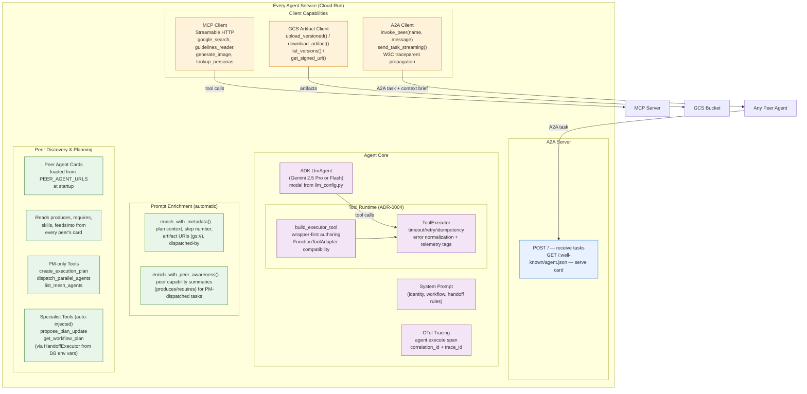

## 1b. Tool Runtime Standardization (ADR-0004)

- Tool execution lifecycle is standardized through `ToolExecutor` for migrated tool entrypoints.
- Tool-authoring pattern is wrapper-first (`build_executor_tool`) with adapters for compatibility paths.
- Runtime policy concerns (timeout/retry/idempotency/error normalization/telemetry tags) are centralized, not duplicated in specialist tool bodies.
- Current remaining runtime sign-off is cloud dashboard telemetry validation (Cloud Logging/Trace field verification).

## 2. Emergent Composition — How Agents Decide Who's Next

Agents don't follow hardcoded pipelines. They **read peer cards** at startup,
**reason about capabilities** using their LLM, and **decide at runtime** who
should receive their output. This is what makes the system extensible — drop
a new agent card and the mesh discovers it automatically.

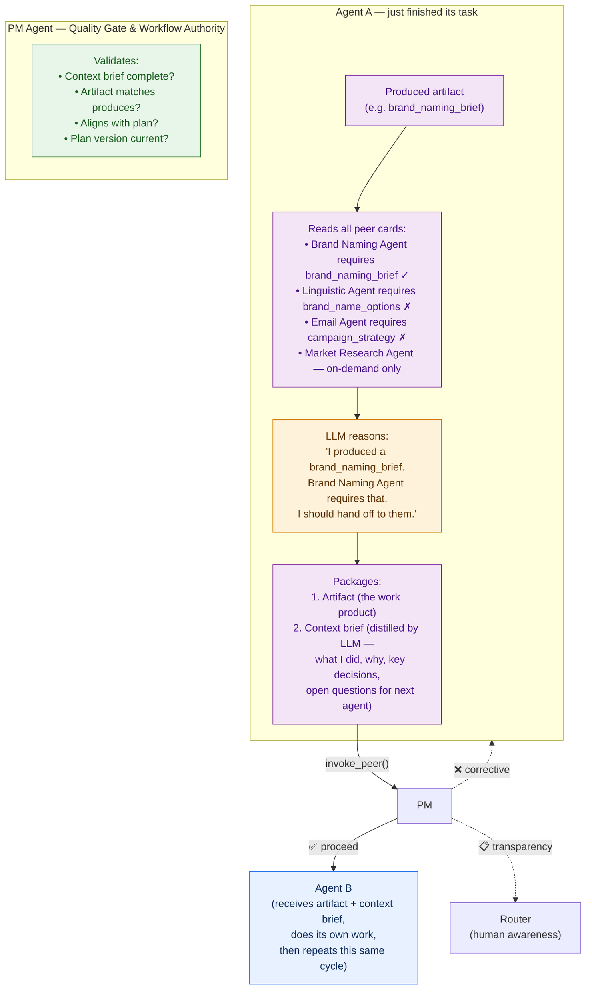

### Why this matters

| Static pipeline | Emergent mesh |
|---|---|
| `A → B → C` hardcoded in code | A reads cards → LLM decides B is next → A invokes B |
| Adding Agent D requires code change | Adding Agent D = drop a card with `requires: [X]` → A discovers it |
| Cross-workflow = separate code path | Agent reasons: "Email Agent can help here" → invokes it directly |
| Failure = pipeline breaks | Agent retries, PM course-corrects, plan evolves |

## 3. Agent Mesh — Complete Service Map

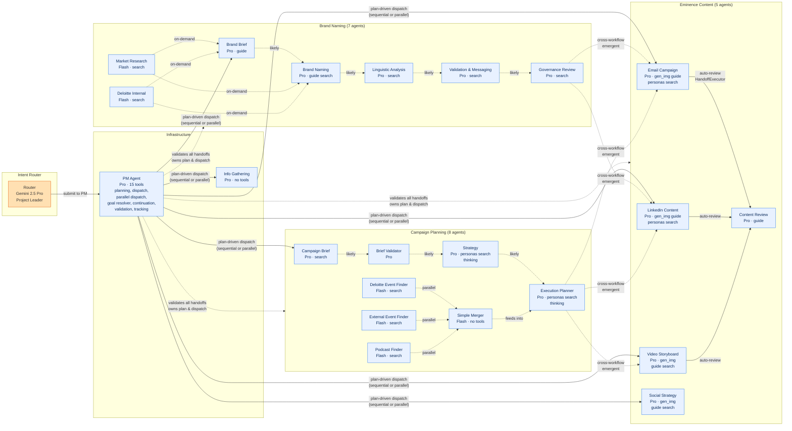

> **Note**: Dashed arrows between agents are "likely" handoff paths
> based on `produces`/`requires` alignment — but agents discover these at runtime
> from peer cards, they are NOT hardcoded. An agent could skip steps, add steps,
> or invoke agents from a different domain based on what it learns.

## 4. Context Passing — What Flows Between Agents

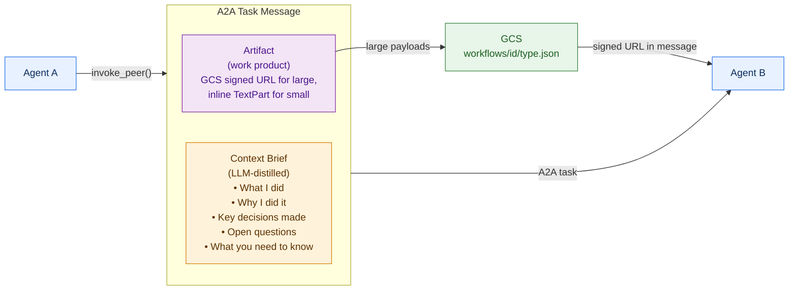

### Context brief vs raw dump

The context brief is **distilled by the agent's own LLM** — not a copy of the
entire conversation history. The agent summarizes what matters for the next
agent. This prevents context degradation across long chains.

```
Example context brief (Brand Brief → Brand Naming):

"I created a brand naming brief for Acme Corp, a B2B cybersecurity startup.
Key decisions: positioned as 'trusted guardian' archetype, excluded any
military/aggressive imagery per client constraint. Industry: cybersecurity.
Target audience: CISOs and IT directors at Fortune 500. Open question:
client mentioned potential international expansion but didn't confirm
markets — you may want to consider cross-language analysis for the names."
```

### What the specialist LLM actually sees (Phase 5 enrichment pipeline)

When PM dispatches a specialist, the executor automatically enriches the raw
A2A message text through three layers before it reaches the LLM:

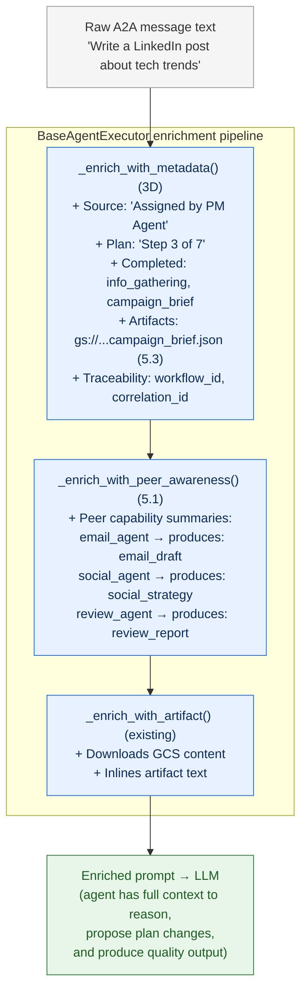

This is why a specialist can reason about the plan and propose changes — it
doesn't just see "Write a LinkedIn post." It sees its step number, what's been
completed, what artifacts are available (with GCS URIs), and what peer agents
exist in the mesh. Combined with the injected `propose_plan_update` and
`get_workflow_plan` tools (5.2), the specialist has both the **context to reason**
and the **tools to act**.

## 5. Brand Naming — Example of Emergent Flow

This shows how the brand naming pipeline works. The arrows represent
**likely** handoff paths based on `produces`/`requires` — but each agent
decides at runtime whether to follow, skip, or deviate.

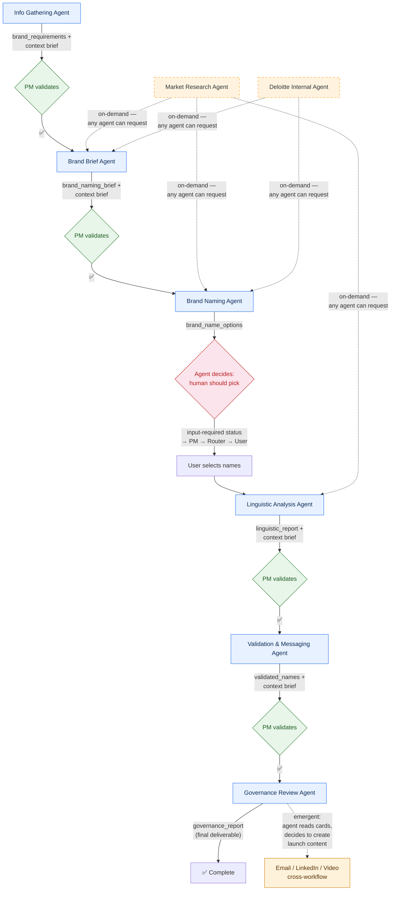

## 5b. Campaign Planning — Example of Emergent Flow

The campaign planning pipeline has a main chain (brief → validator → strategy →
exec planner) and a parallel content finder sub-pipeline (3 finders → merger →
exec planner). All handoffs go through PM validation.

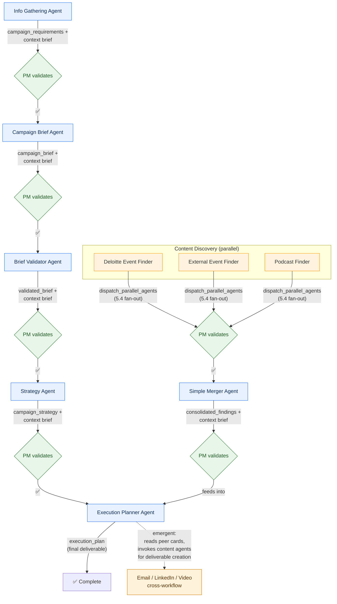

> **Content pipeline**: The 3 finder agents (Deloitte Events, External Events,
> Podcasts) run in parallel (`parallelizable: true` in agent cards). PM dispatches
> them simultaneously using `dispatch_parallel_agents` (5.4), which fans out via
> `asyncio.gather` and collects all results before advancing. Their outputs feed into
> the Simple Merger, which consolidates findings with cross-references and insights.

## 5c. Parallel Dispatch — How PM Handles Independent Steps (5.4)

When plan steps share the same `parallel_group` (computed by Kahn's topological
sort from `produces`/`requires` in agent cards), PM uses `dispatch_parallel_agents`
instead of dispatching sequentially.

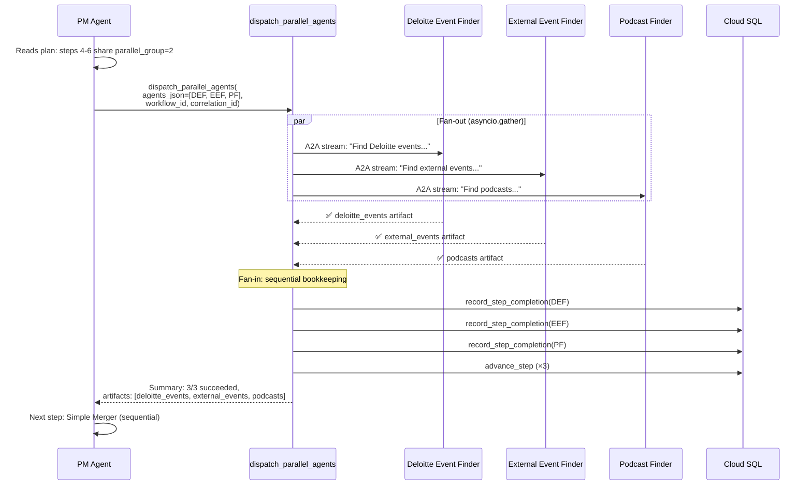

### How `parallel_group` is assigned

The `ExecutionPlanner` uses Kahn's topological sort on the `produces`/`requires`
dependency graph. Agents whose dependencies are all satisfied at the same
topological level AND whose cards have `parallelizable: true` receive the
same `parallel_group` number. PM serialization (5.4a) threads this into the
plan so `dispatch_parallel_agents` knows which steps to fan out together.

### PM prompt decision logic

| Condition | PM action |
|-----------|-----------|
| Next step is **sequential** (no `parallel_group` or unique group) | Use `dispatch_agent` (single dispatch) |
| Next steps share a **`parallel_group`** | Use `dispatch_parallel_agents` (fan-out/fan-in) |
| Mixed (some parallel, some sequential at barrier) | Dispatch parallel group first, then sequential after fan-in |

## 5d. Artifact Versioning & Cross-Workflow Access (5.13–5.15)

Artifacts are the **primary data contract** between agents.  Phase 5D adds
versioned storage, per-agent production tracking, and cross-workflow resolution.

### GCS Path Layout

```
gs://adk-a2a-poc-artifacts/
  └── workflows/{workflow_id}/
      ├── brand_brief_agent_brand_brief.json          ← flat (backward-compat alias)
      └── brand_brief_agent_brand_brief/
          ├── v1.json                                  ← versioned (primary)
          ├── v2.json                                  ← revision
          └── v3.json
```

### Component Map

| Component | Module | Purpose |
|-----------|--------|---------|
| `GcsArtifactClient.upload_versioned()` | `gcs_artifact_client.py` | Write to `…/{name}/v{N}.json` path |
| `GcsArtifactClient.list_versions()` | `gcs_artifact_client.py` | Scan GCS prefix, return `[(version, uri)]` |
| `GcsArtifactClient.get_latest_version_uri()` | `gcs_artifact_client.py` | Highest `(version, uri)` or `None` |
| `ArtifactRepository.get_latest()` | `artifacts/repository.py` | Highest-version DB record for (wf, agent, type) |
| `ArtifactRepository.get_versions()` | `artifacts/repository.py` | All version records ascending |
| `ArtifactRepository.query_cross_workflow()` | `artifacts/repository.py` | Find artifacts by type across ALL workflows |
| `ArtifactRepository.find_by_uri()` | `artifacts/repository.py` | Look up record by GCS URI |
| `ArtifactStore.resolve_artifact_ref()` | `artifacts/service.py` | Flexible ref resolution: `gs://…`, `{wf}:{type}`, UUID |
| `ProducerArtifactTracker` | `artifact_state.py` | Per-agent wrapper: `get_latest`, `current_version`, `get_history`, `record_production` |
| `build_plan_context(extra_artifacts=…)` | `plan_context.py` | PM threads cross-workflow artifact URIs into dispatch metadata |

### Revision Flow

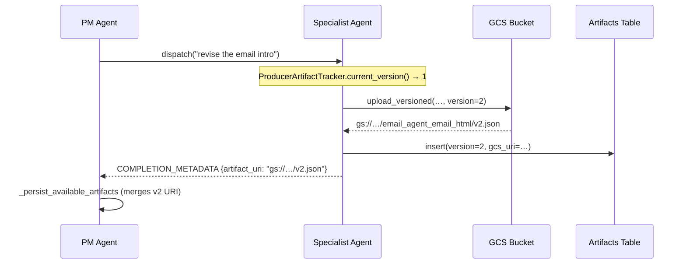

## 6. Cross-Workflow Composition (Phase 5 — Emergent)

This is the payoff of the mesh. Agents aren't siloed in workflows — they
can invoke peers from any domain based on what they discover.

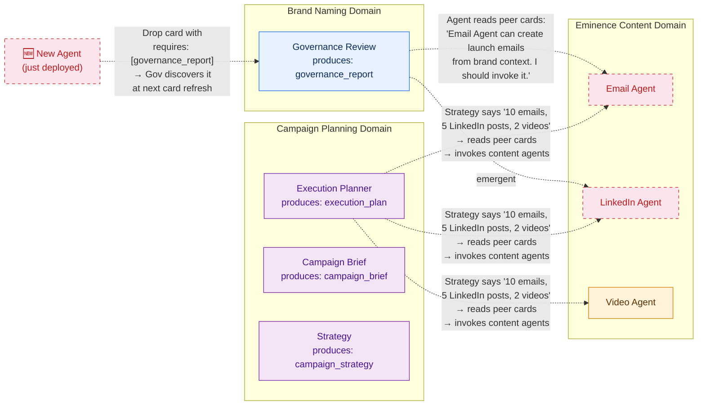

> **This is NOT orchestration.** No code change is needed. The Governance agent's
> LLM reads peer cards, sees that Email Agent accepts brand context as input,
> and decides to invoke it. The Execution Planner reads its strategy output,
> sees that content agents can produce the deliverables, and invokes them in
> parallel. A new agent deployed to the mesh is discoverable at the next
> card refresh (5-min TTL).

### 6b. Cross-Workflow Composition Infrastructure (5B)

The PM has three tool-level mechanisms for cross-workflow composition:

| Mechanism | Tool | When used |
|-----------|------|-----------|
| **Artifact-first planning** | `resolve_goal_agents` | Start of workflow — PM maps user intent to goal artifacts, backward-chains to discover full agent pipeline across domains |
| **Composite workflow creation** | `plan_and_create_workflow` with `workflow_type="composite"` | When `resolve_goal_agents` returns agents from multiple domains (e.g. brand + content) |
| **Mid-workflow scope expansion** | `continue_workflow` | When a specialist's output reveals additional deliverables not in the original plan |

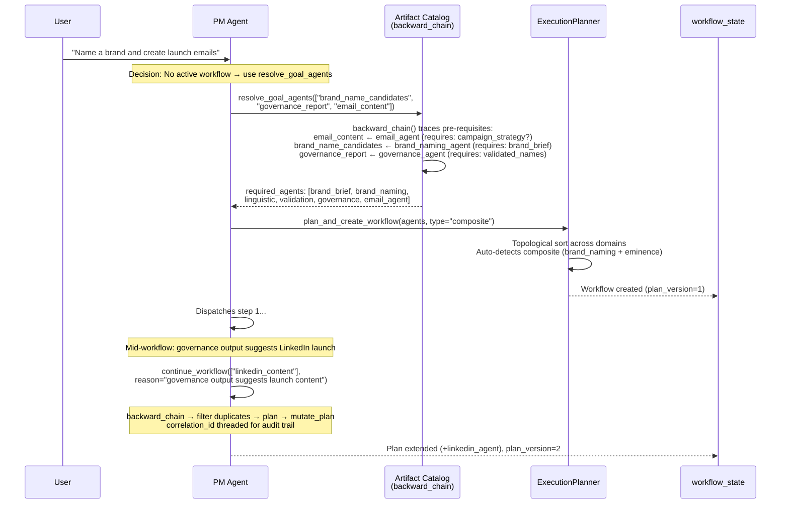

> **Key design**: `resolve_goal_agents` and `continue_workflow` both use the
> same `backward_chain` from `artifact_catalog` — a pure-Python dependency
> graph derived from agent cards' `produces`/`requires`. No LLM calls in the
> resolution path. The planner's `plan()` method auto-detects `composite`
> workflow type when agents span multiple domains (Kahn's topological sort).

## 7. Eminence Content — PM-Validated Handoff Pattern (Live)

All content producers use `HandoffExecutor` which routes through PM validation
before dispatching to downstream peers (replaced the hardcoded `ContentProducerExecutor`
auto-review pattern).

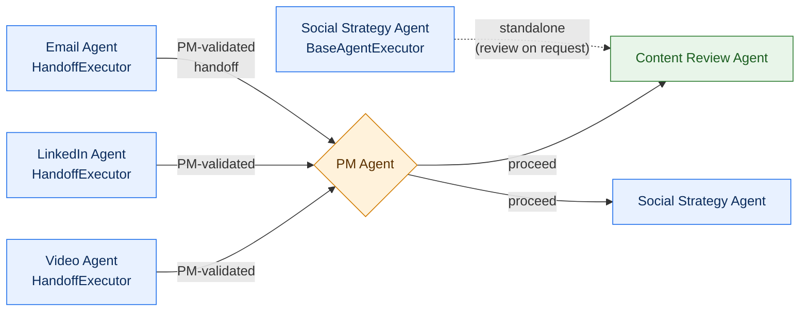

## 8. PM Agent — Validation & Planning Protocol

The PM Agent is the single authority for planning, execution state, and dispatch.
It validates handoffs, tracks progress, and manages plan evolution.

### PM Agent Tool Suite (15 tools)

| Tool | Purpose |
|------|---------|  
| `plan_and_create_workflow` | Compound tool: build plan from dependency graph + create workflow in one call. Supports `workflow_type="composite"` for multi-domain plans |
| `create_execution_plan` | Build initial plan from dependency graph (assigns `parallel_group`) |
| `create_workflow` | Persist a pre-built plan as a trackable workflow |
| `record_step_completion` | Record agent completion with artifact info |
| `record_issue` | Log issues detected during validation |
| `update_living_summary` | Maintain human-readable workflow narrative |
| `get_workflow_progress` | Query current workflow state |
| `get_correlation_status` | Aggregate status across all workflows in a correlation |
| `propose_plan_update` | Structurally validate and apply plan mutations |
| `get_workflow_plan` | Query plan context for any workflow |
| `resolve_goal_agents` | Artifact-first pipeline discovery — backward-chains through artifact catalog to find all required agents (5B) |
| `continue_workflow` | Mid-workflow scope expansion — backward-chain → filter duplicates → plan → mutate_plan atomically. Threads `correlation_id` for audit trail (5B) |
| `list_mesh_agents` | Discover agents in the mesh (filter by workflow/produces/requires) |
| `dispatch_agent` | Dispatch a single specialist with plan context and artifact URIs |
| `dispatch_parallel_agents` | Fan-out independent steps via `asyncio.gather`, fan-in with sequential bookkeeping (5.4) |

### Specialist Agent Tools (auto-injected by HandoffExecutor, 5.2)

Every specialist using `HandoffExecutor` automatically receives two tools
injected in `__init__` **before** `Runner` creation — no per-agent config needed:

| Tool | Purpose |
|------|---------|  
| `propose_plan_update` | Propose new steps (validated through 5 structural gates + optimistic concurrency) |
| `get_workflow_plan` | Query current plan to get `plan_version`, step statuses, and available artifacts |

**How it works**: `HandoffExecutor.__init__` auto-builds a `WorkflowTracker`
from `DB_INSTANCE` / `DB_NAME` / `DB_USER` env vars, then calls
`_inject_proposal_tools(agent, workflow_tracker)` to append both tools.
Double-injection is guarded. If env vars are missing (tests, non-DB agents),
injection is silently skipped.

### Handoff Validation Protocol

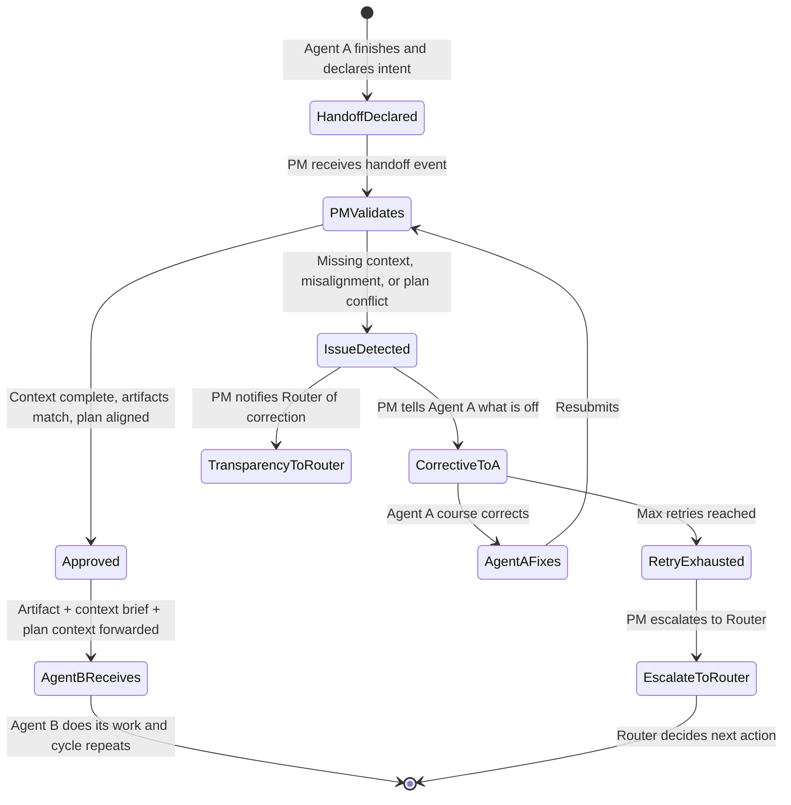

## 9. Plan Evolution — Living Plans (D34)

Plans are living documents. Any agent can propose mutations via the
`propose_plan_update` tool. Specialist agents call this tool **directly**
(injected by `HandoffExecutor`, 5.2) — the 5 structural validation gates
run in-process, then the mutation is applied atomically with optimistic
concurrency (`plan_version`). PM sees the updated plan on its next turn
and decides whether to dispatch the new steps.

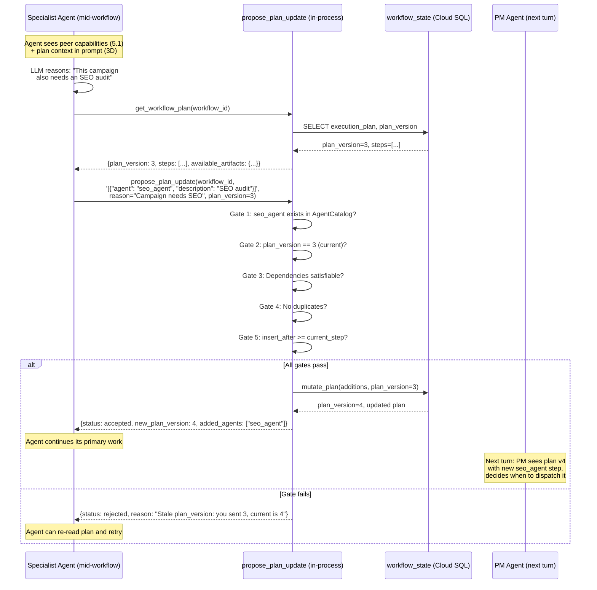

> **Key change from prior design**: Specialists call `propose_plan_update`
> and `get_workflow_plan` directly as ADK tools — the 5 structural gates
> run in-process (pure Python, not LLM). PM is NOT in the proposal loop;
> it sees the already-validated mutation on its next turn and decides
> dispatch. This avoids making PM a bottleneck for every proposal.

### Guardrails

| Type | Guard | Enforced by |
|------|-------|-------------|
| **Structural** | Agent must exist in `AgentCatalog` | Code (`if` statement) |
| **Structural** | `plan_version` must match (optimistic concurrency) | Code |
| **Structural** | `requires` must be `produces`'d by upstream steps | Code |
| **Structural** | No duplicate agent at same position | Code |
| **Structural** | Cannot insert before `current_step` (history immutable) | Code |
| **PM judgment** | Plan getting large? Decompose into child workflows | LLM |
| **PM judgment** | Scope creep? Reject proposal with reason | LLM |
| **Infrastructure** | Cloud Run request timeout (900s router, 600s agents) | Cloud Run |

## 10. Agent Observability — What Each Agent Produces

Every agent automatically emits streaming events and OTel spans through the
shared executor infrastructure. No agent-specific code is needed — the
`BaseAgentExecutor` handles all observability concerns.

### Executor Event Loop — What Happens Inside `execute()`

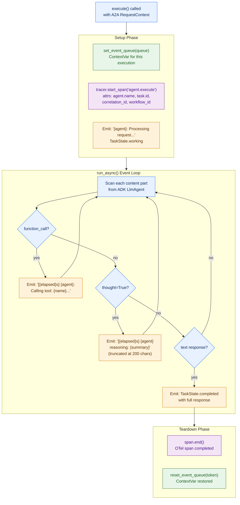

### LLM Configuration — Centralized Per-Agent Settings

All 23 agents pull their LLM configuration from `agents/shared/config/llm_config.py`.
The 4-level resolution hierarchy means production can override any agent's model
without code changes:

```
Resolution order (first match wins):
  1. LLM_MODEL_{AGENT_NAME}   — env var per agent (e.g. LLM_MODEL_ROUTER)
  2. _AGENT_MODELS[agent]     — code default per agent (e.g. market_research → flash)
  3. LLM_DEFAULT_MODEL        — env var global override
  4. _GLOBAL_DEFAULT_MODEL    — hardcoded constant (gemini-2.5-pro)
```

| Agent Group | Default Model | Thinking | Tool Config |
|-------------|---------------|----------|-------------|
| Router | Gemini 2.5 Pro | `include_thoughts=True` | `FunctionCallingConfig(mode=AUTO)` |
| PM Agent | Gemini 2.5 Pro | `include_thoughts=True` | — |
| Content agents (5) | Gemini 2.5 Pro | — | — |
| Brand naming agents (5) | Gemini 2.5 Pro | — | — |
| Campaign Brief + Brief Validator | Gemini 2.5 Pro | — | — |
| Strategy Agent | Gemini 2.5 Pro | `include_thoughts=True` | — |
| Execution Planner | Gemini 2.5 Pro | `include_thoughts=True` | — |
| Event/Podcast Finders (3) | Gemini 2.5 Flash | — | — |
| Simple Merger | Gemini 2.5 Flash | — | — |
| Market Research | Gemini 2.5 Flash | — | — |
| Deloitte Internal | Gemini 2.5 Flash | — | — |
| Info Gathering | Gemini 2.5 Pro | — | — |
