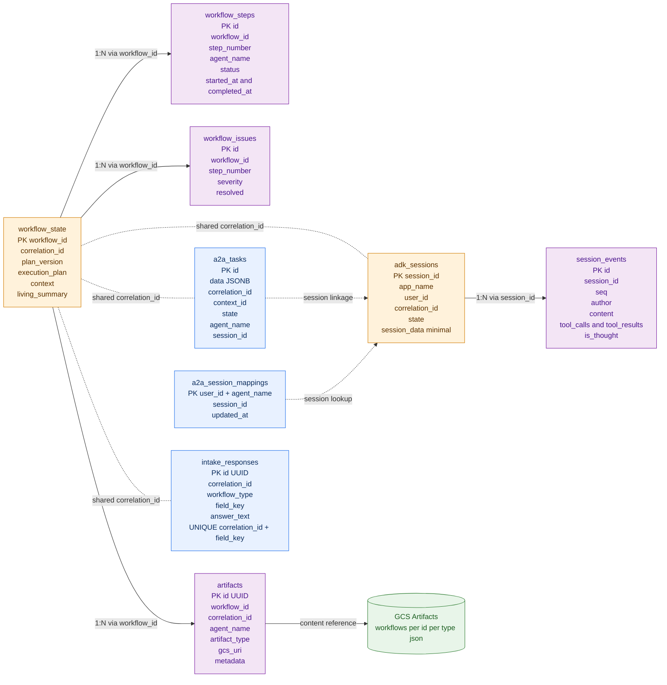
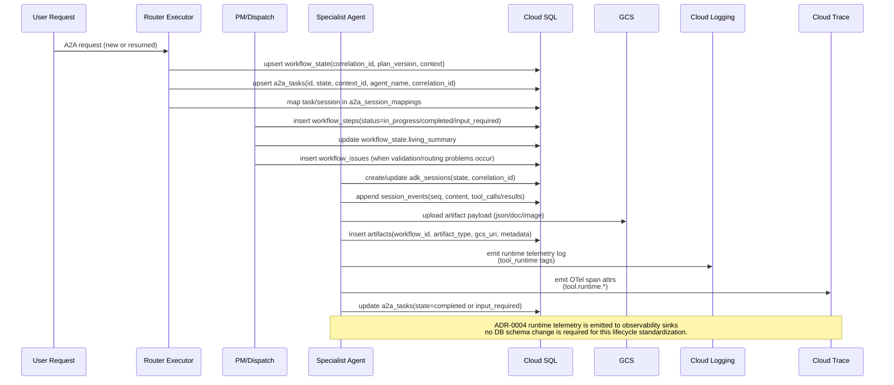
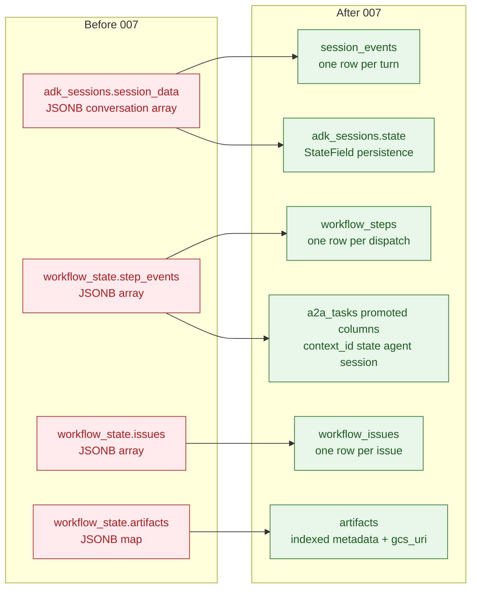
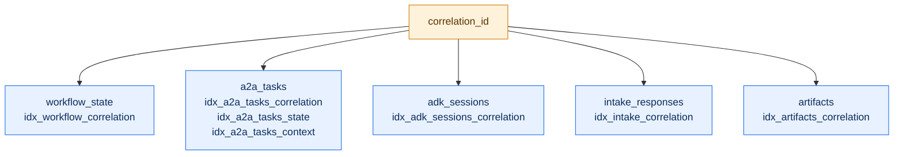

# Database Architecture — V3 Normalized Persistence

> **Last Updated**: 2026-03-17  
> **Scope**: Cloud SQL PostgreSQL schema used by A2A tasks, ADK sessions, workflow tracking, intake capture, and artifact metadata  
> **Source of Truth**: `data_migration/sql/001_initial_schema.sql` through `007_normalize_schema.sql`

## 1) Persistence Principles

- **Normalized first**: event/history arrays moved out of JSONB blobs into row tables.
- **Queryability first**: frequently filtered fields promoted to indexed columns.
- **Traceability first**: `correlation_id` links workflows, tasks, and sessions.
- **Storage split**: Cloud SQL stores metadata and state; GCS stores large artifact payloads.
- **Operational safety**: append-style event tables + explicit indexes for common filters.
- **Runtime-policy isolation**: ADR-0004 tool-runtime standardization changes execution lifecycle and telemetry emission, but does not require DB schema changes.

## 2) Core Data Model (ER-style)

## 3) Write Path Architecture

## 4) Normalization Delta (Before → After)

## 5) Correlation & Query Axes

### Typical operational queries

- **Workflow timeline**: `workflow_state` + `workflow_steps` + `workflow_issues` by `workflow_id`.
- **End-to-end trace**: join by `correlation_id` across workflow/task/session/intake/artifacts.
- **Session replay**: `adk_sessions` + ordered `session_events(seq)`.
- **Task lifecycle checks**: `a2a_tasks` filtered by `state`, `agent_name`, `context_id`, `updated_at`.
- **Artifact lineage**: `artifacts` by `workflow_id` and `artifact_type`, then resolve payload in GCS.

## 6) Ownership Map (Code → Tables)

| Component | Primary writes |
|---|---|
| `agents/shared/persistence/postgresql_task_store.py` | `a2a_tasks`, `a2a_session_mappings` |
| `agents/shared/persistence/postgresql_session_service.py` | `adk_sessions`, `session_events` |
| `agents/shared/progress_tracker.py` | `workflow_steps`, `workflow_issues`, `workflow_state.living_summary` |
| `agents/router/workflow_tracker.py` | `workflow_state` |
| `agents/info_gathering_agent/intake_store.py` | `intake_responses` |
| `agents/shared/persistence/gcs_artifact_client.py` + PM/agents | `artifacts` metadata + GCS object payload |

## 7) Non-Goals / Guardrails

- Do **not** store large generated content blobs in Cloud SQL when a `gcs_uri` is available.
- Do **not** reintroduce append-only JSONB arrays for events/issues/steps.
- Keep `adk_sessions.session_data` minimal for compatibility; authoritative turn history is `session_events`.
- Any new frequently queried field should be added as a promoted/indexed column, not only nested JSONB.
- Do **not** add DB columns solely for runtime telemetry tags unless there is a clear query/use-case requirement; prefer Cloud Logging/Trace for runtime telemetry inspection.
